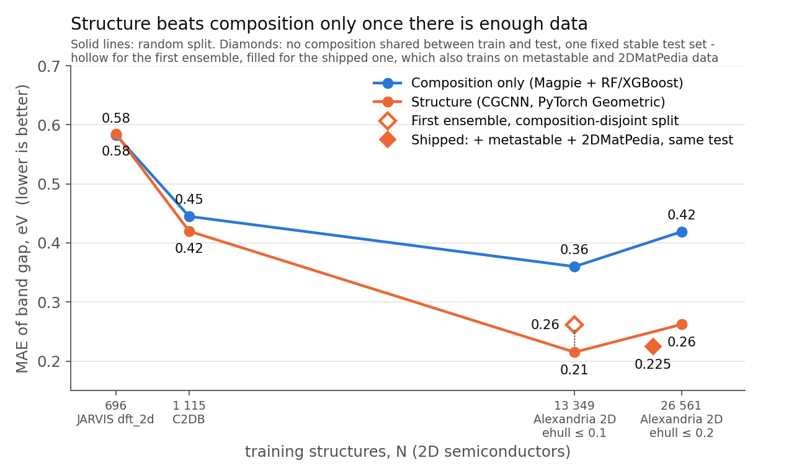
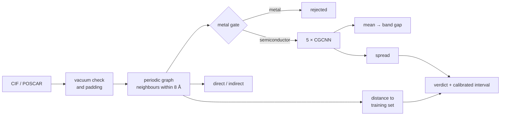
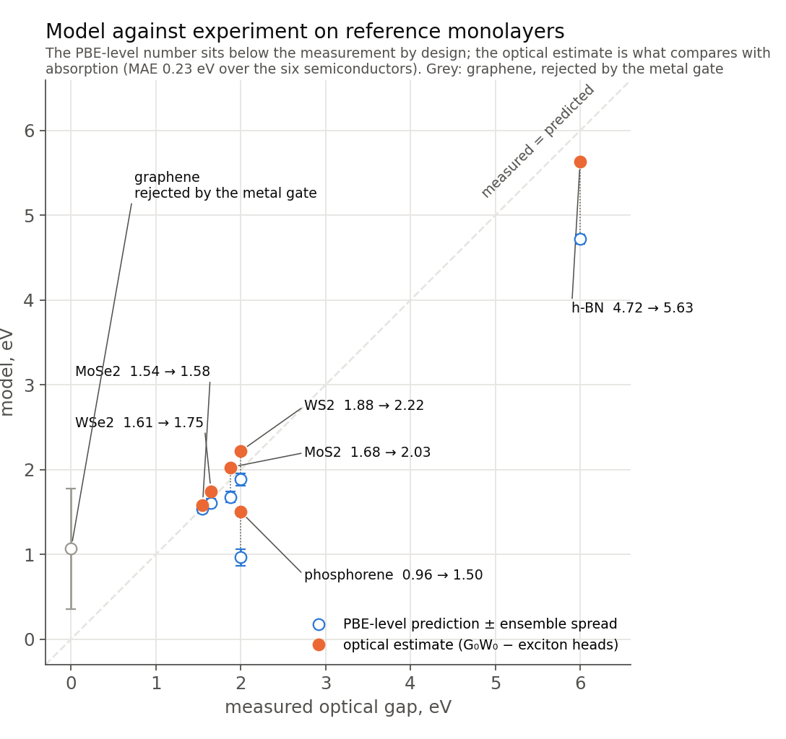
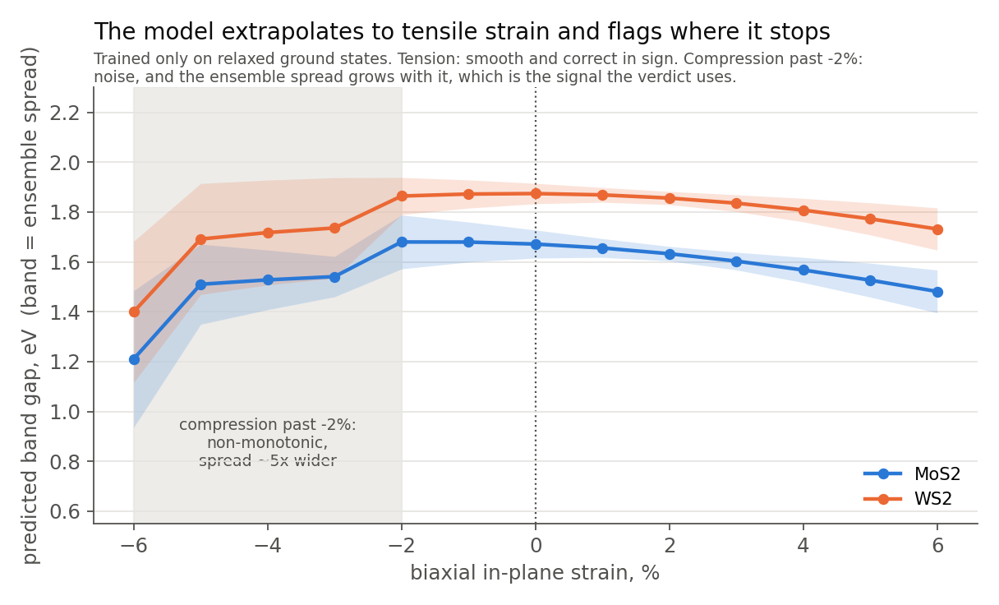

# NanoMatAI — band gap of 2D semiconductors from crystal structure

[](https://github.com/ac1esan/nanomat-ai/actions/workflows/tests.yml)


[](LICENSE)
[Русская версия](README.ru.md)

**[Browse the predictions →](https://ac1esan.github.io/nanomat-ai/)** — 28 372
structures with a calibrated interval and a verdict on each, plus a periodic-table
map of where the model actually works. No install, no upload.
Same page on [Hugging Face Spaces](https://huggingface.co/spaces/ac1esan/nanomat-ai).

A graph neural network that predicts the band gap of a 2D monolayer from its
crystal structure in under a second on a laptop CPU — and, more importantly,
tells you when not to believe it. Built end-to-end solo: open-API data only, a
composition baseline first, a structure model scaled from 700 to 13 000
structures, and a trust layer that was tested until it broke and then fixed.

<p align="center"></p>

**Main finding.** With 700 structures a graph network is no better than a random
forest on composition features (MAE 0.58 eV both). The gap opens only with data:
at 13 349 stable 2D semiconductors the structure model reaches **MAE 0.26 eV on a
composition-disjoint split** versus 0.36 eV for composition. The bottleneck was
data volume, not model class.

## Quick start

```bash
git clone https://github.com/ac1esan/nanomat-ai && cd nanomat-ai
pip install -r requirements.txt          # CPU torch + PyTorch Geometric + pymatgen + gradio
```

```bash
python screen_bandgap.py --in examples/ --out results.csv    # batch: folder of CIF/POSCAR -> ranked CSV
```

If you have no structure file to hand, the
[browser](https://ac1esan.github.io/nanomat-ai/) covers the common case: filter
28 372 precomputed predictions by element, gap range and trust verdict.

```bash
python screen_bandgap.py --app                                # web UI at http://127.0.0.1:7860
```

```bash
pytest -q                                                     # 10 smoke and contract tests
```

Output for the bundled examples ([examples/expected_results.csv](examples/expected_results.csv)):

| file | formula | gap (PBE), eV | 90% interval | verdict |
|---|---|---|---|---|
| WS2.vasp | WS2 | 1.94 | ±0.13 | reliable |
| MoS2.vasp | MoS2 | 1.69 | ±0.11 | reliable |
| MoSe2.vasp | MoSe2 | 1.53 | ±0.24 | reliable |
| WSe2.vasp | WSe2 | 1.26 | ±0.55 | check |
| hBN.vasp | BN | 4.59 | ±0.44 | reliable |
| phosphorene.vasp | P | 0.82 | — | **out-of-domain: unfamiliar chemistry** |
| graphene.vasp | C | 2.78 | — | **out-of-domain: metal gate** |

The last two rows are the point of the project. Both numbers are wrong, and the
tool says so without being told.

## Knowing when not to believe it

A screening tool that is confidently wrong is worse than no tool. This one uses
three independent checks, and each exists because the previous one was caught
failing on a real case.

**1. A metal gate.** The regressor is trained on semiconductors only, so a metal
produces a meaningless number. A separate classifier (ROC-AUC 0.944, precision on
metals 0.866) rejects them first.

The first version of this gate, trained on Alexandria alone, scored ROC-AUC 0.952
and still gave graphene `p(metal) = 0.00`. Cause: of 19 691 training structures,
exactly **two** were carbon-only, and both were labelled semiconductors. Retrained
on three merged sources (24 314 structures, graphene among them) it returns
`p(metal) = 1.00` on graphene with no false positives on the TMDs.

**2. Ensemble spread.** Five models with different seeds; the standard deviation
between them ranks errors well (Spearman 0.45 against absolute error; MC-dropout on
a single model managed 0.17). Error rises from 0.12 to 0.49 eV across its quartiles.

**3. Distance to the training set in latent space.** The spread alone is not
enough, and phosphorene is the proof: the tool predicted 0.82 eV against an
experimental 2.0 eV, and called it reliable with a spread of 0.035 eV. Alexandria
contains exactly **one** elemental-phosphorus 2D structure, every ensemble member
learned from that same one, so all five agreed — confidently and wrongly. Ensemble
spread measures disagreement between initialisations, not ignorance of a chemistry.

Cosine distance to the ten nearest training structures in the model's own
embedding space catches it: phosphorene sits in the 98th percentile, while MoS₂,
WS₂ and h-BN sit near the 40th. It correlates with error slightly better than the
spread (0.47 vs 0.45), and the two together reach 0.50, so they carry different
information. A failed intermediate attempt is worth recording: simply counting how
many training structures shared the query's chemical system correlated with error
*backwards*, because chemically rich systems are both better represented and
intrinsically harder.

**Calibrated intervals.** Raw ±1σ of the ensemble spread covers only 37% of cases,
not 68% — deep ensembles rank well but are overconfident. A scale factor fitted on
the validation split (×5.09) gives 92% coverage on the held-out test split against
a 90% target. It beats a fixed conformal interval, which would have to be ±0.62 eV
for everyone; a confident prediction now carries ±0.11 eV instead.

## How it works



- **Model.** CGCNN in PyTorch Geometric: atomic-number embedding (128), four
  `CGConv` layers with Gaussian radial-basis edge features (40 centres on 0–8 Å),
  mean pooling, MLP head. Defined once in [`nanomat/model.py`](nanomat/model.py)
  and shared by training and inference, so the two cannot drift apart.
- **Data.** Alexandria 2D via the JARVIS-Tools API, filtered to
  `e_above_hull ≤ 0.1 eV/atom` and `gap > 0.01 eV`: 13 349 stable 2D
  semiconductors, target = PBE indirect gap. No custom scraper anywhere.
- **Evaluation.** Splits are composition-disjoint by default: no formula appears
  in both train and test. This matters — the dataset has 13 349 structures but only
  8 388 unique compositions.
- **Gap type.** Predicting direct/indirect from the difference of two regressed
  gaps collapsed to the majority baseline (79%). A dedicated classification head
  with a class weight on the rare class gives ROC-AUC 0.758 on the strict split.
  Its decision threshold is fitted on validation (0.33, not 0.5) and stored in the
  checkpoint, because `pos_weight` shifts the probabilities.

## Results

Composition baseline (Magpie + RandomForest/XGBoost, 5-fold CV) versus CGCNN:

| dataset | N | composition CV MAE | CGCNN MAE | split |
|---|---|---|---|---|
| JARVIS dft_2d (OptB88vdW) | 696 | 0.583 | ≈ 0.585 | random |
| C2DB (PBE) | 1 115 | 0.445 | ≈ 0.42 | random |
| Alexandria 2D, ehull ≤ 0.1 | 13 349 | 0.360 | 0.215 | random |
| Alexandria 2D, ehull ≤ 0.2 | 26 561 | 0.419 | 0.262 | random |
| **Alexandria 2D, ehull ≤ 0.1** | **13 349** | **0.430** | **0.261** | **composition-disjoint** |

The composition figures in the first rows are five-fold cross-validation, which is
not the same protocol as a composition-disjoint split and should not be compared
against it. Scored properly on the very same test set, composition gives 0.430 eV,
not 0.360 — so structure wins by 39%, not the 27% this project claimed until the
comparison was redone with
[`scripts/composition_baseline.py`](scripts/composition_baseline.py). The error was
in our favour to correct.

The shipped ensemble scores **MAE 0.261 eV (95% CI 0.242–0.283), RMSE 0.454,
R² 0.889** on 1 326 held-out structures whose compositions never appear in
training. Members score 0.281 / 0.305 / 0.274 / 0.277 / 0.319, so averaging buys
0.03 eV.

A control run isolates the cost of honest evaluation: identical code and data,
only the split differs.

| split | MAE |
|---|---|
| random | 0.252 |
| composition-disjoint | 0.261 |

Two more things the numbers say:

- **Quality beats quantity.** Relaxing the stability filter doubles N but adds
  metastable structures; both models get worse.
- **Errors follow data density, not physics.** The model is best on
  transition-metal chemistries where Alexandria is dense and worst on light
  main-group compounds. Error does not grow with the size of the gap. The same
  lesson explains both the metal gate and the phosphorene failure above.

### A second property: work function, and the band edges it unlocks

| | Composition | Structure | n_test |
|---|---|---|---|
| Band gap | 0.430 | **0.261** | 1 326 |
| Work function | 0.314 | **0.254** | 337 |

Trained on the 3 505 C2DB structures carrying a work function, same architecture,
same protocol, its own checkpoint. Structure wins by 19% here against 39% for the
gap, which is what you would expect: the work function leans more on chemistry and
less on geometry.

The number alone is the less interesting half. The trained target is vacuum minus
Fermi level; for a metal that is the work function proper, but DFT puts the Fermi
level mid-gap in an undoped semiconductor, so on its own it is a reference level
rather than something a probe reads. That is why h-BN comes out at 3.4 eV where the
literature quotes 4.5 — and the database agrees with the model, at 3.49.

Combined with the gap it places **both band edges relative to vacuum**, which is
the pair a contact metal is matched against:

| | Electron affinity | published | Ionisation potential | published |
|---|---|---|---|---|
| MoS₂ | 4.41 | 4.0 | 6.10 | 6.1 |
| MoSe₂ | 3.95 | 3.9 | 5.49 | 5.5 |
| WS₂ | 3.98 | 3.9 | 5.92 | 6.0 |
| WSe₂ | 3.79 | 3.6 | 5.05 | 5.2 |

The edges are a subtraction between two models, so they need **both** to stand
behind their half and are withheld when either verdict says out-of-domain. This
model carries its own trust layer rather than a share of the gap model's — its own
uncertainty quartiles, its own interval scale and its own latent distance against
its own training embeddings — because the two were trained on different databases.
A structure can be routine for one and unseen for the other.

Graphene is the documented failure, and it is now caught by that second verdict:
one elemental-carbon structure exists in the whole dataset and it sits in the test
split, so the model predicts 3.18 against the database's 4.25 — with a spread of
0.32 against 0.03 for the TMDs and a latent distance past the q90 threshold. Its
verdict reads out-of-domain and no band edges are offered. On the C2DB rows that
carry a reference and were never trained on, that verdict separates MAE 0.130 /
0.233 / 0.445 eV across the three tiers.

### External validation against experiment

<p align="center"></p>

[`validate_experiment.py`](validate_experiment.py) runs seven reference monolayers
(shipped in [`examples/`](examples/), so it works offline), and
[`scripts/fit_gap_corrections.py`](scripts/fit_gap_corrections.py) turns the PBE
output into something measurable. There are **two** targets, and conflating them is
the trap:

| | Fitted against | n | Leave-one-out error |
|---|---|---|---|
| **Quasiparticle gap** — photoemission, transport | HSE06 from JARVIS dft_2d | 32 | **0.19 eV** |
| **Optical gap** — absorption onset | measured monolayer gaps | 5 | 0.71 eV |

The quasiparticle fit is solid: the raw prediction correlates with HSE at r = 0.988,
and leave-one-out barely differs from in-sample (0.19 vs 0.18 eV). The optical fit is
not: its in-sample 0.17 eV collapses to 0.71 eV under leave-one-out, because five
points with h-BN at 6 eV is not a fit, it is an interpolation between two clusters.
Both are reported, labelled, and the optical one is marked as an indication.

The difference between them averages **0.55 eV on the four TMDs**, and that is the
physics working: it is the exciton binding energy, which is why absorption and
photoemission disagree on the same monolayer. Reporting only one number would have
hidden that.

Both corrections are fitted only on points the tool itself calls usable — a
prediction flagged as out-of-domain must not steer the calibration every other
prediction is corrected by.

### Does geometry have to come from a DFT relaxation?

[`scripts/geometry_sensitivity.py`](scripts/geometry_sensitivity.py) answers this
for a future "pick the elements, get a prediction" interface:

- The internal coordinate is free. An ideal trigonal prism reproduces the relaxed
  chalcogen height to 0.02 Å and changes the predicted gap by 0.001 eV.
- The lattice constant is not. Estimated from covalent radii it is 9% too large and
  costs 0.42 eV, more than the model's own error. It has to come from the relaxed
  database.
- Under strain the model extrapolates correctly in tension and breaks under
  compression past −2%, where the ensemble spread widens about fivefold.

<p align="center"></p>

### A hypothesis that was right and still lost

Every plain ensemble member trains on the same data, so a chemistry represented once
is learned identically by all of them and they agree — which is exactly how
phosphorene came out confidently wrong. Bagging should fix that at the source, since
a third of the members never see any given structure. It was trained and compared on
one test set:

| | plain | bagged |
|---|---|---|
| MAE, eV | **0.261** | 0.306 |
| Spearman, spread vs error | 0.450 | **0.495** |
| worst uncertainty quartile / best | 4.08× | **4.34×** |
| phosphorene spread, eV | 0.035 | **0.380** |

The hypothesis held: phosphorene's spread rises by a factor of **10.8**, and the
spread alone now catches the case it used to miss. It was still not adopted, for
three reasons that only appear once you measure.

Accuracy costs 17%, since each member sees about 64% of the structures. The
**combined** out-of-domain signal barely moves — 0.500 to 0.511 — because distance
to the training set in latent space already covered that ground, so bagging buys a
second route to a place the tool could already reach. And a noisier spread raises
false alarms on materials that are fine: WSe₂ drops from `check` to `out-of-domain`
and MoSe₂ from `reliable` to `check`, both well-characterised monolayers.

Paying 17% of accuracy for 2% of combined ranking, and getting more false alarms
with it, is not a trade worth making. The flag stays in the trainer with this
measurement attached, so nobody has to rediscover it.

## Honest limits

- Trained on semiconductors only; the metal gate is the first stage, not a
  guarantee. Its own blind spots are whatever the three merged databases miss.
- The PBE → experiment correction is fitted on five monolayers, four of them TMDs.
  Treat the corrected value as an estimate.
- The calibrated interval assumes the ensemble spread is meaningful, which is
  exactly what fails out-of-domain. That is why out-of-domain results hide the
  interval instead of showing a tight one.
- Conditional coverage is uneven: the most confident quartile gets 84% instead of
  90%.
- **The calibration is scoped to the population it was fitted on.** Re-running the
  model over 16 349 structures it had never seen, including metastable ones
  (`e_above_hull` up to 0.2) and two other DFT functionals, the verdict still ranks
  error correctly (0.33 / 0.43 / 0.57 eV across the three tiers), but the 90%
  interval covers only 78% instead of 90% and the per-tier error figures are
  optimistic. On stable Alexandria 2D the test MAE is 0.261 eV; on metastable
  structures it is 0.509 eV. Re-run
  [`scripts/calibrate_uncertainty.py`](scripts/calibrate_uncertainty.py) on the
  population you actually screen. The precompute script checks this and warns.
- Inputs must be monolayers with a vacuum gap. Thin vacuum is padded
  automatically, because with periodic boundaries it silently adds inter-layer
  edges; cells with no gap ≥ 5 Å are flagged as not 2D.

Full details: [MODEL_CARD.md](MODEL_CARD.md).

## Reproduce

Data export runs locally through the JARVIS API; training needs a GPU. The shipped
weights were produced on two rented RTX 5070 Ti cards in about an hour, including
the metal gate and the type classifier.

```bash
python export_structures_for_alignn.py --source alex_2d --ehull-max 0.1
```

```bash
python train_cgcnn.py --data alignn_data_alex_2d --task gap --split group --ensemble 5 \
    --epochs 200 --batch 64 --workers 4 --out weights/cgcnn_2d_ensemble.pt
```

```bash
python scripts/calibrate_uncertainty.py --weights weights/cgcnn_2d_ensemble.pt \
    --data alignn_data_alex_2d --split weights/cgcnn_2d_ensemble.split.json
```

```bash
python scripts/fit_gap_corrections.py --write    # quasiparticle + optical corrections
```

`--bootstrap` resamples the training set per ensemble member instead of showing all
five identical data. It was measured and **not adopted**; the numbers are below,
under "A hypothesis that was right and still lost".

Training writes `*.metrics.json` (test MAE with bootstrap CI, ensemble calibration)
and `*.split.json` (exact file lists). The calibration step fits the interval
scale, measures both out-of-domain signals and embeds them, plus the reference
embeddings, into the checkpoint — so a checkpoint carries everything the tool needs
to judge its own output.

The metal gate wants all three sources including metals, and the type classifier
wants a second target column:

```bash
python train_cgcnn.py --data data_metal_merged --task metal --split group --out weights/cgcnn_2d_metal.pt
```

```bash
python export_structures_for_alignn.py --source alex_2d --extra-target band_gap_dir --out-dir alignn_data_alex_2d_typed
```

`--pretrained <ckpt>` initialises the trunk from another checkpoint (3D → 2D
transfer). The composition baseline is
`python baseline_2d_bandgap.py --source alex_2d --drop-metals`.

## Repository layout

```
docs/                     the static browser published on GitHub Pages (index.html + data/)
nanomat/families.py       structural prototype tags (1H/1T MX2, honeycomb) for the family view
nanomat/                  graph.py (structure -> graph, vacuum checks), model.py (CGCNN),
                          predict.py (Predictor, batched inference, verdicts, calibration)
screen_bandgap.py         CLI batch screening + Gradio UI      app.py: Hugging Face Spaces entry
train_cgcnn.py            training: gap / type / metal, ensembles, grouped split, thresholds
scripts/calibrate_uncertainty.py   interval scaling + out-of-domain signals -> checkpoint
scripts/geometry_sensitivity.py    prototype vs relaxation, strain response
validate_experiment.py    model vs experiment on reference monolayers (offline)
baseline_2d_bandgap.py    composition baseline (Magpie + RF/XGBoost)
export_structures_for_alignn.py   JARVIS / C2DB / Alexandria -> POSCAR folder + id_prop.csv
weights/                  ensemble (with calibration + reference embeddings), metal gate, gap type
examples/  tests/         reference structures incl. failure cases; 10 pytest checks
figures/                  README figures and the scripts that regenerate them
```

## Roadmap

1. Host the uploader somewhere free. Hugging Face now requires a paid subscription
   for a Gradio Space even on free CPU, so `python screen_bandgap.py --app` is the
   local answer and `scripts/deploy_space.py --kind gradio` waits for another host.
2. Extend the target beyond the band gap. Work function is available for all 3 520
   C2DB structures and matters more for contacts than a third digit of the gap;
   effective masses in JARVIS dft_2d are unusable (WS2 comes out at 3 000 000).
3. Bagging the ensemble over data subsets, so the spread itself reflects sparse
   chemistry instead of relying on the latent-distance check.
4. Replace the five-point PBE correction with a PBE → HSE/GW model fitted on C2DB.

## License

MIT. Training data: Alexandria (CC-BY 4.0), C2DB and JARVIS-DFT, accessed through
[JARVIS-Tools](https://github.com/usnistgov/jarvis).
