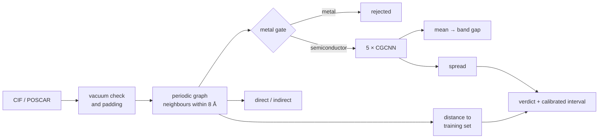

# NanoMatAI — band gap of 2D semiconductors from crystal structure

[](https://github.com/ac1esan/nanomat-ai/actions/workflows/tests.yml)


[](LICENSE)
[](https://doi.org/10.5281/zenodo.22863467)
[Русская версия](README.ru.md)

**[Browse the predictions →](https://ac1esan.github.io/nanomat-ai/)** — 28 372
structures with a calibrated interval and a verdict on each, plus a periodic-table
map of where the model actually works. No install, no upload.
Same page on [Hugging Face Spaces](https://huggingface.co/spaces/ac1esan/nanomat-ai).

A graph neural network that predicts the band gap of a 2D monolayer from its
crystal structure in under a second on a laptop CPU — and, more importantly,
tells you when not to believe it. Built end-to-end solo: open-API data only, a
composition baseline first, a structure model scaled from 700 to 22 000
structures, and a trust layer that was tested until it broke and then fixed.

<p align="center"></p>

**Main finding.** With 700 structures a graph network is no better than a random
forest on composition features (MAE 0.58 eV both). The gap opens only with data: on
a composition-disjoint test set of stable 2D semiconductors the shipped model reaches
**MAE 0.225 eV** against 0.430 eV for composition. The bottleneck was data volume,
not model class — and part of the data the model needed had been filtered out as
"metastable" ([below](#what-the-stability-filter-was-costing)).

## Quick start

```bash
git clone https://github.com/ac1esan/nanomat-ai && cd nanomat-ai
pip install -r requirements.txt          # CPU torch + PyTorch Geometric + pymatgen + gradio
```

```bash
python screen_bandgap.py --in examples/ --out results.csv    # batch: folder of CIF/POSCAR -> ranked CSV
```

If you have no structure file to hand, the
[browser](https://ac1esan.github.io/nanomat-ai/) covers the common case: filter
28 372 precomputed predictions by element, gap range and trust verdict.

```bash
python screen_bandgap.py --app                                # web UI at http://127.0.0.1:7860
```

```bash
pytest -q                                                     # 20 smoke and contract tests
```

Output for the bundled examples ([examples/expected_results.csv](examples/expected_results.csv)):

| file | formula | gap (PBE), eV | 90% interval | verdict |
|---|---|---|---|---|
| WS2.vasp | WS2 | 1.88 | ±0.30 | reliable |
| MoS2.vasp | MoS2 | 1.68 | ±0.26 | reliable |
| MoSe2.vasp | MoSe2 | 1.54 | ±0.20 | reliable |
| WSe2.vasp | WSe2 | 1.60 | ±0.21 | reliable |
| hBN.vasp | BN | 4.72 | ±0.24 | reliable |
| phosphorene.vasp | P | 0.96 | ±0.40 | **check: elevated uncertainty** |
| graphene.vasp | C | 1.07 | — | **out-of-domain: metal gate** |

The last row is the point of the project: graphene is a semimetal, the regressor
never trained on metals, and the tool says so without being told. Phosphorene sits
in between. Its PBE gap is about 0.9 eV in every database that carries it, so the
number is sound, but it is the only elemental-phosphorus layer in training and the
verdict asks you to check.

## Knowing when not to believe it

A screening tool that is confidently wrong is worse than no tool. This one uses
three independent checks, and each exists because the previous one was caught
failing on a real case.

**1. A metal gate.** The regressor is trained on semiconductors only, so a metal
produces a meaningless number. A separate classifier (ROC-AUC 0.944, precision on
metals 0.866) rejects them first.

The first version of this gate, trained on Alexandria alone, scored ROC-AUC 0.952
and still gave graphene `p(metal) = 0.00`. Cause: of 19 691 training structures,
exactly **two** were carbon-only, and both were labelled semiconductors. Retrained
on three merged sources (24 314 structures, graphene among them) it returns
`p(metal) = 1.00` on graphene with no false positives on the TMDs.

**2. Ensemble spread.** Five models with different seeds; the standard deviation
between them ranks errors well (Spearman 0.45 against absolute error; MC-dropout on
a single model managed 0.17). Error rises from 0.10 to 0.43 eV across its quartiles.

**3. Distance to the training set in latent space.** All five members train on the
same data, so on a chemistry the training set barely covers they can agree for the
wrong reason: the spread measures disagreement between initialisations, not how well
a chemistry is covered. Cosine distance to the ten nearest training structures in the
model's own embedding space measures that directly. It correlates with error slightly
better than the spread (0.47 against 0.45) and the two together reach 0.50, so they
carry different information. Built from both, the verdict keeps its order on data the
model never trained on: 0.21 / 0.24 / 0.40 eV across the three tiers on held-out
metastable Alexandria, 0.14 / 0.24 / 0.49 eV on held-out 2DMatPedia.

**A retraction.** This section used to prove the point with phosphorene: 0.82 eV
predicted, 2.0 eV measured, called reliable. Phosphorene is in the training split, and
its PBE gap is 0.85–0.90 eV in all four databases that carry it. The prediction was
right at the level the model predicts; the 1.2 eV was PBE against an optical
measurement — physics, which is what the optical output below exists for. What the
latent distance flagged was a sparse neighbourhood, since it is the only
elemental-phosphorus layer in training: a false alarm on a training point, not an
error caught. The signal stands on the statistics above instead. Comparing a
PBE-level number with experiment is the fifth protocol mistake this project has caught
in its own claims.

A failed intermediate attempt is worth recording: simply counting how many training
structures shared the query's chemical system correlated with error *backwards*,
because chemically rich systems are both better represented and intrinsically harder.

**Calibrated intervals.** Raw ±1σ of the ensemble spread covers only 42% of cases,
not 68% — deep ensembles rank well but are overconfident. A scale factor fitted on the
validation split (×4.19) gives 90% coverage on the held-out test split against a 90%
target. It beats a fixed conformal interval, which would have to be ±0.51 eV for
everyone; a prediction in the reliable tier carries a median ±0.24 eV instead.

## How it works



- **Model.** CGCNN in PyTorch Geometric: atomic-number embedding (128), four
  `CGConv` layers with Gaussian radial-basis edge features (40 centres on 0–8 Å),
  mean pooling, MLP head. Defined once in [`nanomat/model.py`](nanomat/model.py)
  and shared by training and inference, so the two cannot drift apart.
- **Data.** Alexandria 2D and 2DMatPedia via the JARVIS-Tools API; no custom
  scraper anywhere. Training uses 22 103 monolayers: 10 733 stable Alexandria
  semiconductors (`e_above_hull ≤ 0.1 eV/atom`, `gap > 0.01 eV`), 9 724 metastable
  ones (up to 0.2) and 1 646 non-magnetic 2DMatPedia layers that Alexandria does not
  contain. Target = PBE fundamental gap.
- **Evaluation.** Splits are composition-disjoint: no formula appears in both train
  and test. Validation and test are stable Alexandria (1 290 and 1 326 structures)
  and have not changed since the first model, so every number below is on the same
  1 326 structures. This matters — the stable set has 13 349 structures but only
  8 388 unique compositions.
- **Gap type.** Predicting direct/indirect from the difference of two regressed
  gaps collapsed to the majority baseline (79%). A dedicated classification head
  with a class weight on the rare class gives ROC-AUC 0.758 on the strict split.
  Its decision threshold is fitted on validation (0.33, not 0.5) and stored in the
  checkpoint, because `pos_weight` shifts the probabilities.

## Results

Composition baseline (Magpie + RandomForest/XGBoost) versus CGCNN:

| dataset | N | composition MAE | CGCNN MAE | split |
|---|---|---|---|---|
| JARVIS dft_2d (OptB88vdW) | 696 | 0.583 | ≈ 0.585 | random, 5-fold CV |
| C2DB (PBE) | 1 115 | 0.445 | ≈ 0.42 | random, 5-fold CV |
| Alexandria 2D, ehull ≤ 0.1 | 13 349 | 0.360 | 0.215 | random, 5-fold CV |
| Alexandria 2D, ehull ≤ 0.2 | 26 561 | 0.419 | 0.262 | random, its own test set |
| Alexandria 2D, ehull ≤ 0.1 | 13 349 | 0.430 | 0.246 | composition-disjoint |
| **+ metastable + 2DMatPedia, training only** | **22 103 train** | **0.430** | **0.225** | **composition-disjoint, same test** |

The composition figures in the first rows are five-fold cross-validation, which is
not the same protocol as a composition-disjoint split and should not be compared
against it. Scored properly on the very same test set, composition gives 0.430 eV,
not 0.360 — so structure wins by 48% with the shipped model, and the 27% this project
claimed until the comparison was redone with
[`scripts/composition_baseline.py`](scripts/composition_baseline.py) was an error in
our disfavour. The ehull ≤ 0.2 row misled in the other direction; see
[below](#what-the-stability-filter-was-costing).

### The coordinate an edge distance drops

An edge carries a distance and nothing else, so two polymorphs of one composition
are nearly the same graph — and for 2D electronics that is exactly the distinction
that matters, since 1H-MoS₂ is a semiconductor and 1T-MoS₂ is metallic. The model
was measured doing badly at it, so the graph gained a per-atom histogram of bond
angles ([`nanomat/graph.py`](nanomat/graph.py), 4 Å cutoff rather than the 8 Å used
for edges, since an angle to something 8 Å away says nothing about coordination).

Judged against a control trained on the identical split, with the identical seeds,
in the identical environment — the control exists because the previous weights came
from a different torch and a different GPU, which is worth 0.01 eV on its own:

| | control | with angles |
|---|---|---|
| MAE | 0.271 | **0.246** |
| RMSE | 0.492 | **0.435** |
| R² | 0.869 | **0.898** |

Paired over the same 1 326 test structures the difference is **+0.026 eV**, bootstrap
95% +0.015…+0.037, Wilcoxon p = 4·10⁻⁵. The three measurements of polymorph
sensitivity ([`scripts/polymorph_sensitivity.py`](scripts/polymorph_sensitivity.py))
move the way the diagnosis predicted — global spread unchanged, within-composition
and 1H-against-1T substantially better. The data added next roughly doubled those
gains again; the [model card](MODEL_CARD.md) carries all three generations.

The shipped ensemble adds the data described next and scores **MAE 0.225 eV (95% CI
0.207–0.243), RMSE 0.405, R² 0.912** on the same 1 326 held-out structures, whose
compositions never appear in training. Members score 0.266 / 0.243 / 0.251 / 0.253 /
0.267, so averaging buys 0.03 eV.

A control run on the first ensemble isolated the cost of honest evaluation: identical
code and data, only the split differing.

| split | MAE |
|---|---|
| random | 0.252 |
| composition-disjoint | 0.261 |

### What the stability filter was costing

The first models trained only on `e_above_hull ≤ 0.1`, because the 0.2 set in the
table above scored worse (0.262 against 0.215). Both numbers were measured on their
own test split, and the 0.2 split is half metastable, which is harder for any model:
the comparison changed the population it measured on, not only the data it trained
on. [`scripts/stability_experiment.py`](scripts/stability_experiment.py) asks the
question properly — four arms, one split, one GPU session, only the training part
differs, plus two extra test sets whose formulas no arm trained on.

| test set | stable only | + 2DMatPedia | + metastable | **+ both (shipped)** |
|---|---|---|---|---|
| stable Alexandria, 1 326 | 0.249 | 0.261 | 0.236 | **0.225** |
| held-out metastable Alexandria, 2 512 | 0.500 | 0.490 | 0.314 | **0.311** |
| held-out 2DMatPedia, 397 | 0.770 | 0.464 | 0.721 | **0.437** |

Every difference is paired against the control on identical structures; for the
shipped arm the 95% interval sits below zero on all three (−0.039…−0.011 eV on the
stable test). The acceptance rule was written into the project journal before the runs
finished: stay within +0.005 eV of the control on the stable test and beat it on one of
the other two with the whole interval below zero. 2DMatPedia alone failed the first
condition (+0.011); the combination has the larger gain. The two sources are
complementary — each repairs its own population and barely moves the other's.

The change is largest exactly where the model was weakest: carbon on held-out
2DMatPedia 1.59 → 0.67 eV (17 structures, so read it qualitatively), boron
1.82 → 0.92, nitrogen on held-out metastable Alexandria 1.01 → 0.38, hydrogen
1.25 → 0.83.

It also taught the model polymorphs. On C2DB, which none of these models trained on,
the shipped ensemble reproduces 65% of the gap difference between 1H-MX₂ and 1T-MX₂
(angles alone reached 37%, no angles 18%) and gets its sign right 92% of the time. A
metastable structure is, nearly by definition, another polymorph of a formula that
has a stable one: the filter had removed exactly the "same composition, different
structure" contrast a model needs to learn from. The angles made that contrast
visible; the data supplied it.

Errors still follow data density rather than physics — best on transition-metal
chemistries, worst on light main-group ones, flat in the size of the gap — but the
gradient is much shallower than it was.

### A second database, checked structure by structure

2DMatPedia was not merged on trust. Compared by formula it disagreed with Alexandria
by 0.44 eV, but one formula carries several polymorphs and two databases need not have
picked the same one. [`scripts/audit_2dmatpedia.py`](scripts/audit_2dmatpedia.py)
matches by structure: every layer in one frame (vacuum axis turned to the layer
normal, equal vacuum, primitive cell), then pymatgen's `StructureMatcher` with
tolerances tightened for slabs — the defaults normalise by a volume that is mostly
vacuum, and accepted as MoS₂ a structure 1 eV/atom higher in energy.

- 1 178 entries have a twin in Alexandria. Their PBE energies agree to a median
  0.0015 eV/atom: one computational setup, +U included.
- On the same structure the gaps agree to MAE 0.089 eV (median 0.055, r = 0.995).
  Paired by formula, the same entries disagree by 0.304: most of the apparent
  disagreement was polymorphs, not labels.
- Where they differ by more than 0.3 eV, C2DB and JARVIS dft_2d as arbiters side with
  neither database overall. Alexandria misses the Dirac point of honeycomb layers —
  graphene 1.23 eV, silicene 0.86, GaAs 1.11, where C2DB has zero — and that graphene
  entry sits in this model's test split. 2DMatPedia is about 1 eV high on the ZrNCl
  family and, more often, lands in a different magnetic state; only its non-magnetic
  entries are used.

Before any of its data went in, the ensemble of the time was run on all of 2DMatPedia
as an external validation on a database it had never seen: MAE 0.75 eV, 78% of that
population flagged out-of-domain by the model itself, and the verdict still ranking the
error — 0.31 / 0.58 / 0.83 eV across the three tiers.

### A second property: work function, and the band edges it unlocks

| | Composition | Structure | n_test |
|---|---|---|---|
| Band gap | 0.430 | **0.225** | 1 326 |
| Work function | 0.314 | **0.254** | 337 |

Trained on the 3 505 C2DB structures carrying a work function, same architecture,
same protocol, its own checkpoint. Structure wins by 19% here against 48% for the
gap, which is what you would expect: the work function leans more on chemistry and
less on geometry.

The number alone is the less interesting half. The trained target is vacuum minus
Fermi level; for a metal that is the work function proper, but DFT puts the Fermi
level mid-gap in an undoped semiconductor, so on its own it is a reference level
rather than something a probe reads. That is why h-BN comes out at 3.4 eV where the
literature quotes 4.5 — and the database agrees with the model, at 3.49.

Combined with the gap it places **both band edges relative to vacuum**, which is
the pair a contact metal is matched against:

| | Electron affinity | published | Ionisation potential | published |
|---|---|---|---|---|
| MoS₂ | 4.42 | 4.0 | 6.09 | 6.1 |
| MoSe₂ | 3.95 | 3.9 | 5.49 | 5.5 |
| WS₂ | 4.01 | 3.9 | 5.89 | 6.0 |
| WSe₂ | 3.62 | 3.6 | 5.22 | 5.2 |

The edges are a subtraction between two models, so they need **both** to stand
behind their half and are withheld when either verdict says out-of-domain. This
model carries its own trust layer rather than a share of the gap model's — its own
uncertainty quartiles, its own interval scale and its own latent distance against
its own training embeddings — because the two were trained on different databases.
A structure can be routine for one and unseen for the other.

Graphene is the documented failure, and it is now caught by that second verdict:
one elemental-carbon structure exists in the whole dataset and it sits in the test
split, so the model predicts 3.18 against the database's 4.25 — with a spread of
0.32 against 0.03 for the TMDs and a latent distance past the q90 threshold. Its
verdict reads out-of-domain and no band edges are offered. On the C2DB rows that
carry a reference and were never trained on, that verdict separates MAE 0.130 /
0.233 / 0.445 eV across the three tiers.

### External validation against experiment

<p align="center"></p>

[`validate_experiment.py`](validate_experiment.py) runs seven reference monolayers
(shipped in [`examples/`](examples/), so it works offline), and
[`scripts/fit_gap_corrections.py`](scripts/fit_gap_corrections.py) turns the PBE
output into something measurable. There are **two** targets, and conflating them is
the trap:

| | Fitted against | n | Validated error |
|---|---|---|---|
| **Quasiparticle gap** — photoemission, transport | G₀W₀ from C2DB | 184 | **0.26 eV** |
| **Exciton binding energy** | Bethe–Salpeter from C2DB | 184 | **0.12 eV** |
| **Optical gap** = direct G₀W₀ − exciton | the two above | 184 | **0.22 eV** |

All three are cross-validated on **composition-disjoint** folds, the same protocol
as the gap model, because C2DB holds several entries per composition.

**These are not corrections applied to the band gap.** They are linear heads on the
ensemble's own latent space — the 128-dimensional embedding each member already
computes on the way to a gap, five of them concatenated. Training a graph network on
184 materials would fail; this project measured that at 696. Fitting a ridge head on
an encoder that saw 22 103 structures does not.

That change came from measuring where the error actually was. As a function of the
band gap alone, the optical correction sat at 0.38 eV — and feeding it C2DB's *own*
PBE gap instead of the model's prediction only moved it to 0.31. So most of what was
left was not the network being wrong: **the exciton binding energy is not a function
of the band gap.** It depends on how the layer screens, which is a fact about the
structure, and the structure is what the encoder already saw.

| | gap alone | latent head |
|---|---|---|
| Quasiparticle gap (G₀W₀) | 0.40 | **0.26** |
| Exciton binding (BSE) | 0.24 | **0.12** |
| Optical gap | 0.36 | **0.22** |

Refitted on the current encoder, the binding energy improved (0.133 → 0.123 eV) and
the gaps slipped (optical 0.198 → 0.218): an encoder that now serves a much wider
population fits these 184 C2DB materials a little less closely. The band gap gained
10–43%, so the trade was taken, but it is a trade.

The head wins in every band of predicted gap, from 0–1 eV to above 5. It also makes
the three numbers **consistent by construction** — optical is the direct
quasiparticle gap minus the binding energy — which is what retires the retraction
below.

**Where it loses.** Hold out an entire family at the sparse top of the range and ridge
cannot extrapolate where a polynomial can: refit with every entry of BN and the four
TMDs removed, the head gives h-BN 5.43 eV against a measured 6.00, where the polynomial
gives 6.01. Against measurement on those five the polynomial wins overall (0.25 against
0.28 eV) while the head wins on the four TMDs (0.21 against 0.31): h-BN carries the
difference. It is the one place the head loses, and it is reported rather than hidden.

### How the optical target was built

**The optical fit used to be the weak one.** It used to rest on the five
measured monolayers in `examples/`; five points with h-BN alone at 6 eV is not a fit
but an interpolation between two clusters, and its leave-one-out error was 0.71 eV
against an in-sample 0.17. Worse, the line it produced had a negative intercept,
which put **a third of the screening table's optical gaps below their own raw PBE
gap** and 1 870 of them at or below zero — backwards, since PBE underestimates every
measurement.

C2DB computes both halves of an optical gap from first principles for part of its
catalogue: G₀W₀ for the quasiparticle gap, the Bethe–Salpeter equation for the
exciton. That is 184 usable non-magnetic materials instead of 5.
[`scripts/fetch_c2db_optical.py`](scripts/fetch_c2db_optical.py) pulls them and
caches the result in the repository. That target is what the heads above are fitted
to; a quadratic in the gap alone is kept in the checkpoint as the fallback for a
prediction made without the heads, and it is monotone and above the raw gap
everywhere, so the old defect cannot recur.

Those first-principles numbers earn the job by reproducing the five *measured*
monolayers: G₀W₀ − BSE gives 2.02 eV for WS₂ against a measured 2.00, and 1.65 for
WSe₂ against 1.65. The measured five then serve as a held-out check rather than as
the fit:

| | pred | quadratic | old 5-point fit | measured |
|---|---|---|---|---|
| MoS₂ | 1.68 | 2.07 | 1.89 | 1.88 |
| MoSe₂ | 1.54 | 1.93 | 1.69 | 1.55 |
| WS₂ | 1.88 | 2.29 | 2.18 | 2.00 |
| WSe₂ | 1.61 | 2.00 | 1.79 | 1.65 |
| h-BN | 4.72 | 5.99 | 6.12 | 6.00 |
| | | **0.31 eV** | 0.28 eV in-sample, **0.71 eV** leave-one-out | |

The old fit looks better in that table only because those five rows are its training
data. Against a monolayer it has not seen it errs by 0.71 eV.

**A retraction, and how the heads settle it.** This repository used to claim that the difference between the two
corrections was the exciton binding energy, 0.55 eV on the TMDs, matching the
published value. That agreement was circular — both fits had been trained on those
same four materials. With the optical fit moved onto 184 materials the difference
collapses to about 0.3 eV at a TMD while BSE says 0.5, which is how the inference was
caught. Two corrections referenced to *different* quantities cannot have a physical
difference, and HSE06 itself sits about 0.4 eV below G₀W₀ at a 1.7 eV gap.

The latent heads settle it properly, because the binding energy is now predicted
rather than inferred. On the four TMDs the head returns **0.56 / 0.50 / 0.53 / 0.52
eV** against BSE's 0.55 / 0.50 / 0.52 / 0.48 — the published few-tenths-of-an-eV
figure for a monolayer, arrived at from the structure rather than from a coincidence
of two fits. Across the 184 the binding energy is a median of 0.29 of the gap with a
spread of 0.08, which is where the published E_g/4 scaling for 2D materials sits —
and that spread is exactly why no function of the gap alone could have found it.

Both corrections are fitted only on points the tool itself calls usable — a
prediction flagged as out-of-domain must not steer the calibration every other
prediction is corrected by.

### Does geometry have to come from a DFT relaxation?

[`scripts/geometry_sensitivity.py`](scripts/geometry_sensitivity.py) answers this
for a future "pick the elements, get a prediction" interface:

- The internal coordinate is free. An ideal trigonal prism reproduces the relaxed
  chalcogen height to 0.02 Å and changes the predicted gap by 0.001 eV.
- The lattice constant is not. Estimated from covalent radii it is 9% too large and
  costs 0.42 eV, more than the model's own error. It has to come from the relaxed
  database.
- Under strain the model extrapolates correctly in tension and breaks under
  compression past −2%, where the ensemble spread widens about fivefold.

<p align="center"></p>

### A hypothesis that was right and still lost

Every plain ensemble member trains on the same data, so a chemistry represented once
is learned identically by all of them and they agree — phosphorene, the only
elemental-phosphorus layer in training, got a spread of 0.035 eV. Bagging should fix
that at the source, since
a third of the members never see any given structure. It was trained and compared on
one test set:

| | plain | bagged |
|---|---|---|
| MAE, eV | **0.261** | 0.306 |
| Spearman, spread vs error | 0.450 | **0.495** |
| worst uncertainty quartile / best | 4.08× | **4.34×** |
| phosphorene spread, eV | 0.035 | **0.380** |

The hypothesis held: phosphorene's spread rises by a factor of **10.8**, and the
spread alone now marks the sparse case. It was still not adopted, for
three reasons that only appear once you measure.

Accuracy costs 17%, since each member sees about 64% of the structures. The
**combined** out-of-domain signal barely moves — 0.500 to 0.511 — because distance
to the training set in latent space already covered that ground, so bagging buys a
second route to a place the tool could already reach. And a noisier spread raises
false alarms on materials that are fine: WSe₂ drops from `check` to `out-of-domain`
and MoSe₂ from `reliable` to `check`, both well-characterised monolayers.

Paying 17% of accuracy for 2% of combined ranking, and getting more false alarms
with it, is not a trade worth making. The flag stays in the trainer with this
measurement attached, so nobody has to rediscover it.

## Honest limits

- Trained on semiconductors only; the metal gate is the first stage, not a
  guarantee. Its blind spots are whatever the three merged databases miss, and on
  2DMatPedia's metals it caught 71%.
- The labels carry the errors of their databases. Alexandria misses the Dirac point of
  honeycomb layers (graphene is labelled 1.23 eV and sits in the test split);
  2DMatPedia is about 1 eV high on the ZrNCl family and less reliable on magnetic
  materials, which is why only its non-magnetic entries are used.
- The quasiparticle and optical outputs are linear heads fitted on 184 C2DB materials
  (G₀W₀ and BSE), cross-validated at 0.12–0.28 eV and checked against five measured
  monolayers. Treat them as estimates.
- The calibrated interval assumes the ensemble spread is meaningful, which is exactly
  what fails out-of-domain. That is why out-of-domain results hide the interval
  instead of showing a tight one.
- Conditional coverage is uneven: the most confident quartile gets 82% instead of
  90%.
- **The calibration is scoped to the population it was fitted on** — stable
  Alexandria 2D. On the 6 625 rows of the screening table the ensemble never trained
  on (held-out stable and metastable Alexandria, plus C2DB and JARVIS dft_2d under
  their own functionals) the verdict ranks error correctly, 0.20 / 0.24 / 0.42 eV
  across the tiers, but the 90% interval covers 83% rather than 90%. Re-run
  [`scripts/calibrate_uncertainty.py`](scripts/calibrate_uncertainty.py) on the
  population you actually screen. The precompute script checks this and warns.
- Inputs must be monolayers with a vacuum gap. Thin vacuum is padded automatically —
  at training time too, since this release — because with periodic boundaries it
  silently adds inter-layer edges; cells with no gap ≥ 5 Å are flagged as not 2D.

Full details: [MODEL_CARD.md](MODEL_CARD.md).

## Reproduce

Data export runs locally through the JARVIS API; training needs a GPU. The shipped
ensemble came from one rented RTX A4000, trained side by side with the other three
arms of the experiment, its own control included, in about four hours.

```bash
python export_structures_for_alignn.py --source alex_2d --ehull-max 0.1
python export_structures_for_alignn.py --source alex_2d --ehull-max 0.2 --out-dir alignn_data_alex_2d_eh02
```

```bash
python scripts/audit_2dmatpedia.py                 # which 2DMatPedia entries are new, and usable
python scripts/stability_experiment.py prepare     # one folder, four split files, two extra test sets
python scripts/stability_experiment.py cache       # once, before arms run in parallel
```

```bash
python train_cgcnn.py --data alignn_data_exp --split-file alignn_data_exp/splits/A3.json \
    --ensemble 5 --angles 9 --cache --workers 8 --out weights/cgcnn_2d_ensemble.pt
```

```bash
python scripts/calibrate_uncertainty.py --weights weights/cgcnn_2d_ensemble.pt \
    --data alignn_data_exp --split weights/cgcnn_2d_ensemble.split.json
python scripts/fit_gap_corrections.py --write      # quasiparticle + optical fallback
python scripts/fit_exciton.py --write              # latent heads: G0W0 gaps, exciton, optical
```

`--bootstrap` resamples the training set per ensemble member instead of showing all
five identical data. It was measured and **not adopted**; the numbers are above,
under "A hypothesis that was right and still lost".

Training writes `*.metrics.json` (test MAE with bootstrap CI, ensemble calibration)
and `*.split.json` (exact file lists). The calibration step fits the interval scale,
measures both out-of-domain signals and embeds them, plus the reference embeddings,
into the checkpoint — so a checkpoint carries everything the tool needs to judge its
own output.

The metal gate wants all three sources including metals, and the type classifier
wants a second target column:

```bash
python train_cgcnn.py --data data_metal_merged --task metal --split group --out weights/cgcnn_2d_metal.pt
```

```bash
python export_structures_for_alignn.py --source alex_2d --extra-target band_gap_dir --out-dir alignn_data_alex_2d_typed
```

`--pretrained <ckpt>` initialises the trunk from another checkpoint (3D → 2D
transfer). The composition baseline is
`python baseline_2d_bandgap.py --source alex_2d --drop-metals`.

## Repository layout

```
docs/                     the static browser published on GitHub Pages (index.html + data/)
nanomat/                  graph.py (structure -> graph, angles, vacuum checks), model.py (CGCNN),
                          predict.py (Predictor, batched inference, verdicts, calibration, heads),
                          families.py (1H/1T MX2 and honeycomb prototype tags)
screen_bandgap.py         CLI batch screening + Gradio UI      app.py: Hugging Face Spaces entry
train_cgcnn.py            training: gap / type / metal, ensembles, grouped split, --split-file, --angles
scripts/                  calibration, corrections and latent heads, the 2DMatPedia audit, the
                          stability experiment, polymorph sensitivity, baselines, the screening
                          table, the browser's data, deployment
validate_experiment.py    model vs experiment on reference monolayers (offline)
baseline_2d_bandgap.py    composition baseline (Magpie + RF/XGBoost)
export_structures_for_alignn.py   JARVIS / C2DB / Alexandria -> POSCAR folder + id_prop.csv
weights/                  gap ensemble (calibration, heads, reference embeddings inside), metal
                          gate, gap type, work function
data/                     cached C2DB G0W0 + BSE table
examples/  tests/         reference structures incl. failure cases; 20 pytest checks
figures/                  README figures and the scripts that regenerate them
```

## Roadmap

1. **Use it from a language model.** An MCP server exposing prediction, the
   screening table and the model's own limits — and a test of whether models of
   different sizes pass the verdict on or override it.
2. **A 2D band-gap benchmark for JARVIS-Leaderboard.** Of its 322 benchmarks, 67 are
   about band gaps and none about 2D materials.
3. **Scope the calibration to the population**: a second calibration fitted on held-out
   metastable structures, switched with the population, so the interval stops
   over-promising outside the stable set.
4. **Repair the known label errors** — Alexandria's missed Dirac points (graphene,
   silicene, GaAs) — using the arbiter agreement already measured.
5. **More light-element data.** Full C2DB (16 789 entries against 3 520 mirrored in
   JARVIS) and Materials Cloud MC2D; carbon is still the sparsest element in training.
6. Host the uploader somewhere free. Gradio Spaces now require a paid tier, so
   `python screen_bandgap.py --app` is the local answer.

## Citing this

Archived on Zenodo with a DOI that always resolves to the newest release:

> Balandin, D. *NanoMatAI: band gaps of 2D semiconductors from crystal structure,
> with a calibrated trust verdict.* Zenodo. https://doi.org/10.5281/zenodo.22863467

[`CITATION.cff`](CITATION.cff) carries the same in machine-readable form, so
GitHub's *Cite this repository* button and most reference managers pick it up.

## License

MIT. Training data: Alexandria (CC-BY 4.0), C2DB and JARVIS-DFT, accessed through
[JARVIS-Tools](https://github.com/usnistgov/jarvis). The optical correction is
fitted against G₀W₀ and BSE results from [C2DB](https://c2db.fysik.dtu.dk/),
CC-BY-SA 4.0 — cite Haastrup et al., *2D Materials* **5**, 042002 (2018) and
Gjerding et al., *2D Materials* **8**, 044002 (2021). The ensemble also trains on
[2DMatPedia](https://doi.org/10.1038/s41597-019-0097-3) — cite Zhou et al.,
*Scientific Data* **6**, 86 (2019).
