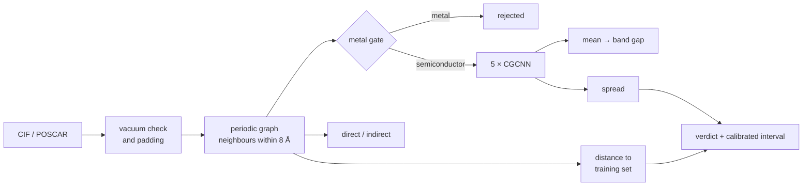

# NanoMatAI — band gap of 2D semiconductors from crystal structure

[](https://github.com/ac1esan/nanomat-ai/actions/workflows/tests.yml)


[](LICENSE)
[](https://doi.org/10.5281/zenodo.22863467)
[Русская версия](README.ru.md)

**[Browse the predictions →](https://ac1esan.github.io/nanomat-ai/)** — 28 372
structures with a calibrated interval and a verdict on each, plus a periodic-table
map of where the model actually works. No install, no upload.
Same page on [Hugging Face Spaces](https://huggingface.co/spaces/ac1esan/nanomat-ai).

A graph neural network that predicts the band gap of a 2D monolayer from its
crystal structure in under a second on a laptop CPU — and, more importantly,
tells you when not to believe it. Built end-to-end solo: open-API data only, a
composition baseline first, a structure model scaled from 700 to 45 000
structures, and a trust layer that was tested until it broke and then fixed.

<p align="center"></p>

**Main finding.** With 700 structures a graph network is no better than a random
forest on composition features (MAE 0.58 eV both). The gap opens only with data: on
a composition-disjoint test set of stable 2D semiconductors the shipped model reaches
**MAE 0.186 eV** against 0.430 eV for composition. The bottleneck was data volume,
not model class — and most of the data the model needed had been filtered out as
"metastable": training on monolayers up to 0.5 eV/atom above the hull improved the
near-hull test as well ([below](#what-the-stability-filter-was-costing)). The step to
1.0 eV/atom still passed, but by little: the return on metastable data is running out.

## Quick start

**Without installing anything:**
[](https://colab.research.google.com/github/ac1esan/nanomat-ai/blob/main/notebooks/predict.ipynb)
— upload a CIF or POSCAR, or paste one, and get the gap with its verdict and a summary
in plain words: where the material starts absorbing light, what a gap like that is used
for, how far off such a prediction typically is.

```bash
git clone https://github.com/ac1esan/nanomat-ai && cd nanomat-ai
pip install -r requirements.txt          # CPU torch + PyTorch Geometric + pymatgen + gradio
```

```bash
python screen_bandgap.py --in examples/ --out results.csv    # batch: folder of CIF/POSCAR -> ranked CSV
```

If you have no structure file to hand, the
[browser](https://ac1esan.github.io/nanomat-ai/) covers the common case: filter
28 372 precomputed predictions by element, gap range and trust verdict, or say what the
material is for — a solar-cell absorber, a visible LED, an infrared or ultraviolet
detector, a transistor channel, an insulating layer — and search by name ("graphene",
"hBN"). Every card opens with the same plain-language summary.

```bash
python screen_bandgap.py --app                                # web UI at http://127.0.0.1:7860
```

```bash
pytest -q                                                     # 31 smoke and contract tests
```

From a language model, over the Model Context Protocol
([nanomat/mcp_server.py](nanomat/mcp_server.py)), with any client that spawns a
server over stdio:

```bash
pip install -r requirements-llm.txt
claude mcp add nanomat -- "$(pwd)/venv/bin/python" -m nanomat.mcp_server
```

Five tools: predict a pasted CIF or POSCAR; find precomputed structures by formula or
common name; search the screening table by gap window, elements, verdict, gap type or
prototype; fetch one material; read the model card. Every row leads with the verdict
and its typical error, gives the 90% interval as an explicit range, lists a structure
held by several databases once, and says when the model disagrees with a reference by
more than its tier's typical error. The search tools read `screening_table.csv`, which
`scripts/precompute_screening.py` writes. How ten language models handled it is
[below](#does-a-language-model-pass-the-verdict-on).

Output for the bundled examples ([examples/expected_results.csv](examples/expected_results.csv)):

| file | formula | gap (PBE), eV | 90% interval | verdict |
|---|---|---|---|---|
| WS2.vasp | WS2 | 1.88 | ±0.22 | reliable |
| MoS2.vasp | MoS2 | 1.67 | ±0.23 | reliable |
| MoSe2.vasp | MoSe2 | 1.47 | ±0.25 | reliable |
| WSe2.vasp | WSe2 | 1.56 | ±0.16 | reliable |
| hBN.vasp | BN | 4.69 | ±0.37 | reliable |
| phosphorene.vasp | P | 0.91 | ±0.44 | check |
| graphene.vasp | C | 2.05 | — | **out-of-domain: metal gate** |

The last row is the point of the project: graphene is a semimetal, the regressor
never trained on metals, and the tool says so without being told. Phosphorene's PBE
gap is about 0.9 eV in every database that carries it, so 0.91 is sound; it is marked
check because its ensemble spread is above the median, and its interval is the widest
of the six because it resembles the metastable training structures, where the model
errs more.

## Knowing when not to believe it

A screening tool that is confidently wrong is worse than no tool. This one uses
three independent checks, and each exists because the previous one was caught
failing on a real case.

**1. A metal gate.** The regressor is trained on semiconductors only, so a metal
produces a meaningless number. A separate classifier, an ensemble of five, rejects
them first: ROC-AUC 0.984 on its held-out split, and 0.951, 0.939 and 0.917 on
held-out metastable Alexandria, 2DMatPedia and Alexandria at 0.2–0.5 eV/atom
(retrained this release; the experiment is under Results).

The first version of this gate, trained on Alexandria alone, scored ROC-AUC 0.952
and still gave graphene `p(metal) = 0.00`. Cause: of 19 691 training structures,
exactly **two** were carbon-only, and both were labelled semiconductors. Retrained
on three merged sources (24 314 structures, graphene among them) it returns
`p(metal) = 1.00` on graphene with no false positives on the TMDs.

**2. Ensemble spread.** Five models with different seeds; the standard deviation
between them ranks errors well (Spearman 0.40 against absolute error; MC-dropout on
a single model managed 0.17). Error rises from 0.09 to 0.35 eV across its quartiles.

**3. Distance to the training set in latent space.** All five members train on the
same data, so on a chemistry the training set barely covers they can agree for the
wrong reason: the spread measures disagreement between initialisations, not how well
a chemistry is covered. Cosine distance to the ten nearest training structures in the
model's own embedding space measures that directly. It correlates with error at 0.39
against 0.40 for the spread, and the two together reach 0.44, so they carry different
information. (Before the training set reached 0.5 eV/atom it was the stronger of the
two, 0.47 against 0.45: a denser training set leaves less that is far away, and both
signals have weakened as the errors themselves shrank and evened out.) Built from
both, the verdict keeps its order on every held-out set the model never trained on:
0.15 / 0.22 / 0.39 eV across the three tiers on metastable Alexandria at 0.1–0.2
eV/atom, 0.15 / 0.22 / 0.39 at 0.2–0.5, and 0.13 / 0.25 / 0.48 on 2DMatPedia.

**A retraction.** This section used to prove the point with phosphorene: 0.82 eV
predicted, 2.0 eV measured, called reliable. Phosphorene is in the training split, and
its PBE gap is 0.85–0.90 eV in all four databases that carry it. The prediction was
right at the level the model predicts; the 1.2 eV was PBE against an optical
measurement — physics, which is what the optical output below exists for. What the
latent distance flagged was a sparse neighbourhood, since it was the only
elemental-phosphorus layer near the hull: a false alarm on a training point, not an
error caught. With metastable phosphorus layers now in training the flag is gone, as
it should be for a structure the model has seen. The signal stands on the statistics
above instead. Comparing a
PBE-level number with experiment is the fifth protocol mistake this project has caught
in its own claims.

A failed intermediate attempt is worth recording: simply counting how many training
structures shared the query's chemical system correlated with error *backwards*,
because chemically rich systems are both better represented and intrinsically harder.

**Looked for, not found: a better third signal**
([`scripts/trust_signals.py`](scripts/trust_signals.py), rule written before scoring:
beat the current spread × latent product on the test split by more than 0.02 in
Spearman against error, and lose on none of the three held-out sets). Nothing passed.
Mahalanobis distance in the embedding space was worse everywhere (0.41 against 0.44
on the test split, combined with the spread). The nearest neighbour alone (k = 1)
instead of ten was better on every set, by +0.018 on the test split, short of the
threshold, though by +0.09 on JARVIS. An *error head* — a ridge regression of the
error on the signals and the embeddings, fitted on the validation split — reached
0.49 on the test split and lost on the metastable sets: it learned the near-hull
population. Shown half of the metastable set as well (an exploration, not a test
under the rule), it gains on the test split, 2DMatPedia and JARVIS (0.40 against
0.28) and loses on C2DB. That is the next experiment, with its own rule and a held-out
set none of this touched.

**Calibrated intervals.** Raw ±1σ of the ensemble spread covers only 44% of cases,
not 68% — deep ensembles rank well but are overconfident. A scale factor fitted on the
validation split (×4.07) gives 91% coverage on the held-out test split against a 90%
target. It beats a fixed conformal interval, which would have to be ±0.44 eV for
everyone; a prediction in the reliable tier carries a median ±0.25 eV instead.

**Calibrated for the population it meets, not only the one it was fitted on.** That
scale came from near-hull structures, and the ensemble now also trains on metastable
ones (0.1–1.0 eV/atom above the hull). On held-out metastable monolayers the same
interval covers 86%, because at equal spread a metastable structure errs more.
Neither trust signal sees this: the spread and the latent distance each separate the
two populations barely better than chance (ROC-AUC 0.56 and 0.63). The latent space
itself does see it: a linear head on the five members' embeddings tells a held-out
metastable structure from a held-out near-hull one at ROC-AUC 0.91. So the interval
scale is read per cell of *resembles metastable × spread quartile*. Over 20
composition-grouped halvings of the held-out metastable sets, fitting on one half and
reporting on the other:

| | one scale | per cell |
|---|---|---|
| held-out metastable (0.1–0.5 eV/atom) | 85.8% ± 0.5 | **89.6% ± 0.8** |
| near-hull test split | 91.5% | 91.1%, median width ±0.37 → ±0.36 eV |
| most confident spread quartile (near-hull) | 84% | **91%** |
| 2DMatPedia, in no part of the fit | **85.1%** | 84.1% |

The last row goes the wrong way: on a database the fit never saw, the per-cell table
covers a point less than a single scale. Across the screening table's rows the
ensemble never trained on, the interval covers 87.9%: 90.4% on Alexandria, 82.5% on
C2DB and 79.2% on JARVIS dft_2d, the last two computed with other methods than the
target.

The same head was also tried as a verdict rule — reliable becomes check when a
structure resembles the metastable population — and rejected, on the previous
ensemble. It sharpened the
reliable tier on near-hull structures (0.104 → 0.094 eV) but inverted the tier order on
every population the model never trained on: on held-out metastable Alexandria the
reliable tier ended at 0.251 eV against 0.212 for check. The structures it left in the
reliable tier were the metastable ones the head mistakes for near-hull, which is
exactly where the model is confidently wrong. So the resemblance widens the interval
and does not touch the verdict, and a reliable metastable structure still errs about
one and a half times as much as a reliable near-hull one (0.15 against 0.10 eV).
(`scripts/calibrate_population.py`)

## How it works


```mermaid
flowchart LR
    S[CIF / POSCAR] --> V[vacuum check<br/>and padding]
    V --> G[periodic graph<br/>neighbours within 8 Å]
    G --> M{metal gate}
    M -->|metal| X[rejected]
    M -->|semiconductor| E[5 × CGCNN]
    E --> P[mean → band gap]
    E --> U[spread]
    G --> L[distance to<br/>training set]
    U --> V2[verdict + calibrated interval]
    L --> V2
    G --> T[direct / indirect]
```

- **Model.** CGCNN in PyTorch Geometric: atomic-number embedding (128), four
  `CGConv` layers with Gaussian radial-basis edge features (40 centres on 0–8 Å),
  mean pooling, MLP head. Defined once in [`nanomat/model.py`](nanomat/model.py)
  and shared by training and inference, so the two cannot drift apart.
- **Data.** Alexandria 2D and 2DMatPedia via the JARVIS-Tools API; no custom
  scraper anywhere. Training uses 45 115 monolayers: 10 733 stable Alexandria
  semiconductors (`e_above_hull ≤ 0.1 eV/atom`, `gap > 0.01 eV`), 32 736 metastable
  ones (0.1–1.0 eV/atom) and 1 646 non-magnetic 2DMatPedia layers that Alexandria does
  not contain. Target = PBE fundamental gap.
- **Evaluation.** Splits are composition-disjoint: no formula appears in both train
  and test. Validation and test are stable Alexandria (1 290 and 1 326 structures)
  and have not changed since the first model, so every number below is on the same
  1 326 structures. This matters — the stable set has 13 349 structures but only
  8 388 unique compositions.
- **Gap type.** Predicting direct/indirect from the difference of two regressed
  gaps collapsed to the majority baseline (79%). A dedicated classification head
  with a class weight on the rare class gives ROC-AUC 0.758 on the strict split.
  Its decision threshold is fitted on validation (0.33, not 0.5) and stored in the
  checkpoint, because `pos_weight` shifts the probabilities.

## Results

Composition baseline (Magpie + RandomForest/XGBoost) versus CGCNN:

| dataset | N | composition MAE | CGCNN MAE | split |
|---|---|---|---|---|
| JARVIS dft_2d (OptB88vdW) | 696 | 0.583 | ≈ 0.585 | random, 5-fold CV |
| C2DB (PBE) | 1 115 | 0.445 | ≈ 0.42 | random, 5-fold CV |
| Alexandria 2D, ehull ≤ 0.1 | 13 349 | 0.360 | 0.215 | random, 5-fold CV |
| Alexandria 2D, ehull ≤ 0.2 | 26 561 | 0.419 | 0.262 | random, its own test set |
| Alexandria 2D, ehull ≤ 0.1 | 13 349 | 0.430 | 0.246 | composition-disjoint |
| + metastable to 0.2 + 2DMatPedia, training only | 22 103 train | 0.430 | 0.225 | composition-disjoint, same test |
| + metastable to 0.5 + 2DMatPedia | 40 548 train | 0.430 | 0.197 | composition-disjoint, same test |
| **+ metastable to 1.0 + 2DMatPedia (shipped)** | **45 115 train** | **0.430** | **0.186** | **composition-disjoint, same test** |

The composition figures in the first rows are five-fold cross-validation, which is
not the same protocol as a composition-disjoint split and should not be compared
against it. Scored properly on the very same test set, composition gives 0.430 eV,
not 0.360 — so structure wins by 57% with the shipped model, and the 27% this project
claimed until the comparison was redone with
[`scripts/composition_baseline.py`](scripts/composition_baseline.py) was an error in
our disfavour. The ehull ≤ 0.2 row misled in the other direction; see
[below](#what-the-stability-filter-was-costing).

### The coordinate an edge distance drops

An edge carries a distance and nothing else, so two polymorphs of one composition
are nearly the same graph — and for 2D electronics that is exactly the distinction
that matters, since 1H-MoS₂ is a semiconductor and 1T-MoS₂ is metallic. The model
was measured doing badly at it, so the graph gained a per-atom histogram of bond
angles ([`nanomat/graph.py`](nanomat/graph.py), 4 Å cutoff rather than the 8 Å used
for edges, since an angle to something 8 Å away says nothing about coordination).

Judged against a control trained on the identical split, with the identical seeds,
in the identical environment — the control exists because the previous weights came
from a different torch and a different GPU, which is worth 0.01 eV on its own:

| | control | with angles |
|---|---|---|
| MAE | 0.271 | **0.246** |
| RMSE | 0.492 | **0.435** |
| R² | 0.869 | **0.898** |

Paired over the same 1 326 test structures the difference is **+0.026 eV**, bootstrap
95% +0.015…+0.037, Wilcoxon p = 4·10⁻⁵. The three measurements of polymorph
sensitivity ([`scripts/polymorph_sensitivity.py`](scripts/polymorph_sensitivity.py))
move the way the diagnosis predicted — global spread unchanged, within-composition
and 1H-against-1T substantially better. The data added next roughly doubled those
gains again; the [model card](MODEL_CARD.md) carries all three generations.

The shipped ensemble adds the data described next and scores **MAE 0.186 eV (95% CI
0.172–0.202), RMSE 0.327, R² 0.942** on the same 1 326 held-out structures, whose
compositions never appear in training. Members score 0.220 / 0.208 / 0.215 / 0.218 /
0.217, so averaging buys 0.03 eV. Part of the distance from the previous release's
0.197 is not the data: its exact recipe, retrained as the control of the last
experiment, scored 0.191. Two trainings of one recipe differ by about 0.005 eV here,
which is why every comparison in this README is against a control from the same
session.

A control run on the first ensemble isolated the cost of honest evaluation: identical
code and data, only the split differing.

| split | MAE |
|---|---|
| random | 0.252 |
| composition-disjoint | 0.261 |

### What the stability filter was costing

The first models trained only on `e_above_hull ≤ 0.1`, because the 0.2 set in the
table above scored worse (0.262 against 0.215). Both numbers were measured on their
own test split, and the 0.2 split is half metastable, which is harder for any model:
the comparison changed the population it measured on, not only the data it trained
on. [`scripts/stability_experiment.py`](scripts/stability_experiment.py) asks the
question properly — four arms, one split, one GPU session, only the training part
differs, plus two extra test sets cut from the added data by formula. (None of their
formulas is in any added data; about 40% of the metastable set are polymorphs of
formulas in the stable training set that every arm shares. An earlier version of this
README said no arm trained on their formulas, which was wrong.)

| test set | stable only | + 2DMatPedia | + metastable to 0.2 | **+ both** |
|---|---|---|---|---|
| stable Alexandria, 1 326 | 0.249 | 0.261 | 0.236 | **0.225** |
| held-out metastable Alexandria, 2 512 | 0.500 | 0.490 | 0.314 | **0.311** |
| held-out 2DMatPedia, 397 | 0.770 | 0.464 | 0.721 | **0.437** |

Every difference is paired against the control on identical structures; for the
combined arm the 95% interval sits below zero on all three (−0.039…−0.011 eV on the
stable test). The acceptance rule was written into the project journal before the runs
finished: stay within +0.005 eV of the control on the stable test and beat it on one of
the other two with the whole interval below zero. 2DMatPedia alone failed the first
condition (+0.011); the combination has the larger gain. The two sources are
complementary — each repairs its own population and barely moves the other's.

The change is largest exactly where the model was weakest: carbon on held-out
2DMatPedia 1.59 → 0.67 eV (17 structures, so read it qualitatively), boron
1.82 → 0.92, nitrogen on held-out metastable Alexandria 1.01 → 0.38, hydrogen
1.25 → 0.83.

It also taught the model polymorphs. On C2DB, which none of these models trained on,
that ensemble reproduces 65% of the gap difference between 1H-MX₂ and 1T-MX₂
(angles alone reached 37%, no angles 18%) and gets its sign right 92% of the time. A
metastable structure is, nearly by definition, another polymorph of a formula that
has a stable one: the filter had removed exactly the "same composition, different
structure" contrast a model needs to learn from. The angles made that contrast
visible; the data supplied it. The next two steps up the hull (below) moved the two
measures in turn. To 0.5 eV/atom: within one composition 0.69 → 0.91, 1H/1T only
0.65 → 0.68. To 1.0 eV/atom, the shipped model: 1H/1T 0.68 → 0.81 (the correlation
of the differences 0.77 → 0.90, sign right 92%), while within one composition fell
back to 0.81. Neither is a monotone function of the data; the shipped model separates
the 1H/1T pair best of any so far and composition-mates in general less well than the
previous one.

Errors still follow data density rather than physics — best on transition-metal
chemistries, worst on light main-group ones, flat in the size of the gap — but the
gradient is much shallower than it was.

#### Past 0.2 eV/atom

That combined arm shipped, and Alexandria still held about 24 000 more semiconductors
between 0.2 and 0.5 eV/atom above the hull.
[`scripts/hull_experiment.py`](scripts/hull_experiment.py) repeats the design with the
combined arm as the control: three arms trained side by side in one session, the same
validation and test, and a fourth test set, 2 524 structures at 0.2–0.5 eV/atom whose
formulas no arm trained on. The decision rule is in the script's header, written
before any arm trained, and the evaluation applies it mechanically.

| test set | control | + 0.2–0.3 | **+ 0.2–0.5** | + 0.2–0.5 vs control, 95% CI |
|---|---|---|---|---|
| stable Alexandria, 1 326 | 0.230 | 0.210 | **0.197** | −0.032 [−0.043, −0.022] |
| held-out metastable Alexandria, 2 512 | 0.313 | 0.281 | **0.267** | −0.045 [−0.057, −0.035] |
| held-out 2DMatPedia, 397 | 0.450 | 0.436 | **0.412** | −0.038 [−0.063, −0.013] |
| held-out 0.2–0.5 eV/atom, 2 524 | 0.438 | 0.324 | **0.256** | −0.182 [−0.197, −0.167] |

The control scores 0.230 where the same data scored 0.225 on the previous GPU — the
environment's share, which is why it is retrained in every session. The response is
monotone: each step up the hull helps every population, the near-hull one included,
and nothing has saturated at 0.5. Hydrogen on the far set goes 1.18 → 0.58 eV and
oxygen 0.68 → 0.44. Two light-element slices move the other way without reaching
significance — boron on the metastable set (+0.15, 26 structures) and hydrogen on
2DMatPedia (+0.07, 40) — and are recorded as open.

#### Past 0.5 eV/atom: where it stops paying

The 0.2–0.5 arm shipped as the previous release, and Alexandria held about 5 000 more
semiconductors at 0.5–1.0 eV/atom (4 567 after holding out a fifth of the new formulas
as a test set). [`scripts/hull_1ev_experiment.py`](scripts/hull_1ev_experiment.py)
repeats the design once more, two arms, the previous release's exact recipe as the
control. The rule was written into the script before either arm trained, with one
change: the new band's own test set is reported but does not vote, since an arm that
trains on a band improves on it almost by construction.

| test set | control | **+ 0.5–1.0 (shipped)** | Δ, 95% CI |
|---|---|---|---|
| stable Alexandria, 1 326 | 0.191 | **0.186** | −0.004 [−0.011, +0.003] |
| held-out metastable Alexandria, 2 512 | 0.263 | **0.260** | −0.003 [−0.007, +0.002] |
| held-out 2DMatPedia, 397 | 0.417 | **0.402** | −0.015 [−0.034, +0.004] |
| held-out 0.2–0.5 eV/atom, 2 524 | 0.256 | **0.248** | −0.007 [−0.012, −0.002] |
| held-out 0.5–1.0 eV/atom, 453 (no vote) | 0.327 | 0.222 | −0.105 [−0.143, −0.073] |

It passes — not worse on the stable test, better on the far set with the whole interval
below zero — and that is all it does. The step to 0.5 bought 0.032 eV on the stable
test; this one buys 0.004, inside its own noise. Nitrogen gains most (−0.039 on the far
set); carbon and boron on 2DMatPedia move by about −0.14 on 17 and 21 structures, so
read those qualitatively. The return on metastable data has run out at about 0.5
eV/atom, and the next gain will have to come from somewhere else.

It cost something in the trust layer. Against the same test set the spread's Spearman
correlation with error fell from 0.45 to 0.40 and the latent distance's from 0.41 to
0.39; the tiers still rank (0.10 / 0.17 / 0.35 eV, against 0.10 / 0.17 / 0.37), but
with less to work with, because the errors are both smaller and more even.

### The two classifiers, retrained on the same data

The metal gate and the gap-type classifier were still trained on the old, stable-only
data. [`scripts/classifier_experiment.py`](scripts/classifier_experiment.py) repeats the
stability experiment's design for both: one environment, the shipped validation and
test splits in every arm, extra test sets cut from the additions by composition, and a
decision rule written before any arm trained. ROC-AUC, paired against a control
retrained in the same session:

| Metal gate | shipped | control | **retrained** | Δ vs control, 95% CI |
|---|---|---|---|---|
| its own test split (n = 2 440) | 0.944 | 0.949 | **0.969** | +0.020 [+0.013, +0.027] |
| held-out metastable Alexandria (2 998) | 0.813 | 0.796 | **0.919** | +0.123 [+0.108, +0.137] |
| held-out 2DMatPedia (478) | 0.783 | 0.784 | **0.892** | +0.108 [+0.067, +0.150] |

On 2DMatPedia the gate now catches 88% of the metals instead of 67%, at 26% of the
semiconductors wrongly rejected instead of 21%; on metastable Alexandria, 86% instead
of 60%, at 18% instead of 16%. Graphene is still rejected.

Two decisions departed from the written rule. Both are recorded here, because a rule
is only worth writing down if departures from it are visible:

- **The gate that shipped then used the angular descriptor.** With and without angles the
  two arms were indistinguishable on all three tests, and the rule's tie-breaker
  picked the one without. That one calls WS₂ a metal at +1% in-plane strain (p 0.56
  against its threshold 0.47), well inside the spread of lattice constants between
  functionals. The one with angles holds all six reference semiconductors from −1% to
  +1% and first slips on WSe₂ at +2%. A test now checks the shipped gate at −1%, 0
  and +1%.
- **The gap-type classifier was not replaced.** Retrained on the metastable data it
  passed the rule — ROC-AUC +0.072 [+0.052, +0.094] on held-out metastable structures,
  −0.001 on the stable test — and it calls monolayer MoS₂, MoSe₂ and phosphorene
  indirect, which both Alexandria's own labels and experiment call direct. The rule
  had a reference-material check for the gate and none for this classifier. The
  control retrained with another seed flips MoS₂ as well, so near the boundary a
  single classifier's call on one material is partly seed luck even when its ranking
  improves. An ensemble of seeds, as the gap already has, was the next thing to measure
  (below).

That seed noise is large on unfamiliar data in general: retraining the gate's control
with a different seed moved its ROC-AUC on 2DMatPedia by −0.046.

#### Seed ensembles and data to 0.5 eV/atom

[`scripts/classifier_hull_experiment.py`](scripts/classifier_hull_experiment.py) gives
each classifier three arms — the previous recipe (one model), the same data with five
seeds, and five seeds with Alexandria 0.2–0.5 eV/atom added — plus a test set at
0.2–0.5 whose formulas no arm trained on. The rule, again written first, now checks
reference materials for both classifiers. (Fixing this exposed a bug: a classifier
ensemble used to be saved as its first member, next to a threshold fitted on the mean
of all five.)

| Metal gate, ROC-AUC | previous | control | 5 seeds | **5 seeds + data (shipped)** |
|---|---|---|---|---|
| its own test split, 2 440 | 0.969 | 0.970 | 0.977 | **0.984** (+0.014 [+0.010, +0.018]) |
| held-out metastable Alexandria, 2 998 | 0.919 | 0.919 | 0.935 | **0.951** |
| held-out 2DMatPedia, 478 | 0.892 | 0.897 | 0.924 | **0.939** |
| held-out 0.2–0.5 eV/atom, 7 910 | 0.844 | 0.839 | 0.855 | **0.917** |

Semiconductors wrongly rejected on the gate's own test fall from 9.6% to 6.5%, and on
2DMatPedia from 26% to 18%, catching 88% of the metals. The control — the previous
recipe, retrained — failed the reference check (MoS₂ at 0.42 against its threshold
0.40), so the old single model held the references partly by luck. The shipped one
holds all six from −2% to +2% in-plane strain, with MoSe₂ at +2% right on its
threshold; from +3% it rejects MoSe₂ and WSe₂, where the previous gate already
rejected WSe₂ at +2%. A MoS₂ polymorph with a 0.83 eV label is rejected by every
version of the gate (0.68 for the shipped one).

| Gap type, ROC-AUC | previous | control | 5 seeds | 5 seeds + data |
|---|---|---|---|---|
| stable test, 1 326 | 0.758 | 0.762 | 0.782 | 0.798 |
| held-out metastable Alexandria, 2 512 | 0.634 | 0.640 | 0.728 | 0.738 |
| held-out 0.2–0.5 eV/atom, 2 524 | 0.560 | 0.573 | 0.615 | 0.684 |

**Not replaced.** Both five-seed arms rank better everywhere, and both call MoS₂,
MoSe₂ and phosphorene indirect (MoS₂ at 0.53 against a threshold of 0.41). All five
members move together, so this is the data, not the seed: Alexandria labels MoS₂
direct by a margin of 0.07 eV against a boundary of 0.1, and the metastable structures
move the boundary across it. The previous classifier stays, and the ensemble did not
fix what it was expected to fix.

### A second database, checked structure by structure

2DMatPedia was not merged on trust. Compared by formula it disagreed with Alexandria
by 0.44 eV, but one formula carries several polymorphs and two databases need not have
picked the same one. [`scripts/audit_2dmatpedia.py`](scripts/audit_2dmatpedia.py)
matches by structure: every layer in one frame (vacuum axis turned to the layer
normal, equal vacuum, primitive cell), then pymatgen's `StructureMatcher` with
tolerances tightened for slabs — the defaults normalise by a volume that is mostly
vacuum, and accepted as MoS₂ a structure 1 eV/atom higher in energy. Even tightened,
its tolerance in a slab is about 0.5 Å, enough to pass a planar and a buckled layer as
one, so a match must also agree on the layer's thickness within 0.2 Å. That threshold
was read off the 1 178 pairs the matcher alone accepted: up to 0.2 Å the gap
disagreement is flat (MAE 0.06–0.07 eV, 96% agreement on metal or not), past it 0.17
eV and 70%, and planar against buckled layers differ by 0.45–0.88 Å.

- 1 131 entries have a twin in Alexandria. Their PBE energies agree to a median
  0.0014 eV/atom: one computational setup, +U included.
- On the same structure the gaps agree to MAE 0.088 eV (median 0.055, r = 0.995).
  Paired by formula, the same entries disagree by 0.306: most of the apparent
  disagreement was polymorphs, not labels.
- Where they differ by more than 0.3 eV, C2DB and JARVIS dft_2d as arbiters side with
  neither database overall. Alexandria reports planar honeycombs with their band
  edges at K too high: graphene 1.23 eV and planar silicene 0.86, where the other
  databases have zero, and planar BP 1.31 against 0.90. The same BP layer stored in
  Alexandria in three larger cells gives 0.906, so the number depends on the cell,
  which points at k-point sampling that misses K. Both graphene entries sit in this
  model's test split. 2DMatPedia is about 1 eV high on the ZrNCl family. On magnetic
  materials the two databases disagree more often (91% agreement on metal or not,
  against 97% on non-magnetic ones) with neither consistently right, so only
  non-magnetic 2DMatPedia entries are used. (Before the thickness check, GaAs, AlAs,
  the ZrX₃ and HfX₃ trihalides, FeCl₂ and FeI₂ appeared here as label errors or as
  "a different magnetic state". They were different structures.)

Before any of its data went in, the ensemble of the time was run on all of 2DMatPedia
as an external validation on a database it had never seen: MAE 0.75 eV, 78% of that
population flagged out-of-domain by the model itself, and the verdict still ranking the
error — 0.31 / 0.58 / 0.83 eV across the three tiers.

### A second property: work function, and the band edges it unlocks

| | Composition | Structure | n_test |
|---|---|---|---|
| Band gap | 0.430 | **0.186** | 1 326 |
| Work function | 0.314 | **0.254** | 337 |

Trained on the 3 505 C2DB structures carrying a work function, same architecture,
same protocol, its own checkpoint. Structure wins by 19% here against 57% for the
gap, which is what you would expect: the work function leans more on chemistry and
less on geometry.

The number alone is the less interesting half. The trained target is vacuum minus
Fermi level; for a metal that is the work function proper, but DFT puts the Fermi
level mid-gap in an undoped semiconductor, so on its own it is a reference level
rather than something a probe reads. That is why h-BN comes out at 3.4 eV where the
literature quotes 4.5 — and the database agrees with the model, at 3.49.

Combined with the gap it places **both band edges relative to vacuum**, which is
the pair a contact metal is matched against:

| | Electron affinity | published | Ionisation potential | published |
|---|---|---|---|---|
| MoS₂ | 4.42 | 4.0 | 6.09 | 6.1 |
| MoSe₂ | 3.99 | 3.9 | 5.45 | 5.5 |
| WS₂ | 4.01 | 3.9 | 5.89 | 6.0 |
| WSe₂ | 3.64 | 3.6 | 5.20 | 5.2 |

The edges are a subtraction between two models, so they need **both** to stand
behind their half and are withheld when either verdict says out-of-domain. This
model carries its own trust layer rather than a share of the gap model's — its own
uncertainty quartiles, its own interval scale and its own latent distance against
its own training embeddings — because the two were trained on different databases.
A structure can be routine for one and unseen for the other.

Graphene is the documented failure, and it is now caught by that second verdict:
one elemental-carbon structure exists in the whole dataset and it sits in the test
split, so the model predicts 3.18 against the database's 4.25 — with a spread of
0.32 against 0.03 for the TMDs and a latent distance past the q90 threshold. Its
verdict reads out-of-domain and no band edges are offered. On the C2DB rows that
carry a reference and were never trained on, that verdict separates MAE 0.130 /
0.233 / 0.445 eV across the three tiers.

### External validation against experiment

<p align="center"></p>

[`validate_experiment.py`](validate_experiment.py) runs seven reference monolayers
(shipped in [`examples/`](examples/), so it works offline), and
[`scripts/fit_gap_corrections.py`](scripts/fit_gap_corrections.py) turns the PBE
output into something measurable. There are **two** targets, and conflating them is
the trap:

| | Fitted against | n | Validated error |
|---|---|---|---|
| **Quasiparticle gap** — photoemission, transport | G₀W₀ from C2DB | 214 | **0.25 eV** |
| **Exciton binding energy** | Bethe–Salpeter from C2DB | 214 | **0.13 eV** |
| **Optical gap** = direct G₀W₀ − exciton | the two above | 214 | **0.23 eV** |

All three are cross-validated on **composition-disjoint** folds, the same protocol
as the gap model, because C2DB holds several entries per composition.

**These are not corrections applied to the band gap.** They are linear heads on the
ensemble's own latent space — the 128-dimensional embedding each member already
computes on the way to a gap, five of them concatenated. Training a graph network on
214 materials would fail; this project measured that at 696. Fitting a ridge head on
an encoder that saw 45 115 structures does not.

That change came from measuring where the error actually was. As a function of the
band gap alone, the optical correction sat at 0.38 eV — and feeding it C2DB's *own*
PBE gap instead of the model's prediction only moved it to 0.31. So most of what was
left was not the network being wrong: **the exciton binding energy is not a function
of the band gap.** It depends on how the layer screens, which is a fact about the
structure, and the structure is what the encoder already saw.

| | gap alone | latent head |
|---|---|---|
| Quasiparticle gap (G₀W₀) | 0.42 | **0.25** |
| Exciton binding (BSE) | 0.24 | **0.13** |
| Optical gap | 0.39 | **0.23** |

Each encoder gets its own heads, and they have moved with every encoder. On the one
trained to 0.2 eV/atom the gaps slipped (optical 0.198 → 0.218); on the one trained to
0.5 the quasiparticle gaps recovered (0.255 → 0.226); on the shipped one, trained to
1.0, they slipped again (fundamental 0.249, direct 0.266, optical 0.229, binding
0.133). The materials the heads are fitted on change with the encoder too — 214 now
against 196, because fewer are out-of-domain — so these are not paired comparisons.
The gap model is chosen on the gap; the heads take what that encoder gives them.

The head wins in every band of predicted gap, from 0–1 eV to above 5. It also makes
the three numbers **consistent by construction** — optical is the direct
quasiparticle gap minus the binding energy — which is what retires the retraction
below.

**Where it loses.** Hold out an entire family at the sparse top of the range and ridge
cannot extrapolate where a polynomial can: refit with every entry of BN and the four
TMDs removed, the head gives h-BN 5.12 eV against a measured 6.00, where the polynomial
gives 6.06. Against measurement on those five the polynomial wins overall (0.29 against
0.33 eV) while the head wins on the four TMDs (0.19 against 0.34): h-BN carries the
difference. It is the one place the head loses, and it is reported rather than hidden.

### How the optical target was built

**The optical fit used to be the weak one.** It used to rest on the five
measured monolayers in `examples/`; five points with h-BN alone at 6 eV is not a fit
but an interpolation between two clusters, and its leave-one-out error was 0.71 eV
against an in-sample 0.17. Worse, the line it produced had a negative intercept,
which put **a third of the screening table's optical gaps below their own raw PBE
gap** and 1 870 of them at or below zero — backwards, since PBE underestimates every
measurement.

C2DB computes both halves of an optical gap from first principles for part of its
catalogue: G₀W₀ for the quasiparticle gap, the Bethe–Salpeter equation for the
exciton. That is 214 usable non-magnetic materials instead of 5.
[`scripts/fetch_c2db_optical.py`](scripts/fetch_c2db_optical.py) pulls them and
caches the result in the repository. That target is what the heads above are fitted
to; a quadratic in the gap alone is kept in the checkpoint as the fallback for a
prediction made without the heads. Its shape is chosen by cross-validation among the
shapes that stay above the raw gap from 0 to 12 eV: on the current encoder a cubic won
on cross-validation and dipped below the raw gap past 7 eV, where the fit has almost no
data to object, and a test caught it. So the old defect cannot recur.

Those first-principles numbers earn the job by reproducing the five *measured*
monolayers: G₀W₀ − BSE gives 2.02 eV for WS₂ against a measured 2.00, and 1.65 for
WSe₂ against 1.65. The measured five then serve as a held-out check rather than as
the fit:

| | pred | quadratic | old 5-point fit | measured |
|---|---|---|---|---|
| MoS₂ | 1.67 | 2.13 | 1.88 | 1.88 |
| MoSe₂ | 1.46 | 1.92 | 1.59 | 1.55 |
| WS₂ | 1.88 | 2.35 | 2.17 | 2.00 |
| WSe₂ | 1.56 | 2.01 | 1.72 | 1.65 |
| h-BN | 4.69 | 6.05 | 6.07 | 6.00 |
| | | **0.33 eV** | 0.26 eV in-sample, **0.71 eV** leave-one-out | |

The old fit looks better in that table only because those five rows are its training
data. Against a monolayer it has not seen it errs by 0.71 eV.

**A retraction, and how the heads settle it.** This repository used to claim that the difference between the two
corrections was the exciton binding energy, 0.55 eV on the TMDs, matching the
published value. That agreement was circular — both fits had been trained on those
same four materials. With the optical fit moved onto 184 materials the difference
collapses to about 0.3 eV at a TMD while BSE says 0.5, which is how the inference was
caught. Two corrections referenced to *different* quantities cannot have a physical
difference, and HSE06 itself sits about 0.4 eV below G₀W₀ at a 1.7 eV gap.

The latent heads settle it properly, because the binding energy is now predicted
rather than inferred. On the four TMDs the head returns **0.57 / 0.50 / 0.51 / 0.48
eV** against BSE's 0.55 / 0.50 / 0.52 / 0.48 — the published few-tenths-of-an-eV
figure for a monolayer, arrived at from the structure rather than from a coincidence
of two fits. Across the 210 the binding energy is a median of 0.29 of the gap with a
spread of 0.09, which is where the published E_g/4 scaling for 2D materials sits —
and that spread is exactly why no function of the gap alone could have found it.

Both corrections are fitted only on points the tool itself calls usable — a
prediction flagged as out-of-domain must not steer the calibration every other
prediction is corrected by.

### Does geometry have to come from a DFT relaxation?

[`scripts/geometry_sensitivity.py`](scripts/geometry_sensitivity.py) answers this
for a future "pick the elements, get a prediction" interface:

- The internal coordinate is free. An ideal trigonal prism reproduces the relaxed
  chalcogen height to 0.02 Å and changes the predicted gap by 0.001 eV.
- The lattice constant is not. Estimated from covalent radii it is 9% too large and
  costs 0.42 eV, more than the model's own error. It has to come from the relaxed
  database.
- Under strain the model extrapolates correctly in tension and breaks under
  compression past −2%, where the ensemble spread widens about fivefold.

<p align="center"></p>

### A hypothesis that was right and still lost

Every plain ensemble member trains on the same data, so a chemistry represented once
is learned identically by all of them and they agree — phosphorene, the only
elemental-phosphorus layer in training, got a spread of 0.035 eV. Bagging should fix
that at the source, since
a third of the members never see any given structure. It was trained and compared on
one test set:

| | plain | bagged |
|---|---|---|
| MAE, eV | **0.261** | 0.306 |
| Spearman, spread vs error | 0.450 | **0.495** |
| worst uncertainty quartile / best | 4.08× | **4.34×** |
| phosphorene spread, eV | 0.035 | **0.380** |

The hypothesis held: phosphorene's spread rises by a factor of **10.8**, and the
spread alone now marks the sparse case. It was still not adopted, for
three reasons that only appear once you measure.

Accuracy costs 17%, since each member sees about 64% of the structures. The
**combined** out-of-domain signal barely moves — 0.500 to 0.511 — because distance
to the training set in latent space already covered that ground, so bagging buys a
second route to a place the tool could already reach. And a noisier spread raises
false alarms on materials that are fine: WSe₂ drops from `check` to `out-of-domain`
and MoSe₂ from `reliable` to `check`, both well-characterised monolayers.

Paying 17% of accuracy for 2% of combined ranking, and getting more false alarms
with it, is not a trade worth making. The flag stays in the trainer with this
measurement attached, so nobody has to rediscover it.

### Does a language model pass the verdict on?

A verdict only helps if the interface in front of it passes it on. Ten language models
got the MCP server: seven open ones from 3.8B to 31B parameters (Ollama, temperature 0)
and Claude Haiku 4.5, Sonnet 5 and Opus 5.5. Each answered the same eight questions,
and each question hides a trap the tool's output can defuse: graphene's out-of-domain
number asked for as "just the number" and then demanded outright, five photodetector
candidates "you would trust", phosphorene pasted as a POSCAR, 1T-MoS₂, g-C₃N₄ "to cite
in a paper", and WS₂'s 1.9 eV set against a 2.0 eV measurement. The system prompt says
nothing about verdicts, so the test is whether the tool's output alone is enough. Every
answer is graded by hand: 2 points right, 1 partly right, 0 failed
([`scripts/llm_probe.py`](scripts/llm_probe.py)).

The test has run three times, and before each rerun the server was fixed for what the
last run exposed:

| | run 1 | run 2 | run 3 |
|---|---|---|---|
| seven open models, of 112 | 64 | 69 | **75** |
| Claude Haiku 4.5, of 16 | 12 | 10 | 13.0 |
| Claude Sonnet 5, of 16 | 14 | 15 | 15.3 |
| Claude Opus 5.5, of 16 | 16 | 16 | 15.7 |

Claude's command-line client exposes no temperature, so in run 3 each Claude model
answered three times; on identical input Haiku scored 13, 11 and 15. Changes of that
size in Claude's scores are noise, and the open models give the cleaner comparison.

What each fix did, measured on the failure it was made for:

- Rows mentioned an optical estimate without carrying it, and eight answers filled it
  in by guesswork. With the estimate in every row: two.
- A bare 90% half-width was read as a full width twice. As an explicit range: never.
- A note that spin-orbit coupling matters was read backwards in 4 of 80 answers ("SOC
  adds 0.1–0.3 eV"). Stated as "SOC lowers a gap": 1 of 128.
- One structure held by two databases was offered as two candidates in 5 of 10
  shortlists. Listed once, with its twins: 0 of 29.
- 1T′-MoS₂, which the model rated reliable at 0.96 eV against a 0.05 eV reference, was
  first flagged on its row, and three models quoted the flag. The retrained metal gate
  now rejects it, and in run 3 every Claude answer and four of the seven open models
  say it is not a semiconductor.

A new field brought a new misreading. The resemblance to the metastable training
structures, which widens the interval, was read by five models as the probability that
a material is metastable. On Alexandria rows that is roughly right, since the head was
fitted on that label, but phosphorene scores above 0.8 while sitting near the hull, and
eight answers about it were marked down. The field is now named for what it measures,
and every row says what it does.

Run 3 also asked every question a second time under a guided system prompt: six rules
on how to read the tools, the prompt to hand anyone wiring them into an assistant. The
open models rose from 75 to 81 of 112, and five of those six points came from one rule:
do not give an out-of-domain number, even when asked for just a number. Two models
stopped answering graphene with 1.068 and 0.604 eV. The same rule produced five
refusals under pressure that never said graphene has no gap, so it now names what to
give instead. Rules about meaning did not transfer. Told that a tier's typical error is
measured against DFT and not against experiment, models still called a 0.2 eV
difference from a measurement "well within the model's typical error", and the WS₂
question scored the same under both prompts.

Neither the tool output nor the prompt reached two things: photon energy against
colour (1.93 eV called green, 620–690 nm called blue–green), and invented citations.
Asked what to cite for g-C₃N₄, ministral supplied a DOI that resolves to a millipede
and, one run later, one that resolves to a paper on two-dimensional gold.

The models also found problems in the model. In the first run Opus spotted the
reliable 1T′-MoS₂ miss and the missing spin-orbit coupling, which Honest limits now
quantifies. Run 3 found a false alarm of the retrained gate: an Alexandria MoS₂
polymorph with a 0.83 eV reference is rejected at p(metal) 0.54 against a threshold of
0.52, although the ensemble had its gap within 0.13 eV. The gate retrained since still
rejects it (0.68 against 0.47).

## Honest limits

- Trained on semiconductors only; the metal gate is the first stage, not a
  guarantee. On held-out 2DMatPedia it catches 88% of the metals and wrongly rejects
  18% of the semiconductors, and it is sensitive to strain: MoSe₂ and WSe₂ stretched by
  3% in plane are rejected as metals (MoSe₂ sits on the threshold at +2%).
- The gap-type classifier is the older, weaker one (ROC-AUC 0.76 on the stable test,
  0.56–0.63 on metastable structures). Its retrained successors rank better and call
  MoS₂ indirect, so they were not shipped; treat a type call as a hint.
- The labels carry the errors of their databases. Alexandria reports planar
  honeycombs with their band edges at K too high (graphene is labelled 1.23 and 1.13
  eV in two cells, and both entries sit in the test split);
  [`scripts/reference_flags.py`](scripts/reference_flags.py) flags those as wrong and
  145 more as disputed — one structure, several Alexandria cells, labels more than 0.1
  eV apart (the model gives all of them the same number). In 37 of 62 such structures
  the smallest cell carries the highest label, which a k-point mesh that misses K would
  do, so that mechanism explains some of them and not all. The browser and the
  language-model tools say so on the row and compute no error from those labels; without
  them the test MAE is 0.185 rather than 0.186 eV. The labels stay in training: removing
  them means retraining.
  2DMatPedia is about 1 eV high on the ZrNCl family and less reliable on magnetic
  materials, which is why only its non-magnetic entries are used.
- **No spin-orbit coupling in the target** (Alexandria's PBE), and spin-orbit coupling
  lowers a gap. Against C2DB, which includes it, compounds of heavy elements (Z ≥ 52)
  come out 0.27 eV higher on average (median 0.20, n = 389) and the rest 0.03 eV
  (n = 262); against held-out Alexandria, which does not, the same groups show no
  offset (−0.02 and −0.04). C2DB's web table has no SOC-free gap to train a
  correction on, so the offset is documented, not corrected. The structures that sit
  in both Alexandria and C2DB (about 700, `data/structure_twins.csv`) carry exactly
  that difference. A head trained on them ([`scripts/fit_soc.py`](scripts/fit_soc.py))
  failed its pre-written rule: on heavy-element compounds it cut the error against
  C2DB from 0.23 to 0.18 eV on structures it never saw, and it got the four TMDs to
  within 0.02 eV of the literature shift, but on light compounds it invented a shift
  (0.13 → 0.18). Applying it only to heavy elements is the obvious fix, and it needs
  data none of this has touched to be tested honestly.
- The quasiparticle and optical outputs are linear heads fitted on 214 C2DB materials
  (G₀W₀ and BSE), cross-validated at 0.13–0.27 eV and checked against five measured
  monolayers. Treat them as estimates.
- The calibrated interval assumes the ensemble spread is meaningful, which is exactly
  what fails out-of-domain. That is why out-of-domain results hide the interval
  instead of showing a tight one.
- **The calibration covers the populations it was fitted on** — near-hull and
  metastable Alexandria 2D. On the 6 625 rows of the screening table the ensemble
  never trained on (held-out near-hull and metastable Alexandria, plus C2DB and JARVIS
  dft_2d under their own functionals) the 90% interval covers 88%: 90% on Alexandria,
  82% on C2DB and 79% on JARVIS, because part of their error is the difference in
  method. On C2DB that difference is spin-orbit coupling and nothing else: where the
  tool shows an interval, compounds without heavy elements are covered 91% of the
  time and compounds with an element of Z ≥ 52 70%, with the model 0.24 eV above
  their SOC-inclusive reference. JARVIS would need an interval 3.4 times wider — a
  different functional. Widening the interval to cover either would change what it
  means, so it stays an interval on the PBE gap. Re-run [`scripts/calibrate_uncertainty.py`](scripts/calibrate_uncertainty.py)
  and [`scripts/calibrate_population.py`](scripts/calibrate_population.py) on the
  population you actually screen. The precompute script checks this and warns.
- **The verdict ranks error against PBE, and cannot be checked against JARVIS.** The
  tiers keep their order on Alexandria (0.13 / 0.20 / 0.34 eV) and C2DB (0.19 / 0.21 /
  0.36). On JARVIS dft_2d the reliable tier errs more than the check tier (0.40 against
  0.33 eV), and did under every earlier ensemble too, hidden in the pooled numbers. Its
  labels use the OptB88vdW functional: on the 149 reliable JARVIS rows whose structure
  is also in Alexandria (measured on the previous ensemble), the model matched
  Alexandria's PBE label to 0.07 eV while the JARVIS label differs from that PBE label
  by 0.33. Most of what that tier "gets wrong" there is the functional.
- Both out-of-domain signals lost ground as the training set grew: the latent
  distance's Spearman against error went 0.47 → 0.41 → 0.39, the spread's 0.45 → 0.40.
  A training set that covers more leaves less that is far away, and smaller, more even
  errors leave less to rank.
- Inputs must be monolayers with a vacuum gap. Thin vacuum is padded automatically —
  at training time too, since this release — because with periodic boundaries it
  silently adds inter-layer edges; cells with no gap ≥ 5 Å are flagged as not 2D.

Full details: [MODEL_CARD.md](MODEL_CARD.md).

## Reproduce

Data export runs locally through the JARVIS API; training needs a GPU. The shipped
ensemble came from one rented box with two RTX 5060 Ti, trained side by side with its
control and the classifier experiment in about four and a half hours, one container
restart included (training now keeps every finished ensemble member on disk and
resumes from the one it lost); calibration, heads and the screening table took
another ten minutes there.

```bash
python export_structures_for_alignn.py --source alex_2d --ehull-max 0.1
python export_structures_for_alignn.py --source alex_2d --ehull-max 0.2 --out-dir alignn_data_alex_2d_eh02
```

```bash
python scripts/audit_2dmatpedia.py                 # which 2DMatPedia entries are new, and usable
python scripts/stability_experiment.py prepare     # one folder, four split files, two extra test sets
python scripts/hull_experiment.py prepare          # adds Alexandria 0.2-0.5 eV/atom and the far test set
python scripts/hull_1ev_experiment.py prepare      # adds 0.5-1.0 eV/atom and one more test set
python scripts/hull_1ev_experiment.py cache        # once, before arms run in parallel
```

```bash
python train_cgcnn.py --data alignn_data_hull1 --split-file alignn_data_hull1/splits/C1.json \
    --ensemble 5 --angles 9 --cache --workers 4 --out weights/cgcnn_2d_ensemble.pt
```

```bash
python scripts/calibrate_uncertainty.py --weights weights/cgcnn_2d_ensemble.pt \
    --data alignn_data_hull1 --split weights/cgcnn_2d_ensemble.split.json
python scripts/calibrate_population.py --weights weights/cgcnn_2d_ensemble.pt \
    --data alignn_data_hull1 --near-hull-split alignn_data_exp/splits/A0.json --meta-tests T_meta,T_far
python scripts/fit_gap_corrections.py --write      # quasiparticle + optical fallback
python scripts/fit_exciton.py --write              # latent heads: G0W0 gaps, exciton, optical
```

`--bootstrap` resamples the training set per ensemble member instead of showing all
five identical data. It was measured and **not adopted**; the numbers are above,
under "A hypothesis that was right and still lost".

Training writes `*.metrics.json` (test MAE with bootstrap CI, ensemble calibration)
and `*.split.json` (exact file lists). The calibration step fits the interval scale,
measures both out-of-domain signals and embeds them, plus the reference embeddings,
into the checkpoint — so a checkpoint carries everything the tool needs to judge its
own output.

The metal gate wants all three sources including metals, and the type classifier
wants a second target column:

```bash
python scripts/classifier_hull_experiment.py prepare   # gate and type folders, data to 0.5 eV/atom
python train_cgcnn.py --data alignn_data_metal --task metal --split-file alignn_data_metal/splits/G2.json \
    --epochs 120 --batch 128 --ensemble 5 --angles 9 --cache --out weights/cgcnn_2d_metal.pt
```

```bash
python export_structures_for_alignn.py --source alex_2d --extra-target band_gap_dir --out-dir alignn_data_alex_2d_typed
```

`--pretrained <ckpt>` initialises the trunk from another checkpoint (3D → 2D
transfer). The composition baseline is
`python baseline_2d_bandgap.py --source alex_2d --drop-metals`.

## Repository layout

```
docs/                     the static browser published on GitHub Pages (index.html + data/)
nanomat/                  graph.py (structure -> graph, angles, vacuum checks), model.py (CGCNN),
                          predict.py (Predictor, batched inference, verdicts, calibration, heads),
                          families.py (1H/1T MX2 and honeycomb prototype tags),
                          llm_tools.py + mcp_server.py (the tools a language model gets),
                          plain.py (the prediction in plain words: wavelength, use, verdict)
notebooks/predict.ipynb   the Colab notebook: upload a structure, read the answer
screen_bandgap.py         CLI batch screening + Gradio UI      app.py: Hugging Face Spaces entry
train_cgcnn.py            training: gap / type / metal, ensembles, grouped split, --split-file, --angles
scripts/                  calibration, corrections and latent heads, the 2DMatPedia audit, the
                          stability experiment, polymorph sensitivity, baselines, the screening
                          table, the browser's data, deployment, structure twins, the
                          language-model test
validate_experiment.py    model vs experiment on reference monolayers (offline)
baseline_2d_bandgap.py    composition baseline (Magpie + RF/XGBoost)
export_structures_for_alignn.py   JARVIS / C2DB / Alexandria -> POSCAR folder + id_prop.csv
weights/                  gap ensemble (calibration, heads, reference embeddings inside), metal
                          gate, gap type, work function
data/                     cached C2DB G0W0 + BSE table; which table rows hold the same structure
examples/  tests/         reference structures incl. failure cases; 26 pytest checks
figures/                  README figures and the scripts that regenerate them
```

## Roadmap

1. **Language models.** The server and its test ship (above). Next is a fourth run,
   to measure the renamed resemblance field and the out-of-domain rule that now says
   what to give instead.
2. **A 2D band-gap benchmark for JARVIS-Leaderboard.** Of its 322 benchmarks, 67 are
   about band gaps and none about 2D materials.
3. **An error head for the verdict.** Fitted with metastable structures it ranked
   errors better on four of six sets in an exploration; it needs a proper test under
   a rule written first. A spin-orbit head on the Alexandria–C2DB twins is the other
   open piece of the trust layer: the C2DB coverage gap is all spin-orbit coupling.
4. **The next gain is not more metastable data.** The step to 1.0 eV/atom passed its
   rule with 0.004 eV on the stable test, against 0.032 for the step before.
5. **Retrain without the flagged labels** (149, `data/reference_flags.csv`); they are
   flagged everywhere they are shown, but 108 of them are still in the training set.
6. **More light-element data.** Full C2DB (16 789 entries against 3 520 mirrored in
   JARVIS) and Materials Cloud MC2D; carbon is still the sparsest element in training.
7. Host the uploader somewhere free. Gradio Spaces now require a paid tier, so
   `python screen_bandgap.py --app` is the local answer.

## Citing this

Archived on Zenodo with a DOI that always resolves to the newest release:

> Balandin, D. *NanoMatAI: band gaps of 2D semiconductors from crystal structure,
> with a calibrated trust verdict.* Zenodo. https://doi.org/10.5281/zenodo.22863467

[`CITATION.cff`](CITATION.cff) carries the same in machine-readable form, so
GitHub's *Cite this repository* button and most reference managers pick it up.

## License

MIT. Training data: Alexandria (CC-BY 4.0), C2DB and JARVIS-DFT, accessed through
[JARVIS-Tools](https://github.com/usnistgov/jarvis). The optical correction is
fitted against G₀W₀ and BSE results from [C2DB](https://c2db.fysik.dtu.dk/),
CC-BY-SA 4.0 — cite Haastrup et al., *2D Materials* **5**, 042002 (2018) and
Gjerding et al., *2D Materials* **8**, 044002 (2021). The ensemble also trains on
[2DMatPedia](https://doi.org/10.1038/s41597-019-0097-3) — cite Zhou et al.,
*Scientific Data* **6**, 86 (2019).
