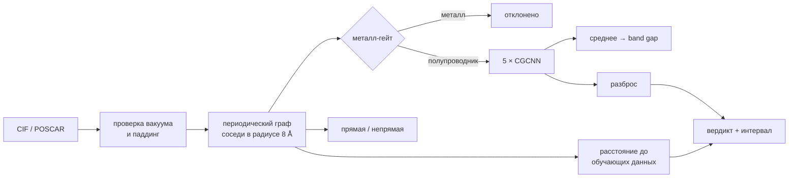

# NanoMatAI — band gap 2D-полупроводников по кристаллической структуре

[English version](README.md)

**[Открыть обозреватель предсказаний →](https://ac1esan.github.io/nanomat-ai/)** —
28 372 структуры с калиброванным интервалом и вердиктом на каждой, плюс карта по
таблице Менделеева, где модель реально работает. Без установки и без загрузки файлов.
Та же страница на [Hugging Face Spaces](https://huggingface.co/spaces/ac1esan/nanomat-ai).

Графовая нейросеть, которая по структуре монослоя предсказывает ширину запрещённой
зоны меньше чем за секунду на процессоре ноутбука. И, что важнее, честно говорит,
когда ей верить не нужно. Проект сделан соло: только открытые API для данных,
сначала baseline по составу, затем структурная модель, масштабированная с 700 до
13 000 структур, и слой доверия, который я ломал до тех пор, пока он не сломался
по-настоящему, а потом чинил.

<p align="center"></p>

**Главный результат.** На 700 структурах графовая сеть не лучше случайного леса на
композиционных признаках, у обоих MAE 0.58 эВ. Разрыв появляется только с данными:
на 13 349 стабильных 2D-полупроводниках структурная модель даёт **MAE 0.26 эВ на
сплите без общих составов** против 0.36 эВ у состава. Узким местом был объём
данных, а не класс модели.

## Быстрый старт

```bash
git clone https://github.com/ac1esan/nanomat-ai && cd nanomat-ai
pip install -r requirements.txt
```

```bash
python screen_bandgap.py --in examples/ --out results.csv    # батч: папка CIF/POSCAR -> ранжированный CSV
```

Если файла структуры под рукой нет, типичный сценарий закрывает
[обозреватель](https://ac1esan.github.io/nanomat-ai/): фильтр по элементам,
диапазону щели и вердикту поверх 28 372 предпосчитанных предсказаний.

```bash
python screen_bandgap.py --app                                # веб-интерфейс на http://127.0.0.1:7860
```

```bash
pytest -q                                                     # 10 смоук- и контрактных тестов
```

Результат для примеров из репозитория ([examples/expected_results.csv](examples/expected_results.csv)):

| файл | формула | gap (PBE), эВ | интервал 90% | вердикт |
|---|---|---|---|---|
| WS2.vasp | WS2 | 1.94 | ±0.13 | reliable |
| MoS2.vasp | MoS2 | 1.69 | ±0.11 | reliable |
| MoSe2.vasp | MoSe2 | 1.53 | ±0.24 | reliable |
| WSe2.vasp | WSe2 | 1.26 | ±0.55 | check |
| hBN.vasp | BN | 4.59 | ±0.44 | reliable |
| phosphorene.vasp | P | 0.82 | — | **вне области: незнакомая химия** |
| graphene.vasp | C | 2.78 | — | **вне области: металл-гейт** |

Последние две строки и есть смысл проекта. Оба числа неверны, и инструмент
сообщает об этом сам, без подсказки.

## Как понять, когда не верить

Инструмент скрининга, который уверенно ошибается, хуже, чем отсутствие
инструмента. Здесь три независимые проверки, и каждая появилась потому, что
предыдущую поймали на провале.

**1. Металл-гейт.** Регрессор обучен только на полупроводниках, поэтому на металле
выдаёт бессмыслицу. Отдельный классификатор (ROC-AUC 0.944, precision на металлах
0.866) отсекает их первым.

Первая версия гейта, обученная на одной Alexandria, имела ROC-AUC 0.952 и при этом
давала графену `p(металл) = 0.00`. Причина: из 19 691 обучающей структуры ровно
**две** были чисто углеродными, и обе помечены полупроводниками. После
переобучения на трёх объединённых источниках (24 314 структур, графен среди них)
гейт возвращает `p(металл) = 1.00` на графене без ложных срабатываний на TMD.

**2. Разброс ансамбля.** Пять моделей с разными сидами; стандартное отклонение
между ними хорошо ранжирует ошибки (Spearman 0.45 с модулем ошибки, у MC-dropout
на одной модели было 0.17). По квартилям разброса ошибка растёт с 0.12 до 0.49 эВ.

**3. Расстояние до обучающих данных в латентном пространстве.** Одного разброса
мало, и доказательство этому — фосфорен: инструмент предсказал 0.82 эВ против
экспериментальных 2.0 эВ и назвал это надёжным при разбросе 0.035 эВ. В Alexandria
ровно **одна** структура элементарного фосфора, все пять членов ансамбля учились
на ней, поэтому дружно согласились, уверенно и неправильно. Разброс ансамбля
измеряет расхождение между инициализациями, а не незнание химии.

Косинусное расстояние до десяти ближайших обучающих структур в собственном
пространстве эмбеддингов модели это ловит: фосфорен попадает в 98-й перцентиль,
тогда как MoS₂, WS₂ и h-BN сидят около 40-го. С ошибкой оно коррелирует чуть лучше
разброса (0.47 против 0.45), а вместе они дают 0.50, то есть несут разную
информацию. Провалившуюся промежуточную попытку стоит записать: простой подсчёт,
сколько обучающих структур делят химическую систему с запросом, коррелировал с
ошибкой **в обратную сторону**, потому что химически богатые системы одновременно
и лучше представлены, и объективно сложнее.

**Калиброванные интервалы.** Сырые ±1σ разброса покрывают всего 37 процентов
случаев вместо 68: глубокие ансамбли хорошо ранжируют, но переоценивают свою
уверенность. Множитель, подобранный на валидации (×5.09), даёт 92 процента
покрытия на отложенном тесте при целевых 90. Это лучше фиксированного конформного
интервала, который для всех был бы ±0.62 эВ, тогда как уверенное предсказание
теперь несёт ±0.11 эВ.

## Как устроено



- **Модель.** CGCNN на PyTorch Geometric: эмбеддинг атомного номера (128), четыре
  слоя `CGConv` с гауссовыми RBF-признаками рёбер (40 центров на 0–8 Å), среднее по
  атомам, MLP-голова. Определена один раз в [`nanomat/model.py`](nanomat/model.py)
  и используется и обучением, и инференсом, поэтому разойтись они не могут.
- **Данные.** Alexandria 2D через API JARVIS-Tools, фильтр `e_above_hull ≤ 0.1`
  эВ/атом и `gap > 0.01` эВ: 13 349 стабильных 2D-полупроводников, таргет —
  непрямая щель PBE. Никакого собственного парсера.
- **Оценка.** Сплит по умолчанию без общих составов: ни одна формула не встречается
  одновременно в обучении и тесте. Это существенно: на 13 349 структур приходится
  всего 8 388 уникальных составов.
- **Тип щели.** Попытка вывести тип из разности двух регрессий свалилась в
  тривиальный baseline (79 процентов). Отдельная классификационная голова с весом
  на редком классе даёт ROC-AUC 0.758 на строгом сплите. Порог решения подобран на
  валидации (0.33, а не 0.5) и хранится в чекпойнте, потому что `pos_weight`
  смещает вероятности.

## Результаты

Baseline по составу (Magpie + RandomForest/XGBoost, 5-fold CV) против CGCNN:

| датасет | N | состав, CV MAE | CGCNN MAE | сплит |
|---|---|---|---|---|
| JARVIS dft_2d (OptB88vdW) | 696 | 0.583 | ≈ 0.585 | случайный |
| C2DB (PBE) | 1 115 | 0.445 | ≈ 0.42 | случайный |
| Alexandria 2D, ehull ≤ 0.1 | 13 349 | 0.360 | 0.215 | случайный |
| Alexandria 2D, ehull ≤ 0.2 | 26 561 | 0.419 | 0.262 | случайный |
| **Alexandria 2D, ehull ≤ 0.1** | **13 349** | **0.430** | **0.261** | **без общих составов** |

Числа для состава в первых строках получены пятикратной кросс-валидацией, а это
другой протокол, и сравнивать его со сплитом без общих составов нельзя. На том же
самом тестовом наборе состав даёт 0.430 эВ, а не 0.360, то есть структура выигрывает
39 процентов, а не 27, как проект утверждал до перепроверки через
[`scripts/composition_baseline.py`](scripts/composition_baseline.py). Ошибка была в
нашу пользу.

Поставляемый ансамбль даёт **MAE 0.261 эВ (95% ДИ 0.242–0.283), RMSE 0.454,
R² 0.889** на 1 326 отложенных структурах, чьи составы ни разу не встречаются в
обучении. Члены дают 0.281 / 0.305 / 0.274 / 0.277 / 0.319, то есть усреднение
выигрывает 0.03 эВ.

Контрольный прогон отделяет цену честной оценки: тот же код, те же данные,
отличается только сплит.

| Сплит | MAE |
|---|---|
| случайный | 0.252 |
| без общих составов | 0.261 |

Ещё два вывода из чисел:

- **Качество важнее количества.** Ослабление фильтра стабильности удваивает N, но
  добавляет метастабильные структуры, и хуже становится обеим моделям.
- **Ошибка следует за плотностью данных, а не за физикой.** Модель точнее всего на
  переходных металлах, где Alexandria плотная, и хуже всего на лёгких main-group
  соединениях. От величины щели ошибка не зависит. Тот же урок объясняет и
  металл-гейт, и провал на фосфорене выше.

### Второе свойство: работа выхода и края зон, которые она открывает

| | Состав | Структура | n_test |
|---|---|---|---|
| Ширина щели | 0.430 | **0.261** | 1 326 |
| Работа выхода | 0.314 | **0.254** | 337 |

Обучено на 3505 структурах C2DB, где работа выхода есть, той же архитектурой и по
тому же протоколу, в отдельном чекпойнте. Структура выигрывает 19 процентов против
39 у щели, и это осмысленно: работа выхода сильнее опирается на химию и слабее на
геометрию.

Само число — менее интересная половина. Обученная величина это вакуум минус уровень
Ферми: для металла это работа выхода в обычном смысле, но у нелегированного
полупроводника DFT кладёт уровень Ферми посреди щели, поэтому само по себе это
опорный уровень, а не то, что показывает прибор. Отсюда и h-BN с 3.4 эВ против
литературных 4.5, причём база согласна с моделью, там 3.49.

Вместе со щелью оно задаёт **положение обоих краёв зон относительно вакуума**, а
это и есть пара, по которой подбирают металл контакта:

| | Сродство к электрону | литература | Потенциал ионизации | литература |
|---|---|---|---|---|
| MoS₂ | 4.41 | 4.0 | 6.10 | 6.1 |
| MoSe₂ | 3.95 | 3.9 | 5.49 | 5.5 |
| WS₂ | 3.98 | 3.9 | 5.92 | 6.0 |
| WSe₂ | 3.79 | 3.6 | 5.05 | 5.2 |

Края зон наследуют вердикт щели, поэтому предсказание, от которого инструмент
отказался, не может вернуться в виде двух производных чисел. Графен — задокументированный
провал: элементарно-углеродная структура в наборе ровно одна и лежит в тестовой выборке,
поэтому модель даёт 3.18 против 4.25 в базе. Разброс при этом 0.32 против 0.03 у TMD,
то есть сигнал сработал на неверном числе.

### Внешняя валидация на эксперименте

<p align="center"></p>

[`validate_experiment.py`](validate_experiment.py) прогоняет семь эталонных
монослоёв (лежат в [`examples/`](examples/), поэтому работает офлайн), а
[`scripts/fit_gap_corrections.py`](scripts/fit_gap_corrections.py) переводит вывод
уровня PBE в измеримую величину. Целей **две**, и путать их нельзя:

| | Подогнано по | n | Ошибка leave-one-out |
|---|---|---|---|
| **Квазичастичная щель** — фотоэмиссия, транспорт | HSE06 из JARVIS dft_2d | 32 | **0.19 эВ** |
| **Оптическая щель** — край поглощения | измеренные щели монослоёв | 5 | 0.71 эВ |

Квазичастичная поправка надёжна: сырое предсказание коррелирует с HSE при r = 0.988,
а кросс-валидация почти не отличается от подгонки в выборке (0.19 против 0.18 эВ).
Оптическая — нет: её 0.17 эВ в выборке превращаются в 0.71 при leave-one-out, потому
что пять точек, где h-BN сидит на 6 эВ, это не подгонка, а интерполяция между двумя
скоплениями. Показываются обе, подписанные, и оптическая помечена как ориентир.

Разница между ними на четырёх TMD в среднем **0.55 эВ**, и это работает физика:
перед нами энергия связи экситона, из-за которой поглощение и фотоэмиссия дают на
одном монослое разные числа. Одно число вместо двух эту разницу бы спрятало.

Обе поправки подгоняются только по точкам, которые инструмент сам считает
пригодными: предсказание вне области применимости не должно определять калибровку,
которой правят все остальные.

### Обязательно ли брать геометрию из DFT-релаксации

[`scripts/geometry_sensitivity.py`](scripts/geometry_sensitivity.py) отвечает на
это для будущего интерфейса «выбрал элементы, получил предсказание»:

- Внутренняя координата бесплатна. Идеальная тригональная призма воспроизводит
  релаксированную высоту халькогена с точностью 0.02 Å и меняет щель на 0.001 эВ.
- Постоянная решётки нет. Оценённая из ковалентных радиусов, она на 9 процентов
  больше и стоит 0.42 эВ, что превышает собственную ошибку модели. Брать её нужно
  из базы релаксированных структур.
- Под деформацией модель корректно экстраполирует на растяжение и ломается на
  сжатии дальше минус двух процентов, где разброс ансамбля расширяется впятеро.

<p align="center"></p>

## Границы честности

- Обучена только на полупроводниках; металл-гейт это первая ступень, а не
  гарантия. Его собственные слепые пятна это то, чего нет в трёх объединённых базах.
- Поправка PBE подогнана на пяти монослоях, четыре из которых TMD. Это оценка.
- Калиброванный интервал предполагает, что разброс ансамбля осмыслен, а именно это
  и ломается вне области применимости. Поэтому для таких результатов интервал не
  показывается вовсе, вместо того чтобы выглядеть обманчиво узким.
- Условное покрытие неравномерно: самый уверенный квартиль получает 84 процента
  вместо 90.
- **Калибровка действует только для той популяции, на которой подогнана.** Прогон
  по 16 349 структурам, которых модель не видела, включая метастабильные
  (`e_above_hull` до 0.2) и два других функционала, показал: вердикт по-прежнему
  корректно ранжирует ошибку (0.33 / 0.43 / 0.57 эВ по трём тирам), но интервал 90
  процентов покрывает лишь 78, а заявленная ошибка тиров занижена. На стабильной
  Alexandria 2D тестовая MAE равна 0.261 эВ, на метастабильных структурах 0.509 эВ.
  Перекалибруйте
  [`scripts/calibrate_uncertainty.py`](scripts/calibrate_uncertainty.py) под свою
  популяцию. Скрипт предпосчёта проверяет это и предупреждает.
- Вход должен быть монослоем с вакуумной щелью. Тонкий вакуум дополняется
  автоматически, потому что с периодическими границами он молча добавляет
  межслойные рёбра; ячейки без щели ≥ 5 Å помечаются как не-2D.

Подробности: [MODEL_CARD.md](MODEL_CARD.md).

## Воспроизведение

Экспорт данных идёт локально через API JARVIS; обучение требует GPU. Поставляемые
веса получены на двух арендованных RTX 5070 Ti примерно за час, включая металл-гейт
и классификатор типа.

```bash
python export_structures_for_alignn.py --source alex_2d --ehull-max 0.1
```

```bash
python train_cgcnn.py --data alignn_data_alex_2d --task gap --split group --ensemble 5 \
    --epochs 200 --batch 64 --workers 4 --out weights/cgcnn_2d_ensemble.pt
```

```bash
python scripts/calibrate_uncertainty.py --weights weights/cgcnn_2d_ensemble.pt \
    --data alignn_data_alex_2d --split weights/cgcnn_2d_ensemble.split.json
```

```bash
python scripts/fit_gap_corrections.py --write    # квазичастичная и оптическая поправки
```

Флаг `--bootstrap` при обучении заставляет каждый член ансамбля учиться на своей
бутстрап-подвыборке, а не на одинаковых данных. Тогда разброс между членами начинает
отражать и разреженность химии, а не только инициализацию — то самое слабое место,
которое сейчас компенсирует проверка латентным расстоянием. Цена: каждый член видит
около 63 процентов уникальных структур, поэтому эффект надо измерять, а не предполагать.

Обучение пишет `*.metrics.json` (тестовый MAE с бутстрап-интервалом, калибровка
ансамбля) и `*.split.json` (точные списки файлов). Шаг калибровки подбирает масштаб
интервала, измеряет оба сигнала выхода за область применимости и вкладывает их
вместе с эталонными эмбеддингами в чекпойнт, так что чекпойнт несёт в себе всё
нужное, чтобы судить о собственном выводе.

Металл-гейту нужны все три источника вместе с металлами, классификатору типа —
второй столбец таргета:

```bash
python train_cgcnn.py --data data_metal_merged --task metal --split group --out weights/cgcnn_2d_metal.pt
```

```bash
python export_structures_for_alignn.py --source alex_2d --extra-target band_gap_dir --out-dir alignn_data_alex_2d_typed
```

`--pretrained <ckpt>` инициализирует тело сети из другого чекпойнта (перенос
3D → 2D). Baseline по составу:
`python baseline_2d_bandgap.py --source alex_2d --drop-metals`.

## Структура репозитория

```
docs/                     статический обозреватель, публикуется через GitHub Pages
nanomat/families.py       распознавание прототипов (1H/1T MX2, honeycomb) для вида по семействам
nanomat/                  graph.py (структура -> граф, проверки вакуума), model.py (CGCNN),
                          predict.py (Predictor, пакетный инференс, вердикты, калибровка)
screen_bandgap.py         CLI батч-скрининг + Gradio UI        app.py: точка входа для HF Spaces
train_cgcnn.py            обучение: gap / type / metal, ансамбли, сплит по составу, пороги
scripts/calibrate_uncertainty.py   масштаб интервала + сигналы OOD -> в чекпойнт
scripts/geometry_sensitivity.py    прототип против релаксации, отклик на деформацию
validate_experiment.py    модель против эксперимента на эталонных монослоях (офлайн)
baseline_2d_bandgap.py    baseline по составу (Magpie + RF/XGBoost)
export_structures_for_alignn.py   JARVIS / C2DB / Alexandria -> папка POSCAR + id_prop.csv
weights/                  ансамбль (с калибровкой и эмбеддингами), металл-гейт, тип щели
examples/  tests/         эталонные структуры, включая случаи провала; 10 проверок pytest
figures/                  рисунки README и скрипты, которые их пересобирают
```

## Планы

1. Найти бесплатный хостинг для загрузчика. Hugging Face теперь требует платную
   подписку за Gradio-Space даже на бесплатном CPU, поэтому локальный запуск
   `python screen_bandgap.py --app` остаётся основным ответом, а режим
   `scripts/deploy_space.py --kind gradio` ждёт другой площадки.
2. Расширить таргет за пределы щели. Работа выхода есть у всех 3520 структур C2DB и
   для контактов важнее третьего знака в щели; эффективные массы из JARVIS dft_2d
   непригодны (у WS2 получается три миллиона).
3. Бэггинг ансамбля по подвыборкам данных, чтобы сам разброс отражал разреженность
   химии, а не полагался на проверку латентным расстоянием.
4. Заменить пятиточечную поправку PBE моделью PBE → HSE/GW, обученной на C2DB.

## Лицензия

MIT. Данные: Alexandria (CC-BY 4.0), C2DB и JARVIS-DFT через
[JARVIS-Tools](https://github.com/usnistgov/jarvis).
