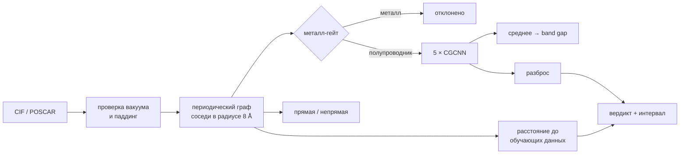

# NanoMatAI — band gap 2D-полупроводников по кристаллической структуре

[](https://doi.org/10.5281/zenodo.22863467)

[English version](README.md)

**[Открыть обозреватель предсказаний →](https://ac1esan.github.io/nanomat-ai/)** —
28 372 структуры с калиброванным интервалом и вердиктом на каждой, плюс карта по
таблице Менделеева, где модель реально работает. Без установки и без загрузки файлов.
Та же страница на [Hugging Face Spaces](https://huggingface.co/spaces/ac1esan/nanomat-ai).

Графовая нейросеть, которая по структуре монослоя предсказывает ширину запрещённой
зоны меньше чем за секунду на процессоре ноутбука. И, что важнее, честно говорит,
когда ей верить не нужно. Проект сделан соло: только открытые API для данных,
сначала baseline по составу, затем структурная модель, масштабированная с 700 до
22 000 структур, и слой доверия, который я ломал до тех пор, пока он не сломался
по-настоящему, а потом чинил.

<p align="center"></p>

**Главный результат.** На 700 структурах графовая сеть не лучше случайного леса на
композиционных признаках, у обоих MAE 0.58 эВ. Разрыв появляется только с данными: на
тестовом наборе стабильных 2D-полупроводников без общих с обучением составов
поставляемая модель даёт **MAE 0.225 эВ** против 0.430 эВ у состава. Узким местом был
объём данных, а не класс модели — причём часть нужных модели данных была отсеяна как
«метастабильная» ([ниже](#чего-стоил-фильтр-стабильности)).

## Быстрый старт

```bash
git clone https://github.com/ac1esan/nanomat-ai && cd nanomat-ai
pip install -r requirements.txt
```

```bash
python screen_bandgap.py --in examples/ --out results.csv    # батч: папка CIF/POSCAR -> ранжированный CSV
```

Если файла структуры под рукой нет, типичный сценарий закрывает
[обозреватель](https://ac1esan.github.io/nanomat-ai/): фильтр по элементам,
диапазону щели и вердикту поверх 28 372 предпосчитанных предсказаний.

```bash
python screen_bandgap.py --app                                # веб-интерфейс на http://127.0.0.1:7860
```

```bash
pytest -q                                                     # 22 смоук- и контрактных теста
```

Из языковой модели — через Model Context Protocol
([nanomat/mcp_server.py](nanomat/mcp_server.py)), любым клиентом, который запускает
сервер по stdio:

```bash
pip install -r requirements-llm.txt
claude mcp add nanomat -- "$(pwd)/venv/bin/python" -m nanomat.mcp_server
```

Пять инструментов: предсказать вставленный CIF или POSCAR; найти посчитанные структуры
по формуле или общепринятому названию; искать по таблице скрининга — окно щели,
элементы, вердикт, тип щели, прототип; получить один материал; прочитать карточку
модели. Каждая строка начинается с вердикта и типичной ошибки его тира, даёт 90%-интервал
явным диапазоном и говорит, когда модель расходится с эталоном сильнее типичной ошибки
тира. Поисковые инструменты читают `screening_table.csv`, его пишет
`scripts/precompute_screening.py`.

Результат для примеров из репозитория ([examples/expected_results.csv](examples/expected_results.csv)):

| файл | формула | gap (PBE), эВ | интервал 90% | вердикт |
|---|---|---|---|---|
| WS2.vasp | WS2 | 1.88 | ±0.30 | reliable |
| MoS2.vasp | MoS2 | 1.68 | ±0.26 | reliable |
| MoSe2.vasp | MoSe2 | 1.54 | ±0.20 | reliable |
| WSe2.vasp | WSe2 | 1.60 | ±0.21 | reliable |
| hBN.vasp | BN | 4.72 | ±0.24 | reliable |
| phosphorene.vasp | P | 0.96 | ±0.40 | **check: повышенная неопределённость** |
| graphene.vasp | C | 1.07 | — | **вне области: металл-гейт** |

Последняя строка и есть смысл проекта: графен — полуметалл, регрессор на металлах не
учился, и инструмент сообщает об этом сам, без подсказки. Фосфорен посередине: его
PBE-щель около 0.9 эВ во всех базах, где он есть, так что число правильное, но это
единственный слой элементарного фосфора в обучении, и вердикт просит перепроверить.

## Как понять, когда не верить

Инструмент скрининга, который уверенно ошибается, хуже, чем отсутствие
инструмента. Здесь три независимые проверки, и каждая появилась потому, что
предыдущую поймали на провале.

**1. Металл-гейт.** Регрессор обучен только на полупроводниках, поэтому на металле
выдаёт бессмыслицу. Отдельный классификатор (ROC-AUC 0.944, precision на металлах
0.866) отсекает их первым.

Первая версия гейта, обученная на одной Alexandria, имела ROC-AUC 0.952 и при этом
давала графену `p(металл) = 0.00`. Причина: из 19 691 обучающей структуры ровно
**две** были чисто углеродными, и обе помечены полупроводниками. После
переобучения на трёх объединённых источниках (24 314 структур, графен среди них)
гейт возвращает `p(металл) = 1.00` на графене без ложных срабатываний на TMD.

**2. Разброс ансамбля.** Пять моделей с разными сидами; стандартное отклонение
между ними хорошо ранжирует ошибки (Spearman 0.45 с модулем ошибки, у MC-dropout
на одной модели было 0.17). По квартилям разброса ошибка растёт с 0.10 до 0.43 эВ.

**3. Расстояние до обучающих данных в латентном пространстве.** Все пять членов учатся
на одних данных, поэтому на химии, которую обучающая выборка почти не покрывает, они
могут согласиться по неверной причине: разброс измеряет расхождение между
инициализациями, а не то, насколько химия покрыта данными. Косинусное расстояние до
десяти ближайших обучающих структур в собственном пространстве эмбеддингов модели
измеряет это напрямую. С ошибкой оно коррелирует чуть лучше разброса (0.47 против
0.45), а вместе они дают 0.50, то есть несут разную информацию. Вердикт, построенный на
обоих, сохраняет порядок и на данных, которых модель не видела: 0.21 / 0.24 / 0.40 эВ
по трём тирам на отложенной метастабильной Alexandria и 0.14 / 0.24 / 0.49 эВ на
отложенной 2DMatPedia.

**Опровержение.** Раньше этот раздел доказывал мысль фосфореном: предсказано 0.82 эВ,
измерено 2.0, вердикт «надёжно». Фосфорен лежит в обучающей выборке, а его PBE-щель —
0.85–0.90 эВ во всех четырёх базах, где он есть. Предсказание было верным на том
уровне, который модель предсказывает; 1.2 эВ — это PBE против оптического измерения,
то есть физика, для которой и существует оптическая оценка ниже. Латентное расстояние
отметило разреженную окрестность — это единственный слой элементарного фосфора в
обучении: ложная тревога на обучающей точке, а не пойманная ошибка. Сигнал держится
на статистике выше, а не на этом примере. Сравнение числа уровня PBE с экспериментом
— пятая ошибка протокола, которую проект нашёл в собственных утверждениях.

Провалившуюся промежуточную попытку стоит записать: простой подсчёт, сколько
обучающих структур делят химическую систему с запросом, коррелировал с ошибкой
**в обратную сторону**, потому что химически богатые системы одновременно и лучше
представлены, и объективно сложнее.

**Калиброванные интервалы.** Сырые ±1σ разброса покрывают всего 42 процента случаев
вместо 68: глубокие ансамбли хорошо ранжируют, но переоценивают свою уверенность.
Множитель, подобранный на валидации (×4.19), даёт 90 процентов покрытия на отложенном
тесте при целевых 90. Это лучше фиксированного конформного интервала, который для всех
был бы ±0.51 эВ, тогда как предсказание в тире reliable несёт медианные ±0.24 эВ.

## Как устроено



- **Модель.** CGCNN на PyTorch Geometric: эмбеддинг атомного номера (128), четыре
  слоя `CGConv` с гауссовыми RBF-признаками рёбер (40 центров на 0–8 Å), среднее по
  атомам, MLP-голова. Определена один раз в [`nanomat/model.py`](nanomat/model.py)
  и используется и обучением, и инференсом, поэтому разойтись они не могут.
- **Данные.** Alexandria 2D и 2DMatPedia через API JARVIS-Tools, никакого
  собственного парсера. Обучение — 22 103 монослоя: 10 733 стабильных полупроводника
  Alexandria (`e_above_hull ≤ 0.1` эВ/атом, `gap > 0.01` эВ), 9 724 метастабильных (до
  0.2) и 1 646 немагнитных слоёв 2DMatPedia, которых в Alexandria нет. Таргет —
  фундаментальная щель PBE.
- **Оценка.** Сплит без общих составов: ни одна формула не встречается одновременно в
  обучении и тесте. Валидация и тест — стабильная Alexandria (1 290 и 1 326 структур) и
  не менялись с первой модели, поэтому все числа ниже посчитаны на одних и тех же
  1 326 структурах. Это существенно: на 13 349 стабильных структур приходится всего
  8 388 уникальных составов.
- **Тип щели.** Попытка вывести тип из разности двух регрессий свалилась в
  тривиальный baseline (79 процентов). Отдельная классификационная голова с весом
  на редком классе даёт ROC-AUC 0.758 на строгом сплите. Порог решения подобран на
  валидации (0.33, а не 0.5) и хранится в чекпойнте, потому что `pos_weight`
  смещает вероятности.

## Результаты

Baseline по составу (Magpie + RandomForest/XGBoost) против CGCNN:

| датасет | N | состав, MAE | CGCNN MAE | сплит |
|---|---|---|---|---|
| JARVIS dft_2d (OptB88vdW) | 696 | 0.583 | ≈ 0.585 | случайный, 5-fold CV |
| C2DB (PBE) | 1 115 | 0.445 | ≈ 0.42 | случайный, 5-fold CV |
| Alexandria 2D, ehull ≤ 0.1 | 13 349 | 0.360 | 0.215 | случайный, 5-fold CV |
| Alexandria 2D, ehull ≤ 0.2 | 26 561 | 0.419 | 0.262 | случайный, свой тест |
| Alexandria 2D, ehull ≤ 0.1 | 13 349 | 0.430 | 0.246 | без общих составов |
| **+ метастабильные + 2DMatPedia, только в обучении** | **22 103 обуч.** | **0.430** | **0.225** | **без общих составов, тот же тест** |

Числа для состава в первых строках получены пятикратной кросс-валидацией, а это
другой протокол, и сравнивать его со сплитом без общих составов нельзя. На том же
самом тестовом наборе состав даёт 0.430 эВ, а не 0.360, то есть структура выигрывает
48 процентов у поставляемой модели, а заявленные до перепроверки через
[`scripts/composition_baseline.py`](scripts/composition_baseline.py) 27 процентов были
ошибкой не в нашу пользу. Строка ehull ≤ 0.2 ввела в заблуждение в обратную сторону,
см. [ниже](#чего-стоил-фильтр-стабильности).

### Координата, которую теряет расстояние на ребре

Ребро несёт только расстояние, поэтому два полиморфа одного состава для графа почти
неразличимы — а для 2D-электроники это ровно то различие, которое важно: 1H-MoS₂
полупроводник, 1T-MoS₂ металлический. Слабость была измерена, и граф получил
поатомную гистограмму углов связей ([`nanomat/graph.py`](nanomat/graph.py),
отсечение 4 Å вместо 8 Å для рёбер: угол до атома в 8 Å ничего не говорит о
координации).

Сравнение с контролем, обученным на том же сплите, с теми же сидами, в том же
окружении — контроль нужен потому, что прежние веса считались на другом torch и
другой карте, а это само по себе стоит 0.01 эВ:

| | контроль | с углами |
|---|---|---|
| MAE | 0.271 | **0.246** |
| RMSE | 0.492 | **0.435** |
| R² | 0.869 | **0.898** |

Парно по тем же 1326 тестовым структурам разность **+0.026 эВ**, бутстрап 95%
+0.015…+0.037, Wilcoxon p = 4·10⁻⁵. Три измерения чувствительности к полиморфам
([`scripts/polymorph_sensitivity.py`](scripts/polymorph_sensitivity.py)) двинулись
так, как предсказывал диагноз: глобальный разброс не изменился, внутрисоставной и
1H против 1T заметно выросли. Данные, описанные дальше, примерно ещё раз удвоили этот
выигрыш; все три поколения — в [карточке модели](MODEL_CARD.md).

Поставляемый ансамбль добавляет данные, описанные дальше, и даёт **MAE 0.225 эВ
(95% ДИ 0.207–0.243), RMSE 0.405, R² 0.912** на тех же 1 326 отложенных структурах,
чьи составы ни разу не встречаются в обучении. Члены дают 0.266 / 0.243 / 0.251 /
0.253 / 0.267, то есть усреднение выигрывает 0.03 эВ.

Контрольный прогон на первом ансамбле отделил цену честной оценки: тот же код, те же
данные, отличается только сплит.

| Сплит | MAE |
|---|---|
| случайный | 0.252 |
| без общих составов | 0.261 |

### Чего стоил фильтр стабильности

Первые модели учились только на `e_above_hull ≤ 0.1`, потому что набор с порогом 0.2
из таблицы выше дал худший результат (0.262 против 0.215). Но каждое из этих чисел
посчитано на своём тесте, а тест набора 0.2 наполовину метастабильный, что труднее для
любой модели: сравнение меняло популяцию, на которой меряли, а не только данные,
на которых учили. [`scripts/stability_experiment.py`](scripts/stability_experiment.py)
ставит вопрос правильно: четыре плеча, один сплит, одна GPU-сессия, отличается только
обучающая часть, плюс два дополнительных теста, на формулах которых не училось ни одно
плечо.

| тест | только стабильные | + 2DMatPedia | + метастабильные | **+ оба (поставка)** |
|---|---|---|---|---|
| стабильная Alexandria, 1 326 | 0.249 | 0.261 | 0.236 | **0.225** |
| отложенная метастабильная Alexandria, 2 512 | 0.500 | 0.490 | 0.314 | **0.311** |
| отложенная 2DMatPedia, 397 | 0.770 | 0.464 | 0.721 | **0.437** |

Все разности парные, против контроля на тех же структурах; у поставляемого плеча
95-процентный интервал ниже нуля на всех трёх тестах (−0.039…−0.011 эВ на стабильном).
Правило приёмки было записано в журнал проекта до окончания прогонов: на стабильном
тесте не хуже контроля больше чем на +0.005 эВ, а на одном из двух других лучше, с
интервалом целиком ниже нуля. 2DMatPedia в одиночку провалила первое условие (+0.011);
у комбинации выигрыш больше. Источники дополняют друг друга: каждый чинит свою
популяцию и почти не трогает чужую.

Сильнее всего изменилось там, где модель была слабее всего: углерод на отложенной
2DMatPedia 1.59 → 0.67 эВ (17 структур, так что это качественный вывод), бор 1.82 →
0.92, азот на отложенной метастабильной Alexandria 1.01 → 0.38, водород 1.25 → 0.83.

Заодно модель научилась полиморфам. На C2DB, на которой не училась ни одна из этих
моделей, поставляемый ансамбль воспроизводит 65 процентов разности щелей между 1H-MX₂ и
1T-MX₂ (одни углы давали 37, без углов было 18) и угадывает её знак в 92 процентах
случаев. Метастабильная структура — почти по определению другой полиморф состава, у
которого есть стабильный: фильтр вырезал ровно тот контраст «один состав — разные
структуры», на котором модель учится их различать. Углы сделали этот контраст видимым,
данные дали, на чём учиться.

Ошибка по-прежнему следует за плотностью данных, а не за физикой — точнее всего на
переходных металлах, хуже всего на лёгких main-group соединениях, от величины щели не
зависит, — но перепад стал заметно мягче.

### Вторая база, проверенная по структурам

2DMatPedia не добавляли на доверии. По формулам она расходилась с Alexandria на
0.44 эВ, но у одной формулы несколько полиморфов, и базы не обязаны были взять один и
тот же. [`scripts/audit_2dmatpedia.py`](scripts/audit_2dmatpedia.py) сопоставляет по
структуре: каждый слой в единую рамку (ось вакуума к нормали слоя, одинаковый вакуум,
примитивная ячейка), затем `StructureMatcher` из pymatgen с допусками, ужесточёнными
под слои: дефолтные нормируются на объём, который в слое почти весь вакуум, и
принимали за MoS₂ структуру на 1 эВ/атом выше по энергии.

- У 1 178 записей нашёлся двойник в Alexandria. Их PBE-энергии совпадают с медианой
  0.0015 эВ/атом: одна расчётная схема, включая +U.
- На одной и той же структуре щели совпадают с MAE 0.089 эВ (медиана 0.055,
  r = 0.995). В паре «по формуле» те же записи расходятся на 0.304: большая часть
  кажущегося расхождения была полиморфами, а не метками.
- Где расхождение больше 0.3 эВ, судьи — C2DB и JARVIS dft_2d — в целом не встают ни на
  одну сторону. Alexandria промахивается мимо точки Дирака у сотовых слоёв — графен
  1.23 эВ, силицен 0.86, GaAs 1.11, где у C2DB ноль, — и этот графен лежит в тестовом
  сплите модели. 2DMatPedia завышает на ~1 эВ семейство ZrNCl и чаще сходится к другому
  магнитному состоянию; поэтому берутся только её немагнитные записи.

До того как данные пошли в дело, тогдашний ансамбль прогнали по всей 2DMatPedia как
внешнюю валидацию на базе, которой он не видел: MAE 0.75 эВ, 78 процентов этой
популяции модель сама пометила как вне области, и вердикт всё равно ранжировал ошибку —
0.31 / 0.58 / 0.83 эВ по трём тирам.

### Второе свойство: работа выхода и края зон, которые она открывает

| | Состав | Структура | n_test |
|---|---|---|---|
| Ширина щели | 0.430 | **0.225** | 1 326 |
| Работа выхода | 0.314 | **0.254** | 337 |

Обучено на 3505 структурах C2DB, где работа выхода есть, той же архитектурой и по
тому же протоколу, в отдельном чекпойнте. Структура выигрывает 19 процентов против
48 у щели, и это осмысленно: работа выхода сильнее опирается на химию и слабее на
геометрию.

Само число — менее интересная половина. Обученная величина это вакуум минус уровень
Ферми: для металла это работа выхода в обычном смысле, но у нелегированного
полупроводника DFT кладёт уровень Ферми посреди щели, поэтому само по себе это
опорный уровень, а не то, что показывает прибор. Отсюда и h-BN с 3.4 эВ против
литературных 4.5, причём база согласна с моделью, там 3.49.

Вместе со щелью оно задаёт **положение обоих краёв зон относительно вакуума**, а
это и есть пара, по которой подбирают металл контакта:

| | Сродство к электрону | литература | Потенциал ионизации | литература |
|---|---|---|---|---|
| MoS₂ | 4.42 | 4.0 | 6.09 | 6.1 |
| MoSe₂ | 3.95 | 3.9 | 5.49 | 5.5 |
| WS₂ | 4.01 | 3.9 | 5.89 | 6.0 |
| WSe₂ | 3.62 | 3.6 | 5.22 | 5.2 |

Края зон — это вычитание между двумя моделями, поэтому за свою половину должна
отвечать **каждая** из них: края не показываются, если хоть один вердикт говорит
«вне области применимости». У этой модели свой слой доверия, а не доля чужого —
свои квартили разброса, свой множитель интервала и своё латентное расстояние до
своих обучающих эмбеддингов, потому что обучались они на разных базах. Структура
может быть обычной для одной и невиданной для другой.

Графен — задокументированный провал, и теперь его ловит именно этот второй вердикт:
элементарно-углеродная структура в наборе ровно одна и лежит в тестовой выборке,
поэтому модель даёт 3.18 против 4.25 в базе — с разбросом 0.32 против 0.03 у TMD и
латентным расстоянием за порогом q90. Вердикт читается как «вне области
применимости», краёв зон не будет. На строках C2DB, где есть эталон и на которых
модель не обучалась, этот вердикт разделяет ошибку как 0.130 / 0.233 / 0.445 эВ по
трём тирам.

### Внешняя валидация на эксперименте

<p align="center"></p>

[`validate_experiment.py`](validate_experiment.py) прогоняет семь эталонных
монослоёв (лежат в [`examples/`](examples/), поэтому работает офлайн), а
[`scripts/fit_gap_corrections.py`](scripts/fit_gap_corrections.py) переводит вывод
уровня PBE в измеримую величину. Целей **две**, и путать их нельзя:

| | Подогнано по | n | Ошибка |
|---|---|---|---|
| **Квазичастичная щель** — фотоэмиссия, транспорт | G₀W₀ из C2DB | 184 | **0.26 эВ** |
| **Энергия связи экситона** | Бете–Солпитер из C2DB | 184 | **0.12 эВ** |
| **Оптическая щель** = прямая G₀W₀ − экситон | по двум выше | 184 | **0.22 эВ** |

Все три проверены на **сплите по составам** — том же протоколе, что и у модели щели,
потому что в C2DB на один состав приходится несколько записей.

**Это не поправки к щели.** Это линейные головы поверх **собственного латентного
пространства ансамбля** — 128-мерного вектора, который каждый из пяти членов и так
считает по дороге к щели, все пять подряд. Обучать граф-сеть на 184 материалах
бессмысленно, в этом проекте это измерено на 696. Подогнать ридж поверх энкодера,
видевшего 22 103 структуры, — нет.

Решение пришло из измерения, где на самом деле сидела ошибка. Как функция одной
только щели оптическая поправка давала 0.38 эВ — а если подать ей **собственную**
PBE-щель C2DB вместо предсказания, становилось всего 0.31. Значит основное было не в
том, что сеть ошибается: **энергия связи экситона не является функцией щели.** Она
зависит от экранирования, то есть от структуры, а структуру энкодер уже видел.

| | одна щель | латентная голова |
|---|---|---|
| Квазичастичная щель (G₀W₀) | 0.40 | **0.26** |
| Энергия связи (BSE) | 0.24 | **0.12** |
| Оптическая щель | 0.36 | **0.22** |

После переподгонки на текущем энкодере энергия связи стала точнее (0.133 → 0.123 эВ), а
щели немного просели (оптическая 0.198 → 0.218): энкодер, который теперь обслуживает
гораздо более широкую популяцию, чуть хуже подходит под эти 184 материала C2DB. Сама
щель выиграла 10–43 процента, поэтому размен принят, но это размен.

Голова выигрывает в каждой полосе предсказанной щели, от 0–1 эВ до >5. И она делает
три числа **согласованными по построению**: оптическая = прямая квазичастичная минус
энергия связи. Именно это закрывает опровержение ниже.

**Где проигрывает.** Убери целое семейство на разреженном верху диапазона — и ридж не
экстраполирует там, где полином может: при переподгонке без всех записей BN и четырёх
TMD голова даёт h-BN 5.43 эВ против измеренных 6.00, тогда как полином даёт 6.01. По
измерению на этих пяти полином в целом выигрывает (0.25 против 0.28 эВ), а на четырёх
TMD выигрывает голова (0.21 против 0.31): разницу несёт h-BN. Это единственное место,
где голова хуже, и оно сообщается, а не прячется.

### Как собрана цель для оптической щели

**Раньше оптическая была слабым местом.** Раньше она опиралась на пять
измеренных монослоёв: пять точек, где один h-BN сидит на 6 эВ, — это не подгонка, а
интерполяция между двумя скоплениями, и её 0.17 эВ в выборке превращались в 0.71 при
leave-one-out. Хуже того, у прямой получался отрицательный свободный член, из-за чего
**у трети строк таблицы скрининга оптическая щель оказывалась НИЖЕ собственной сырой
щели PBE**, а у 1870 — не выше нуля. Это перевёрнуто: PBE занижает любое измерение.

C2DB считает обе половины оптической щели из первых принципов для части своего
каталога: G₀W₀ для квазичастичной щели и уравнение Бете–Солпитера для экситона. Это
184 пригодных немагнитных материала вместо пяти.
[`scripts/fetch_c2db_optical.py`](scripts/fetch_c2db_optical.py) их забирает и
кэширует в репозитории. Новая подгонка — квадратичная: она обошла прямую на 12 сидах
кросс-валидации из 12 (прямая завышает в середине диапазона), монотонна и всюду выше
сырой щели, так что старый дефект повториться не может.

Честная проверка — те самые пять измеренных монослоёв, которых новая подгонка не видела:

| | предсказание | новая | старая на 5 точках | измерено |
|---|---|---|---|---|
| MoS₂ | 1.68 | 2.07 | 1.89 | 1.88 |
| MoSe₂ | 1.54 | 1.93 | 1.69 | 1.55 |
| WS₂ | 1.88 | 2.29 | 2.18 | 2.00 |
| WSe₂ | 1.61 | 2.00 | 1.79 | 1.65 |
| h-BN | 4.72 | 5.99 | 6.12 | 6.00 |
| | | **0.31 эВ** | 0.28 эВ в выборке, **0.71 эВ** leave-one-out | |

Старая выглядит лучше в этой таблице только потому, что эти пять строк — её обучающие
данные. На невиданном монослое она ошибается на 0.71 эВ, новая — на 0.31.

**Опровержение, и как головы его закрывают.** Раньше здесь утверждалось, что разность
двух поправок — это энергия связи экситона, 0.55 эВ на TMD, как в литературе. Согласие
было круговым: обе подгонки обучались на этих же четырёх материалах. У двух поправок,
привязанных к **разным** эталонам, разность вообще не может быть физической величиной,
а сам HSE06 идёт примерно на 0.4 эВ ниже G₀W₀ при щели 1.7 эВ.

Латентные головы закрывают это как надо: энергия связи теперь **предсказывается**, а не
выводится. На четырёх TMD голова даёт **0.56 / 0.50 / 0.53 / 0.52 эВ** против BSE
0.55 / 0.50 / 0.52 / 0.48 — те самые несколько десятых эВ из литературы, полученные из
структуры, а не из совпадения двух подгонок. По всем 184 энергия связи составляет
медианные 0.29 от щели с разбросом 0.08 — там же, где известный скейлинг E_g/4 для 2D,
и именно этот разброс объясняет, почему никакая функция одной щели её не нашла бы.

Обе поправки подгоняются только по точкам, которые инструмент сам считает
пригодными: предсказание вне области применимости не должно определять калибровку,
которой правят все остальные.

### Обязательно ли брать геометрию из DFT-релаксации

[`scripts/geometry_sensitivity.py`](scripts/geometry_sensitivity.py) отвечает на
это для будущего интерфейса «выбрал элементы, получил предсказание»:

- Внутренняя координата бесплатна. Идеальная тригональная призма воспроизводит
  релаксированную высоту халькогена с точностью 0.02 Å и меняет щель на 0.001 эВ.
- Постоянная решётки нет. Оценённая из ковалентных радиусов, она на 9 процентов
  больше и стоит 0.42 эВ, что превышает собственную ошибку модели. Брать её нужно
  из базы релаксированных структур.
- Под деформацией модель корректно экстраполирует на растяжение и ломается на
  сжатии дальше минус двух процентов, где разброс ансамбля расширяется впятеро.

<p align="center"></p>

### Гипотеза, которая оказалась верной и всё равно проиграла

Все члены обычного ансамбля учатся на одних данных, поэтому химию, представленную
одним примером, они выучивают одинаково и дружно соглашаются: у фосфорена,
единственного слоя элементарного фосфора в обучении, разброс был 0.035 эВ. Бэггинг должен чинить это в корне: треть членов любую
конкретную структуру не увидит. Обучили и сравнили на одном тестовом наборе:

| | обычный | бэггинг |
|---|---|---|
| MAE, эВ | **0.261** | 0.306 |
| Spearman, разброс против ошибки | 0.450 | **0.495** |
| худший квартиль неопр. / лучший | 4.08× | **4.34×** |
| разброс на фосфорене, эВ | 0.035 | **0.380** |

Гипотеза подтвердилась: разброс на фосфорене вырос **в 10.8 раза**, и теперь он
сам помечает разреженный случай. Принят бэггинг всё равно не был, по трём
причинам, которые видны только после измерения.

Точность падает на 17 процентов, потому что каждый член видит около 64 процентов
структур. **Совместный** сигнал выхода за область применимости сдвигается едва
заметно, с 0.500 до 0.511, потому что расстояние до обучающих данных в латентном
пространстве уже закрывало ту же дыру: бэггинг покупает второй путь туда, куда
инструмент и так доходил. А более шумный разброс добавляет ложных тревог на
нормальных материалах: WSe₂ падает с `check` до `out-of-domain`, MoSe₂ с `reliable`
до `check`, оба — хорошо изученные монослои.

Платить 17 процентами точности за 2 процента совместного ранжирования, получая в
придачу ложные тревоги, невыгодно. Флаг остаётся в обучающем скрипте вместе с этим
измерением, чтобы никому не пришлось открывать это заново.

## Границы честности

- Обучена только на полупроводниках; металл-гейт — первая ступень, а не гарантия. Его
  слепые пятна — то, чего нет в трёх объединённых базах, а на металлах 2DMatPedia он
  поймал 71 процент.
- Метки несут ошибки своих баз. Alexandria промахивается мимо точки Дирака у сотовых
  слоёв (графену стоит 1.23 эВ, и он лежит в тестовом сплите); 2DMatPedia завышает на
  ~1 эВ семейство ZrNCl и менее надёжна на магнитных материалах, поэтому берутся
  только её немагнитные записи.
- Квазичастичная и оптическая оценки — линейные головы, подогнанные на 184 материалах
  C2DB (G₀W₀ и BSE), с кросс-валидационной ошибкой 0.12–0.28 эВ и проверкой на пяти
  измеренных монослоях. Это оценки.
- Калиброванный интервал предполагает, что разброс ансамбля осмыслен, а именно это и
  ломается вне области применимости. Поэтому для таких результатов интервал не
  показывается вовсе, вместо того чтобы выглядеть обманчиво узким.
- Условное покрытие неравномерно: самый уверенный квартиль получает 82 процента
  вместо 90.
- **Калибровка действует только для той популяции, на которой подогнана** — стабильной
  Alexandria 2D. На 6 625 строках таблицы скрининга, на которых ансамбль не учился
  (отложенная стабильная и метастабильная Alexandria, плюс C2DB и JARVIS dft_2d со
  своими функционалами), вердикт корректно ранжирует ошибку — 0.20 / 0.24 / 0.42 эВ по
  тирам, — но интервал 90 процентов покрывает 83, а не 90. Перекалибруйте
  [`scripts/calibrate_uncertainty.py`](scripts/calibrate_uncertainty.py) под свою
  популяцию. Скрипт предпосчёта проверяет это и предупреждает.
- Вход должен быть монослоем с вакуумной щелью. Тонкий вакуум дополняется
  автоматически — с этой версии и при обучении тоже, — потому что с периодическими
  границами он молча добавляет межслойные рёбра; ячейки без щели ≥ 5 Å помечаются как
  не-2D.

Подробности: [MODEL_CARD.md](MODEL_CARD.md).

## Воспроизведение

Экспорт данных идёт локально через API JARVIS; обучение требует GPU. Поставляемый
ансамбль получен на одной арендованной RTX A4000: он учился параллельно с тремя другими
плечами эксперимента, включая собственный контроль, примерно четыре часа.

```bash
python export_structures_for_alignn.py --source alex_2d --ehull-max 0.1
python export_structures_for_alignn.py --source alex_2d --ehull-max 0.2 --out-dir alignn_data_alex_2d_eh02
```

```bash
python scripts/audit_2dmatpedia.py                 # какие записи 2DMatPedia новые и годные
python scripts/stability_experiment.py prepare     # одна папка, четыре сплита, два доп. теста
python scripts/stability_experiment.py cache       # один раз, до параллельного запуска плеч
```

```bash
python train_cgcnn.py --data alignn_data_exp --split-file alignn_data_exp/splits/A3.json \
    --ensemble 5 --angles 9 --cache --workers 8 --out weights/cgcnn_2d_ensemble.pt
```

```bash
python scripts/calibrate_uncertainty.py --weights weights/cgcnn_2d_ensemble.pt \
    --data alignn_data_exp --split weights/cgcnn_2d_ensemble.split.json
python scripts/fit_gap_corrections.py --write      # квазичастичная и запасная оптическая
python scripts/fit_exciton.py --write              # латентные головы: G0W0, экситон, оптика
```

Флаг `--bootstrap` даёт каждому члену ансамбля свою бутстрап-подвыборку вместо
одинаковых данных. Он был измерен и **не принят**; числа выше, в разделе
«Гипотеза, которая оказалась верной и всё равно проиграла».

Обучение пишет `*.metrics.json` (тестовый MAE с бутстрап-интервалом, калибровка
ансамбля) и `*.split.json` (точные списки файлов). Шаг калибровки подбирает масштаб
интервала, измеряет оба сигнала выхода за область применимости и вкладывает их вместе
с эталонными эмбеддингами в чекпойнт, так что чекпойнт несёт в себе всё нужное, чтобы
судить о собственном выводе.

Металл-гейту нужны все три источника вместе с металлами, классификатору типа —
второй столбец таргета:

```bash
python train_cgcnn.py --data data_metal_merged --task metal --split group --out weights/cgcnn_2d_metal.pt
```

```bash
python export_structures_for_alignn.py --source alex_2d --extra-target band_gap_dir --out-dir alignn_data_alex_2d_typed
```

`--pretrained <ckpt>` инициализирует тело сети из другого чекпойнта (перенос
3D → 2D). Baseline по составу:
`python baseline_2d_bandgap.py --source alex_2d --drop-metals`.

## Структура репозитория

```
docs/                     статический обозреватель, публикуется через GitHub Pages
nanomat/                  graph.py (структура -> граф, углы, проверки вакуума), model.py (CGCNN),
                          predict.py (Predictor, пакетный инференс, вердикты, калибровка, головы),
                          families.py (прототипы 1H/1T MX2 и honeycomb)
screen_bandgap.py         CLI батч-скрининг + Gradio UI        app.py: точка входа для HF Spaces
train_cgcnn.py            обучение: gap / type / metal, ансамбли, сплит по составу, --split-file, --angles
scripts/                  калибровка, поправки и латентные головы, сверка с 2DMatPedia, эксперимент
                          со стабильностью, полиморфы, baseline, таблица скрининга, данные
                          обозревателя, деплой
validate_experiment.py    модель против эксперимента на эталонных монослоях (офлайн)
baseline_2d_bandgap.py    baseline по составу (Magpie + RF/XGBoost)
export_structures_for_alignn.py   JARVIS / C2DB / Alexandria -> папка POSCAR + id_prop.csv
weights/                  ансамбль щели (калибровка, головы, эталонные эмбеддинги внутри),
                          металл-гейт, тип щели, работа выхода
data/                     кэш таблицы G0W0 + BSE из C2DB
examples/  tests/         эталонные структуры, включая случаи провала; 20 проверок pytest
figures/                  рисунки README и скрипты, которые их пересобирают
```

## Планы

1. **Языковые модели.** MCP-сервер уже в репозитории (см. «Быстрый старт»). Осталось
   опубликовать проверку: передают ли модели разного размера вердикт дальше или
   переступают через него.
2. **2D-бенчмарк щели для JARVIS-Leaderboard.** Из 322 его бенчмарков 67 про щель и ни
   одного про 2D-материалы.
3. **Калибровка под популяцию**: вторая калибровка на отложенных метастабильных
   структурах, переключаемая вместе с популяцией, чтобы интервал не обещал лишнего
   вне стабильного набора.
4. **Исправить известные ошибки меток** — промахи Alexandria мимо точки Дирака
   (графен, силицен, GaAs) — по уже измеренному согласию судей.
5. **Больше данных по лёгким элементам.** Полная C2DB (16 789 записей против 3 520 в
   зеркале JARVIS) и Materials Cloud MC2D; углерод по-прежнему самый редкий элемент
   в обучении.
6. Найти бесплатный хостинг для загрузчика: Gradio-Space теперь только в платном
   тарифе, поэтому локальный `python screen_bandgap.py --app` остаётся основным ответом.

## Как цитировать

Архивировано на Zenodo, DOI всегда ведёт на последнюю версию:

> Balandin, D. *NanoMatAI: band gaps of 2D semiconductors from crystal structure,
> with a calibrated trust verdict.* Zenodo. https://doi.org/10.5281/zenodo.22863467

То же самое в машиночитаемом виде лежит в [`CITATION.cff`](CITATION.cff), поэтому
кнопка GitHub «Cite this repository» и большинство менеджеров ссылок подхватят
это сами.

## Лицензия

MIT. Данные: Alexandria (CC-BY 4.0), C2DB и JARVIS-DFT через
[JARVIS-Tools](https://github.com/usnistgov/jarvis). Оптическая поправка подогнана по
результатам G₀W₀ и BSE из [C2DB](https://c2db.fysik.dtu.dk/), CC-BY-SA 4.0 —
цитировать Haastrup et al., *2D Materials* **5**, 042002 (2018) и Gjerding et al.,
*2D Materials* **8**, 044002 (2021). Ансамбль также учится на
[2DMatPedia](https://doi.org/10.1038/s41597-019-0097-3) — цитировать Zhou et al.,
*Scientific Data* **6**, 86 (2019).
