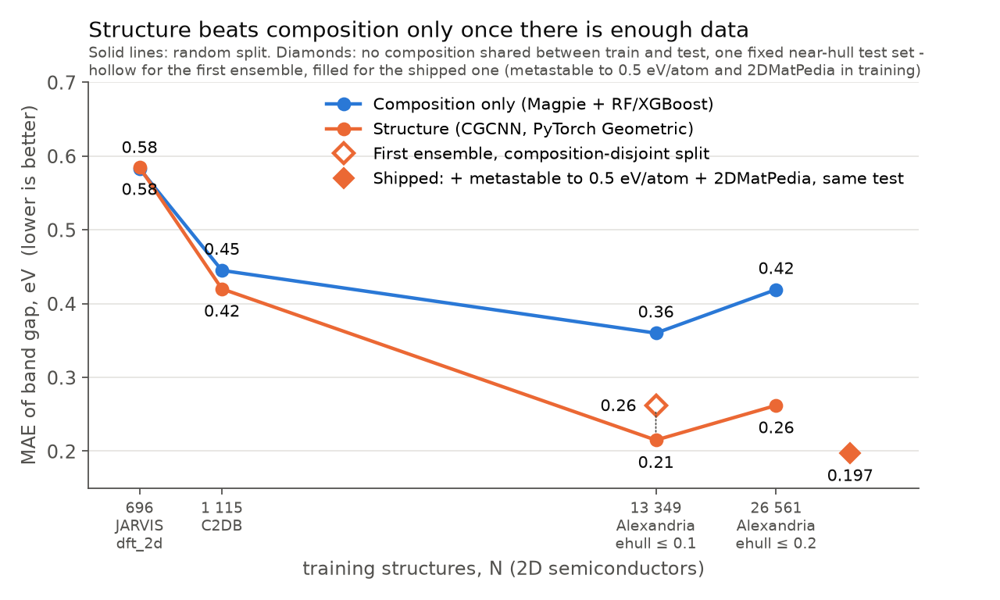
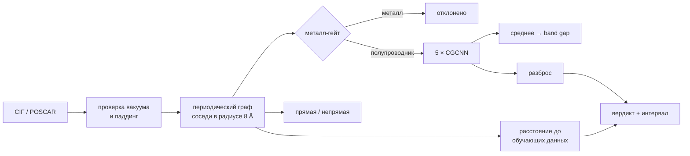
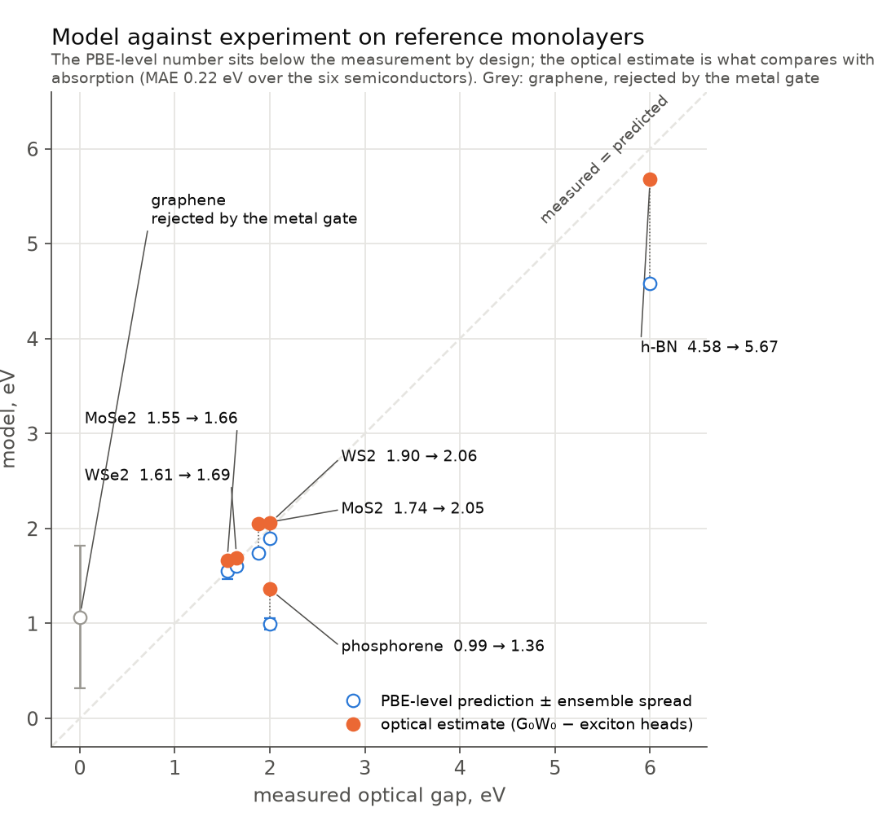
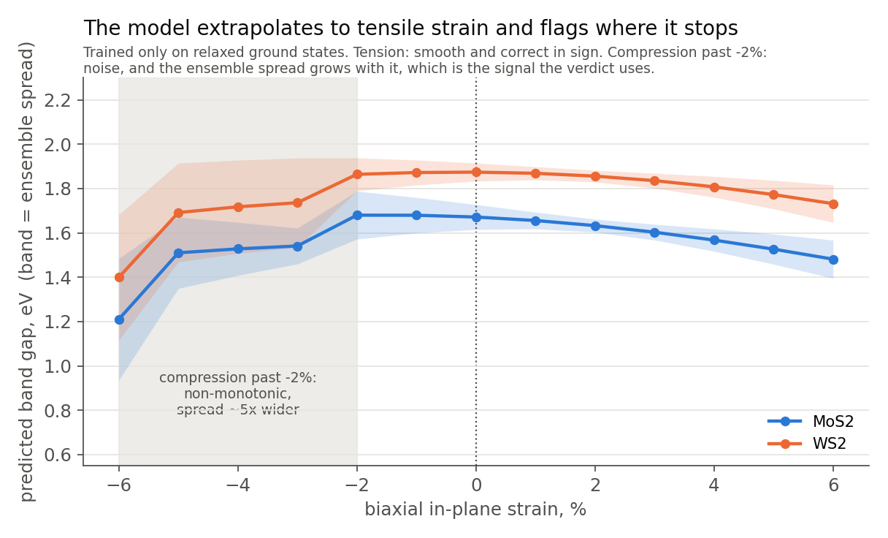

# NanoMatAI — band gap 2D-полупроводников по кристаллической структуре

[](https://doi.org/10.5281/zenodo.22863467)

[English version](README.md)

**[Открыть обозреватель предсказаний →](https://ac1esan.github.io/nanomat-ai/)** —
28 372 структуры с калиброванным интервалом и вердиктом на каждой, плюс карта по
таблице Менделеева, где модель реально работает. Без установки и без загрузки файлов.
Та же страница на [Hugging Face Spaces](https://huggingface.co/spaces/ac1esan/nanomat-ai).

Графовая нейросеть, которая по структуре монослоя предсказывает ширину запрещённой
зоны меньше чем за секунду на процессоре ноутбука. И, что важнее, честно говорит,
когда ей верить не нужно. Проект сделан соло: только открытые API для данных,
сначала baseline по составу, затем структурная модель, масштабированная с 700 до
45 000 структур, и слой доверия, который я ломал до тех пор, пока он не сломался
по-настоящему, а потом чинил.

<p align="center"></p>

**Главный результат.** На 700 структурах графовая сеть не лучше случайного леса на
композиционных признаках, у обоих MAE 0.58 эВ. Разрыв появляется только с данными: на
тестовом наборе стабильных 2D-полупроводников без общих с обучением составов
поставляемая модель даёт **MAE 0.186 эВ** против 0.430 эВ у состава. Узким местом был
объём данных, а не класс модели — причём большая часть нужных модели данных была
отсеяна как «метастабильная»: обучение на монослоях до 0.5 эВ/атом над оболочкой
улучшило и тест у оболочки ([ниже](#чего-стоил-фильтр-стабильности)). Шаг до 1.0
эВ/атом тоже прошёл, но едва: отдача от метастабильных данных заканчивается.

## Быстрый старт

```bash
git clone https://github.com/ac1esan/nanomat-ai && cd nanomat-ai
pip install -r requirements.txt
```

```bash
python screen_bandgap.py --in examples/ --out results.csv    # батч: папка CIF/POSCAR -> ранжированный CSV
```

Если файла структуры под рукой нет, типичный сценарий закрывает
[обозреватель](https://ac1esan.github.io/nanomat-ai/): фильтр по элементам,
диапазону щели и вердикту поверх 28 372 предпосчитанных предсказаний.

```bash
python screen_bandgap.py --app                                # веб-интерфейс на http://127.0.0.1:7860
```

```bash
pytest -q                                                     # 27 смоук- и контрактных тестов
```

Из языковой модели — через Model Context Protocol
([nanomat/mcp_server.py](nanomat/mcp_server.py)), любым клиентом, который запускает
сервер по stdio:

```bash
pip install -r requirements-llm.txt
claude mcp add nanomat -- "$(pwd)/venv/bin/python" -m nanomat.mcp_server
```

Пять инструментов: предсказать вставленный CIF или POSCAR; найти посчитанные структуры
по формуле или общепринятому названию; искать по таблице скрининга — окно щели,
элементы, вердикт, тип щели, прототип; получить один материал; прочитать карточку
модели. Каждая строка начинается с вердикта и типичной ошибки его тира, даёт 90%-интервал
явным диапазоном, показывает структуру из нескольких баз один раз и говорит, когда модель
расходится с эталоном сильнее типичной ошибки тира. Поисковые инструменты читают
`screening_table.csv`, его пишет `scripts/precompute_screening.py`. Как с этим справились
десять языковых моделей — [ниже](#передаёт-ли-языковая-модель-вердикт-дальше).

Результат для примеров из репозитория ([examples/expected_results.csv](examples/expected_results.csv)):

| файл | формула | gap (PBE), эВ | интервал 90% | вердикт |
|---|---|---|---|---|
| WS2.vasp | WS2 | 1.88 | ±0.22 | reliable |
| MoS2.vasp | MoS2 | 1.67 | ±0.23 | reliable |
| MoSe2.vasp | MoSe2 | 1.47 | ±0.25 | reliable |
| WSe2.vasp | WSe2 | 1.56 | ±0.16 | reliable |
| hBN.vasp | BN | 4.69 | ±0.37 | reliable |
| phosphorene.vasp | P | 0.91 | ±0.44 | check |
| graphene.vasp | C | 2.05 | — | **вне области: металл-гейт** |

Последняя строка и есть смысл проекта: графен — полуметалл, регрессор на металлах не
учился, и инструмент сообщает об этом сам, без подсказки. PBE-щель фосфорена около
0.9 эВ во всех базах, где он есть, так что 0.91 — верное число. Вердикт check потому,
что разброс ансамбля у него выше медианы, а интервал самый широкий из шести, потому
что он похож на метастабильные обучающие структуры, на которых модель ошибается
сильнее.

## Как понять, когда не верить

Инструмент скрининга, который уверенно ошибается, хуже, чем отсутствие
инструмента. Здесь три независимые проверки, и каждая появилась потому, что
предыдущую поймали на провале.

**1. Металл-гейт.** Регрессор обучен только на полупроводниках, поэтому на металле
выдаёт бессмыслицу. Отдельный классификатор, ансамбль из пяти, отсекает их первым:
ROC-AUC 0.984 на своём отложенном сплите и 0.951 / 0.939 / 0.917 на отложенных
метастабильной Alexandria, 2DMatPedia и Alexandria 0.2–0.5 эВ/атом (переобучен в этой
версии, эксперимент — в разделе «Результаты»).

Первая версия гейта, обученная на одной Alexandria, имела ROC-AUC 0.952 и при этом
давала графену `p(металл) = 0.00`. Причина: из 19 691 обучающей структуры ровно
**две** были чисто углеродными, и обе помечены полупроводниками. После
переобучения на трёх объединённых источниках (24 314 структур, графен среди них)
гейт возвращает `p(металл) = 1.00` на графене без ложных срабатываний на TMD.

**2. Разброс ансамбля.** Пять моделей с разными сидами; стандартное отклонение
между ними хорошо ранжирует ошибки (Spearman 0.40 с модулем ошибки, у MC-dropout
на одной модели было 0.17). По квартилям разброса ошибка растёт с 0.09 до 0.35 эВ.

**3. Расстояние до обучающих данных в латентном пространстве.** Все пять членов учатся
на одних данных, поэтому на химии, которую обучающая выборка почти не покрывает, они
могут согласиться по неверной причине: разброс измеряет расхождение между
инициализациями, а не то, насколько химия покрыта данными. Косинусное расстояние до
десяти ближайших обучающих структур в собственном пространстве эмбеддингов модели
измеряет это напрямую. С ошибкой оно коррелирует на 0.39 против 0.40 у разброса, а
вместе они дают 0.44, то есть несут разную информацию. (Пока обучение не доходило до
0.5 эВ/атом, оно было сильнее разброса, 0.47 против 0.45: чем плотнее обучающая
выборка, тем меньше «далёкого», а оба сигнала ослабли ещё и потому, что сами ошибки
стали меньше и ровнее.) Вердикт, построенный на обоих, сохраняет порядок на каждом
отложенном наборе, которого модель не видела: 0.15 / 0.22 / 0.39 эВ по трём тирам на
метастабильной Alexandria 0.1–0.2 эВ/атом, 0.15 / 0.22 / 0.39 на 0.2–0.5 и
0.13 / 0.25 / 0.48 на 2DMatPedia.

**Опровержение.** Раньше этот раздел доказывал мысль фосфореном: предсказано 0.82 эВ,
измерено 2.0, вердикт «надёжно». Фосфорен лежит в обучающей выборке, а его PBE-щель —
0.85–0.90 эВ во всех четырёх базах, где он есть. Предсказание было верным на том
уровне, который модель предсказывает; 1.2 эВ — это PBE против оптического измерения,
то есть физика, для которой и существует оптическая оценка ниже. Латентное расстояние
отметило разреженную окрестность — это был единственный слой элементарного фосфора у
оболочки: ложная тревога на обучающей точке, а не пойманная ошибка. Теперь, когда в
обучении есть метастабильные слои фосфора, флага нет, как и должно быть для
структуры, которую модель видела. Сигнал держится на статистике выше, а не на этом
примере. Сравнение числа уровня PBE с экспериментом
— пятая ошибка протокола, которую проект нашёл в собственных утверждениях.

Провалившуюся промежуточную попытку стоит записать: простой подсчёт, сколько
обучающих структур делят химическую систему с запросом, коррелировал с ошибкой
**в обратную сторону**, потому что химически богатые системы одновременно и лучше
представлены, и объективно сложнее.

**Калиброванные интервалы.** Сырые ±1σ разброса покрывают всего 44 процента случаев
вместо 68: глубокие ансамбли хорошо ранжируют, но переоценивают свою уверенность.
Множитель, подобранный на валидации (×4.07), даёт 91 процент покрытия на отложенном
тесте при целевых 90. Это лучше фиксированного конформного интервала, который для всех
был бы ±0.44 эВ, тогда как предсказание в тире reliable несёт медианные ±0.25 эВ.

**Калибровка под ту популяцию, которая встретится, а не только под ту, на которой
подгоняли.** Множитель подобран на структурах у выпуклой оболочки, а ансамбль теперь
учится и на метастабильных (0.1–1.0 эВ/атом над оболочкой). На отложенных
метастабильных монослоях тот же интервал покрывает 86%, потому что при равном разбросе
метастабильная структура ошибается сильнее. Ни один сигнал доверия этого не видит:
разброс и латентное расстояние отличают две популяции едва лучше монетки (ROC-AUC 0.56
и 0.63). Видит само латентное пространство: линейная голова на эмбеддингах пяти членов
отличает отложенную метастабильную структуру от отложенной стабильной с ROC-AUC 0.91.
Поэтому множитель интервала берётся по ячейке «похожа на метастабильную × квартиль
разброса». На 20 разбиениях отложенных метастабильных наборов пополам по составам
(подгонка на одной половине, отчёт на другой):

| | один множитель | по ячейкам |
|---|---|---|
| отложенные метастабильные (0.1–0.5 эВ/атом) | 85.8% ± 0.5 | **89.6% ± 0.8** |
| стабильный тест | 91.5% | 91.1%, медианная ширина ±0.37 → ±0.36 эВ |
| самый уверенный квартиль разброса (стабильные) | 84% | **91%** |
| 2DMatPedia, не участвовала в подгонке | **85.1%** | 84.1% |

Последняя строка — в обратную сторону: на базе, которой подгонка не видела, таблица по
ячейкам покрывает на пункт меньше одного множителя. На строках таблицы скрининга,
на которых ансамбль не учился, интервал покрывает 87.9%: 90.4% на Alexandria, 82.5% на
C2DB и 79.2% на JARVIS dft_2d; две последние посчитаны другими методами, чем цель.

Ту же голову пробовали и как правило вердикта — reliable становится check, если
структура похожа на метастабильную, — и отвергли, на предыдущем ансамбле. Оно улучшало тир reliable на
стабильных (0.104 → 0.094 эВ), но переворачивало порядок тиров на каждой популяции,
которой модель не видела: на отложенной метастабильной Alexandria reliable закончил с
0.251 эВ против 0.212 у check. В reliable оставались как раз метастабильные
структуры, которые голова принимает за стабильные, — ровно там модель уверенно
ошибается. Поэтому сходство расширяет интервал и не трогает вердикт, а надёжная
метастабильная структура по-прежнему ошибается примерно в полтора раза сильнее
надёжной стабильной (0.15 против 0.10 эВ). (`scripts/calibrate_population.py`)

## Как устроено


```mermaid
flowchart LR
    S[CIF / POSCAR] --> V[проверка вакуума<br/>и паддинг]
    V --> G[периодический граф<br/>соседи в радиусе 8 Å]
    G --> M{металл-гейт}
    M -->|металл| X[отклонено]
    M -->|полупроводник| E[5 × CGCNN]
    E --> P[среднее → band gap]
    E --> U[разброс]
    G --> L[расстояние до<br/>обучающих данных]
    U --> V2[вердикт + интервал]
    L --> V2
    G --> T[прямая / непрямая]
```

- **Модель.** CGCNN на PyTorch Geometric: эмбеддинг атомного номера (128), четыре
  слоя `CGConv` с гауссовыми RBF-признаками рёбер (40 центров на 0–8 Å), среднее по
  атомам, MLP-голова. Определена один раз в [`nanomat/model.py`](nanomat/model.py)
  и используется и обучением, и инференсом, поэтому разойтись они не могут.
- **Данные.** Alexandria 2D и 2DMatPedia через API JARVIS-Tools, никакого
  собственного парсера. Обучение — 45 115 монослоёв: 10 733 стабильных полупроводника
  Alexandria (`e_above_hull ≤ 0.1` эВ/атом, `gap > 0.01` эВ), 32 736 метастабильных
  (0.1–1.0 эВ/атом) и 1 646 немагнитных слоёв 2DMatPedia, которых в Alexandria нет. Таргет —
  фундаментальная щель PBE.
- **Оценка.** Сплит без общих составов: ни одна формула не встречается одновременно в
  обучении и тесте. Валидация и тест — стабильная Alexandria (1 290 и 1 326 структур) и
  не менялись с первой модели, поэтому все числа ниже посчитаны на одних и тех же
  1 326 структурах. Это существенно: на 13 349 стабильных структур приходится всего
  8 388 уникальных составов.
- **Тип щели.** Попытка вывести тип из разности двух регрессий свалилась в
  тривиальный baseline (79 процентов). Отдельная классификационная голова с весом
  на редком классе даёт ROC-AUC 0.758 на строгом сплите. Порог решения подобран на
  валидации (0.33, а не 0.5) и хранится в чекпойнте, потому что `pos_weight`
  смещает вероятности.

## Результаты

Baseline по составу (Magpie + RandomForest/XGBoost) против CGCNN:

| датасет | N | состав, MAE | CGCNN MAE | сплит |
|---|---|---|---|---|
| JARVIS dft_2d (OptB88vdW) | 696 | 0.583 | ≈ 0.585 | случайный, 5-fold CV |
| C2DB (PBE) | 1 115 | 0.445 | ≈ 0.42 | случайный, 5-fold CV |
| Alexandria 2D, ehull ≤ 0.1 | 13 349 | 0.360 | 0.215 | случайный, 5-fold CV |
| Alexandria 2D, ehull ≤ 0.2 | 26 561 | 0.419 | 0.262 | случайный, свой тест |
| Alexandria 2D, ehull ≤ 0.1 | 13 349 | 0.430 | 0.246 | без общих составов |
| + метастабильные до 0.2 + 2DMatPedia, только в обучении | 22 103 обуч. | 0.430 | 0.225 | без общих составов, тот же тест |
| + метастабильные до 0.5 + 2DMatPedia | 40 548 обуч. | 0.430 | 0.197 | без общих составов, тот же тест |
| **+ метастабильные до 1.0 + 2DMatPedia (поставка)** | **45 115 обуч.** | **0.430** | **0.186** | **без общих составов, тот же тест** |

Числа для состава в первых строках получены пятикратной кросс-валидацией, а это
другой протокол, и сравнивать его со сплитом без общих составов нельзя. На том же
самом тестовом наборе состав даёт 0.430 эВ, а не 0.360, то есть структура выигрывает
57 процентов у поставляемой модели, а заявленные до перепроверки через
[`scripts/composition_baseline.py`](scripts/composition_baseline.py) 27 процентов были
ошибкой не в нашу пользу. Строка ehull ≤ 0.2 ввела в заблуждение в обратную сторону,
см. [ниже](#чего-стоил-фильтр-стабильности).

### Координата, которую теряет расстояние на ребре

Ребро несёт только расстояние, поэтому два полиморфа одного состава для графа почти
неразличимы — а для 2D-электроники это ровно то различие, которое важно: 1H-MoS₂
полупроводник, 1T-MoS₂ металлический. Слабость была измерена, и граф получил
поатомную гистограмму углов связей ([`nanomat/graph.py`](nanomat/graph.py),
отсечение 4 Å вместо 8 Å для рёбер: угол до атома в 8 Å ничего не говорит о
координации).

Сравнение с контролем, обученным на том же сплите, с теми же сидами, в том же
окружении — контроль нужен потому, что прежние веса считались на другом torch и
другой карте, а это само по себе стоит 0.01 эВ:

| | контроль | с углами |
|---|---|---|
| MAE | 0.271 | **0.246** |
| RMSE | 0.492 | **0.435** |
| R² | 0.869 | **0.898** |

Парно по тем же 1326 тестовым структурам разность **+0.026 эВ**, бутстрап 95%
+0.015…+0.037, Wilcoxon p = 4·10⁻⁵. Три измерения чувствительности к полиморфам
([`scripts/polymorph_sensitivity.py`](scripts/polymorph_sensitivity.py)) двинулись
так, как предсказывал диагноз: глобальный разброс не изменился, внутрисоставной и
1H против 1T заметно выросли. Данные, описанные дальше, примерно ещё раз удвоили этот
выигрыш; все три поколения — в [карточке модели](MODEL_CARD.md).

Поставляемый ансамбль добавляет данные, описанные дальше, и даёт **MAE 0.186 эВ
(95% ДИ 0.172–0.202), RMSE 0.327, R² 0.942** на тех же 1 326 отложенных структурах,
чьи составы ни разу не встречаются в обучении. Члены дают 0.220 / 0.208 / 0.215 /
0.218 / 0.217, то есть усреднение выигрывает 0.03 эВ. Часть расстояния от 0.197
прошлой версии — не данные: её точный рецепт, переобученный как контроль последнего
эксперимента, дал 0.191. Два обучения одного рецепта здесь расходятся примерно на
0.005 эВ, поэтому каждое сравнение в этом README — против контроля из той же сессии.

Контрольный прогон на первом ансамбле отделил цену честной оценки: тот же код, те же
данные, отличается только сплит.

| Сплит | MAE |
|---|---|
| случайный | 0.252 |
| без общих составов | 0.261 |

### Чего стоил фильтр стабильности

Первые модели учились только на `e_above_hull ≤ 0.1`, потому что набор с порогом 0.2
из таблицы выше дал худший результат (0.262 против 0.215). Но каждое из этих чисел
посчитано на своём тесте, а тест набора 0.2 наполовину метастабильный, что труднее для
любой модели: сравнение меняло популяцию, на которой меряли, а не только данные,
на которых учили. [`scripts/stability_experiment.py`](scripts/stability_experiment.py)
ставит вопрос правильно: четыре плеча, один сплит, одна GPU-сессия, отличается только
обучающая часть, плюс два дополнительных теста, вырезанных из добавок по формулам.
(Ни одной их формулы нет в добавленных данных; но около 40% метастабильного теста —
полиморфы формул из общей для всех плеч стабильной обучающей выборки. Раньше здесь
было написано, что ни одно плечо не училось на их формулах, — это было неверно.)

| тест | только стабильные | + 2DMatPedia | + метастабильные до 0.2 | **+ оба** |
|---|---|---|---|---|
| стабильная Alexandria, 1 326 | 0.249 | 0.261 | 0.236 | **0.225** |
| отложенная метастабильная Alexandria, 2 512 | 0.500 | 0.490 | 0.314 | **0.311** |
| отложенная 2DMatPedia, 397 | 0.770 | 0.464 | 0.721 | **0.437** |

Все разности парные, против контроля на тех же структурах; у комбинированного плеча
95-процентный интервал ниже нуля на всех трёх тестах (−0.039…−0.011 эВ на стабильном).
Правило приёмки было записано в журнал проекта до окончания прогонов: на стабильном
тесте не хуже контроля больше чем на +0.005 эВ, а на одном из двух других лучше, с
интервалом целиком ниже нуля. 2DMatPedia в одиночку провалила первое условие (+0.011);
у комбинации выигрыш больше. Источники дополняют друг друга: каждый чинит свою
популяцию и почти не трогает чужую.

Сильнее всего изменилось там, где модель была слабее всего: углерод на отложенной
2DMatPedia 1.59 → 0.67 эВ (17 структур, так что это качественный вывод), бор 1.82 →
0.92, азот на отложенной метастабильной Alexandria 1.01 → 0.38, водород 1.25 → 0.83.

Заодно модель научилась полиморфам. На C2DB, на которой не училась ни одна из этих
моделей, тот ансамбль воспроизводит 65 процентов разности щелей между 1H-MX₂ и
1T-MX₂ (одни углы давали 37, без углов было 18) и угадывает её знак в 92 процентах
случаев. Метастабильная структура — почти по определению другой полиморф состава, у
которого есть стабильный: фильтр вырезал ровно тот контраст «один состав — разные
структуры», на котором модель учится их различать. Углы сделали этот контраст видимым,
данные дали, на чём учиться. Следующие два шага вверх по оболочке (ниже) двигали две
меры по очереди. До 0.5 эВ/атом: внутри состава 0.69 → 0.91, пара 1H/1T только
0.65 → 0.68. До 1.0 эВ/атом, поставляемая модель: 1H/1T 0.68 → 0.81 (корреляция
разностей 0.77 → 0.90, знак верен в 92 процентах), а внутри состава откатилось к 0.81.
Ни то ни другое не монотонно по данным: поставляемая модель лучше всех прежних
различает пару 1H/1T и хуже предыдущей — соседей по составу вообще.

Ошибка по-прежнему следует за плотностью данных, а не за физикой — точнее всего на
переходных металлах, хуже всего на лёгких main-group соединениях, от величины щели не
зависит, — но перепад стал заметно мягче.

#### Дальше 0.2 эВ/атом

Комбинированное плечо ушло в поставку, а в Alexandria оставалось ещё около 24 000
полупроводников на 0.2–0.5 эВ/атом над оболочкой.
[`scripts/hull_experiment.py`](scripts/hull_experiment.py) повторяет тот же дизайн, с
комбинированным плечом в роли контроля: три плеча обучались рядом в одной сессии, те же
валидация и тест, плюс четвёртый тест — 2 524 структуры на 0.2–0.5 эВ/атом, на формулах
которых не училось ни одно плечо. Правило решения записано в шапке скрипта до обучения,
и оценка применяет его механически.

| тест | контроль | + 0.2–0.3 | **+ 0.2–0.5** | + 0.2–0.5 против контроля, 95% ДИ |
|---|---|---|---|---|
| стабильная Alexandria, 1 326 | 0.230 | 0.210 | **0.197** | −0.032 [−0.043, −0.022] |
| отложенная метастабильная Alexandria, 2 512 | 0.313 | 0.281 | **0.267** | −0.045 [−0.057, −0.035] |
| отложенная 2DMatPedia, 397 | 0.450 | 0.436 | **0.412** | −0.038 [−0.063, −0.013] |
| отложенные 0.2–0.5 эВ/атом, 2 524 | 0.438 | 0.324 | **0.256** | −0.182 [−0.197, −0.167] |

Контроль даёт 0.230 там, где те же данные дали 0.225 на прошлой карте, — это вклад
окружения, поэтому контроль и переобучается в каждой сессии. Отклик монотонный: каждый
шаг вверх по оболочке улучшает все популяции, включая стабильную, и к 0.5 насыщения не
видно. Водород на дальнем тесте 1.18 → 0.58 эВ, кислород 0.68 → 0.44. Два среза по
лёгким элементам сдвинулись в обратную сторону, не дойдя до значимости, — бор на
метастабильном тесте (+0.15, 26 структур) и водород на 2DMatPedia (+0.07, 40); они
записаны как открытые.

#### Дальше 0.5 эВ/атом: где перестаёт окупаться

Плечо 0.2–0.5 ушло в прошлую версию, а в Alexandria оставалось ещё около 5 000
полупроводников на 0.5–1.0 эВ/атом (4 567 после того, как пятую часть новых формул
отложили в тест). [`scripts/hull_1ev_experiment.py`](scripts/hull_1ev_experiment.py)
повторяет дизайн ещё раз: два плеча, контроль — точный рецепт прошлой версии. Правило
записано в скрипт до обучения, с одним изменением: тест из новой полосы показывается,
но не голосует, потому что плечо, обученное на полосе, выигрывает на ней почти по
построению.

| тест | контроль | **+ 0.5–1.0 (поставка)** | Δ, 95% ДИ |
|---|---|---|---|
| стабильная Alexandria, 1 326 | 0.191 | **0.186** | −0.004 [−0.011, +0.003] |
| отложенная метастабильная Alexandria, 2 512 | 0.263 | **0.260** | −0.003 [−0.007, +0.002] |
| отложенная 2DMatPedia, 397 | 0.417 | **0.402** | −0.015 [−0.034, +0.004] |
| отложенные 0.2–0.5 эВ/атом, 2 524 | 0.256 | **0.248** | −0.007 [−0.012, −0.002] |
| отложенные 0.5–1.0 эВ/атом, 453 (не голосует) | 0.327 | 0.222 | −0.105 [−0.143, −0.073] |

Правило выполнено — на стабильном тесте не хуже, на дальнем лучше с интервалом целиком
ниже нуля, — и больше ничего. Шаг до 0.5 дал на стабильном тесте 0.032 эВ, этот —
0.004, внутри собственного шума. Больше всех выиграл азот (−0.039 на дальнем тесте);
углерод и бор на 2DMatPedia сдвинулись примерно на −0.14 на 17 и 21 структуре, это
качественный вывод. Отдача от метастабильных данных исчерпана примерно на 0.5
эВ/атом, и следующий выигрыш придётся искать в другом месте.

Слой доверия за это заплатил. На том же тесте корреляция Спирмена разброса с ошибкой
упала с 0.45 до 0.40, латентного расстояния — с 0.41 до 0.39. Тиры по-прежнему
ранжируют (0.10 / 0.17 / 0.35 эВ против 0.10 / 0.17 / 0.37), но работать им не с чем:
ошибки стали и меньше, и ровнее.

### Два классификатора, переобученные на тех же данных

Металл-гейт и классификатор типа щели всё ещё учились на старых, только стабильных
данных. [`scripts/classifier_experiment.py`](scripts/classifier_experiment.py)
повторяет для них дизайн эксперимента со стабильностью: одно окружение, боевые
валидация и тест в каждом плече, дополнительные тесты вырезаны из добавок по составу,
а правило решения записано до обучения. ROC-AUC, парно против контроля, переобученного
в той же сессии:

| Металл-гейт | был | контроль | **переобучен** | Δ к контролю, 95% ДИ |
|---|---|---|---|---|
| свой тестовый сплит (n = 2 440) | 0.944 | 0.949 | **0.969** | +0.020 [+0.013, +0.027] |
| отложенная метастабильная Alexandria (2 998) | 0.813 | 0.796 | **0.919** | +0.123 [+0.108, +0.137] |
| отложенная 2DMatPedia (478) | 0.783 | 0.784 | **0.892** | +0.108 [+0.067, +0.150] |

На 2DMatPedia гейт теперь ловит 88% металлов вместо 67% и ошибочно отсекает 26%
полупроводников вместо 21%; на метастабильной Alexandria — 86% вместо 60% при 18%
вместо 16%. Графен по-прежнему отсекается.

Два решения отступили от записанного правила. Оба записаны здесь, потому что правило
стоит записывать, только если отступления от него видны:

- **Гейт, ушедший тогда в поставку, использовал угловой дескриптор.** С углами и без плечи оказались
  неразличимы на всех трёх тестах, и правило при равенстве выбирало плечо без углов.
  Но оно называет WS₂ металлом уже при растяжении в плоскости на 1% (p 0.56 при
  пороге 0.47), а это внутри разброса постоянных решётки между функционалами. Плечо с
  углами держит все шесть эталонных полупроводников от −1% до +1% и впервые
  ошибается на WSe₂ при +2%. Тест теперь проверяет поставляемый гейт при −1%, 0 и +1%.
- **Классификатор типа щели не заменён.** Переобученный на метастабильных данных, он
  прошёл правило — ROC-AUC +0.072 [+0.052, +0.094] на отложенных метастабильных,
  −0.001 на стабильном тесте, — но называет монослои MoS₂, MoSe₂ и фосфорена
  непрямозонными, а и метки самой Alexandria, и эксперимент говорят «прямая». В правиле
  была проверка на эталонах для гейта и не было для этого классификатора. Контроль с
  другим сидом тоже переворачивает MoS₂, так что у границы ответ одиночного
  классификатора на конкретном материале — отчасти удача сида, даже когда ранжирование
  улучшается. Следующее, что нужно было измерить, — ансамбль сидов, как у щели (ниже).

Шум сида на незнакомых данных вообще велик: контроль гейта, переобученный с другим
сидом, сдвинул ROC-AUC на 2DMatPedia на −0.046.

#### Ансамбли сидов и данные до 0.5 эВ/атом

[`scripts/classifier_hull_experiment.py`](scripts/classifier_hull_experiment.py) даёт
каждому классификатору три плеча — прошлый рецепт (одна модель), те же данные с пятью
сидами и пять сидов с добавленной Alexandria 0.2–0.5 эВ/атом — плюс тест на 0.2–0.5,
на формулах которого не училось ни одно плечо. Правило снова записано заранее и теперь
проверяет эталоны у обоих классификаторов. (Попутно нашёлся баг: ансамбль
классификаторов сохранялся как его первый член, рядом с порогом, подобранным по
среднему всех пяти.)

| Металл-гейт, ROC-AUC | прошлый | контроль | 5 сидов | **5 сидов + данные (поставка)** |
|---|---|---|---|---|
| свой тестовый сплит, 2 440 | 0.969 | 0.970 | 0.977 | **0.984** (+0.014 [+0.010, +0.018]) |
| отложенная метастабильная Alexandria, 2 998 | 0.919 | 0.919 | 0.935 | **0.951** |
| отложенная 2DMatPedia, 478 | 0.892 | 0.897 | 0.924 | **0.939** |
| отложенные 0.2–0.5 эВ/атом, 7 910 | 0.844 | 0.839 | 0.855 | **0.917** |

Ложно отсечённых полупроводников на собственном тесте гейта стало 6.5% вместо 9.6%,
на 2DMatPedia — 18% вместо 26% при 88% пойманных металлов. Контроль — прошлый рецепт,
переобученный, — провалил проверку эталонов (MoS₂ 0.42 при пороге 0.40), то есть
старая одиночная модель держала эталоны отчасти везением. Поставляемый держит все шесть
от −2% до +2% растяжения в плоскости, MoSe₂ при +2% ровно на пороге; с +3% отсекает
MoSe₂ и WSe₂, тогда как прошлый гейт отсекал WSe₂ уже при +2%. Полиморф MoS₂ с меткой
0.83 эВ отсекают все версии гейта (у поставляемого 0.68).

| Тип щели, ROC-AUC | прошлый | контроль | 5 сидов | 5 сидов + данные |
|---|---|---|---|---|
| стабильный тест, 1 326 | 0.758 | 0.762 | 0.782 | 0.798 |
| отложенная метастабильная Alexandria, 2 512 | 0.634 | 0.640 | 0.728 | 0.738 |
| отложенные 0.2–0.5 эВ/атом, 2 524 | 0.560 | 0.573 | 0.615 | 0.684 |

**Не заменён.** Оба плеча с пятью сидами ранжируют лучше везде, и оба называют MoS₂,
MoSe₂ и фосфорен непрямозонными (MoS₂ — 0.53 при пороге 0.41). Все пять членов
сдвигаются вместе, значит, дело в данных, а не в сиде: Alexandria метит MoS₂ прямой с
запасом 0.07 эВ при границе 0.1, и метастабильные структуры переносят границу через
него. Остаётся прошлый классификатор; ансамбль не исправил того, что от него ждали.

### Вторая база, проверенная по структурам

2DMatPedia не добавляли на доверии. По формулам она расходилась с Alexandria на
0.44 эВ, но у одной формулы несколько полиморфов, и базы не обязаны были взять один и
тот же. [`scripts/audit_2dmatpedia.py`](scripts/audit_2dmatpedia.py) сопоставляет по
структуре: каждый слой в единую рамку (ось вакуума к нормали слоя, одинаковый вакуум,
примитивная ячейка), затем `StructureMatcher` из pymatgen с допусками, ужесточёнными
под слои: дефолтные нормируются на объём, который в слое почти весь вакуум, и
принимали за MoS₂ структуру на 1 эВ/атом выше по энергии. Даже ужесточённый, в слое
его допуск около 0.5 Å — хватает, чтобы принять плоский и гофрированный слой за один,
поэтому у двойников должна ещё совпадать толщина слоя, в пределах 0.2 Å. Порог взят
из 1 178 пар, которые принимало одно сопоставление: до 0.2 Å расхождение щели ровное
(MAE 0.06–0.07 эВ, согласие «металл или нет» 96%), дальше 0.17 эВ и 70%, а плоский и
гофрированный слои различаются на 0.45–0.88 Å.

- У 1 131 записи нашёлся двойник в Alexandria. Их PBE-энергии совпадают с медианой
  0.0014 эВ/атом: одна расчётная схема, включая +U.
- На одной и той же структуре щели совпадают с MAE 0.088 эВ (медиана 0.055,
  r = 0.995). В паре «по формуле» те же записи расходятся на 0.306: большая часть
  кажущегося расхождения была полиморфами, а не метками.
- Где расхождение больше 0.3 эВ, судьи — C2DB и JARVIS dft_2d — в целом не встают ни на
  одну сторону. Alexandria завышает щель плоских сотовых слоёв с краями зон в точке K:
  графен 1.23 эВ и плоский силицен 0.86, где у других баз ноль, плоский BP 1.31 против
  0.90. Тот же слой BP хранится в Alexandria ещё в трёх ячейках побольше и там даёт
  0.906, то есть число зависит от ячейки — похоже на k-сетку, не содержащую K. Обе
  записи графена лежат в тестовом сплите модели. 2DMatPedia завышает на ~1 эВ
  семейство ZrNCl. На магнитных материалах базы расходятся чаще (согласие «металл
  или нет» 91% против 97% на немагнитных), и ни одна не права стабильно, поэтому
  берутся только немагнитные записи 2DMatPedia. (До проверки толщины здесь стояли
  GaAs, AlAs, тригалогениды ZrX₃ и HfX₃, FeCl₂ и FeI₂ — как ошибки меток или как
  «другое магнитное состояние». Это были разные структуры.)

До того как данные пошли в дело, тогдашний ансамбль прогнали по всей 2DMatPedia как
внешнюю валидацию на базе, которой он не видел: MAE 0.75 эВ, 78 процентов этой
популяции модель сама пометила как вне области, и вердикт всё равно ранжировал ошибку —
0.31 / 0.58 / 0.83 эВ по трём тирам.

### Второе свойство: работа выхода и края зон, которые она открывает

| | Состав | Структура | n_test |
|---|---|---|---|
| Ширина щели | 0.430 | **0.186** | 1 326 |
| Работа выхода | 0.314 | **0.254** | 337 |

Обучено на 3505 структурах C2DB, где работа выхода есть, той же архитектурой и по
тому же протоколу, в отдельном чекпойнте. Структура выигрывает 19 процентов против
57 у щели, и это осмысленно: работа выхода сильнее опирается на химию и слабее на
геометрию.

Само число — менее интересная половина. Обученная величина это вакуум минус уровень
Ферми: для металла это работа выхода в обычном смысле, но у нелегированного
полупроводника DFT кладёт уровень Ферми посреди щели, поэтому само по себе это
опорный уровень, а не то, что показывает прибор. Отсюда и h-BN с 3.4 эВ против
литературных 4.5, причём база согласна с моделью, там 3.49.

Вместе со щелью оно задаёт **положение обоих краёв зон относительно вакуума**, а
это и есть пара, по которой подбирают металл контакта:

| | Сродство к электрону | литература | Потенциал ионизации | литература |
|---|---|---|---|---|
| MoS₂ | 4.42 | 4.0 | 6.09 | 6.1 |
| MoSe₂ | 3.99 | 3.9 | 5.45 | 5.5 |
| WS₂ | 4.01 | 3.9 | 5.89 | 6.0 |
| WSe₂ | 3.64 | 3.6 | 5.20 | 5.2 |

Края зон — это вычитание между двумя моделями, поэтому за свою половину должна
отвечать **каждая** из них: края не показываются, если хоть один вердикт говорит
«вне области применимости». У этой модели свой слой доверия, а не доля чужого —
свои квартили разброса, свой множитель интервала и своё латентное расстояние до
своих обучающих эмбеддингов, потому что обучались они на разных базах. Структура
может быть обычной для одной и невиданной для другой.

Графен — задокументированный провал, и теперь его ловит именно этот второй вердикт:
элементарно-углеродная структура в наборе ровно одна и лежит в тестовой выборке,
поэтому модель даёт 3.18 против 4.25 в базе — с разбросом 0.32 против 0.03 у TMD и
латентным расстоянием за порогом q90. Вердикт читается как «вне области
применимости», краёв зон не будет. На строках C2DB, где есть эталон и на которых
модель не обучалась, этот вердикт разделяет ошибку как 0.130 / 0.233 / 0.445 эВ по
трём тирам.

### Внешняя валидация на эксперименте

<p align="center"></p>

[`validate_experiment.py`](validate_experiment.py) прогоняет семь эталонных
монослоёв (лежат в [`examples/`](examples/), поэтому работает офлайн), а
[`scripts/fit_gap_corrections.py`](scripts/fit_gap_corrections.py) переводит вывод
уровня PBE в измеримую величину. Целей **две**, и путать их нельзя:

| | Подогнано по | n | Ошибка |
|---|---|---|---|
| **Квазичастичная щель** — фотоэмиссия, транспорт | G₀W₀ из C2DB | 214 | **0.25 эВ** |
| **Энергия связи экситона** | Бете–Солпитер из C2DB | 214 | **0.13 эВ** |
| **Оптическая щель** = прямая G₀W₀ − экситон | по двум выше | 214 | **0.23 эВ** |

Все три проверены на **сплите по составам** — том же протоколе, что и у модели щели,
потому что в C2DB на один состав приходится несколько записей.

**Это не поправки к щели.** Это линейные головы поверх **собственного латентного
пространства ансамбля** — 128-мерного вектора, который каждый из пяти членов и так
считает по дороге к щели, все пять подряд. Обучать граф-сеть на 214 материалах
бессмысленно, в этом проекте это измерено на 696. Подогнать ридж поверх энкодера,
видевшего 45 115 структур, — нет.

Решение пришло из измерения, где на самом деле сидела ошибка. Как функция одной
только щели оптическая поправка давала 0.38 эВ — а если подать ей **собственную**
PBE-щель C2DB вместо предсказания, становилось всего 0.31. Значит основное было не в
том, что сеть ошибается: **энергия связи экситона не является функцией щели.** Она
зависит от экранирования, то есть от структуры, а структуру энкодер уже видел.

| | одна щель | латентная голова |
|---|---|---|
| Квазичастичная щель (G₀W₀) | 0.42 | **0.25** |
| Энергия связи (BSE) | 0.24 | **0.13** |
| Оптическая щель | 0.39 | **0.23** |

У каждого энкодера свои головы, и они двигались с каждым энкодером. На обученном до
0.2 эВ/атом щели просели (оптическая 0.198 → 0.218); на обученном до 0.5
квазичастичные вернулись (0.255 → 0.226); на поставляемом, до 1.0, снова просели
(фундаментальная 0.249, прямая 0.266, оптическая 0.229, энергия связи 0.133). Набор
материалов, на котором подгоняются головы, тоже меняется вместе с энкодером — теперь
214 против 196, потому что меньше уходит вне области, — так что это не парные
сравнения. Модель щели выбирается по щели; головы берут то, что даёт этот энкодер.

Голова выигрывает в каждой полосе предсказанной щели, от 0–1 эВ до >5. И она делает
три числа **согласованными по построению**: оптическая = прямая квазичастичная минус
энергия связи. Именно это закрывает опровержение ниже.

**Где проигрывает.** Убери целое семейство на разреженном верху диапазона — и ридж не
экстраполирует там, где полином может: при переподгонке без всех записей BN и четырёх
TMD голова даёт h-BN 5.12 эВ против измеренных 6.00, тогда как полином даёт 6.06. По
измерению на этих пяти полином в целом выигрывает (0.29 против 0.33 эВ), а на четырёх
TMD выигрывает голова (0.19 против 0.34): разницу несёт h-BN. Это единственное место,
где голова хуже, и оно сообщается, а не прячется.

### Как собрана цель для оптической щели

**Раньше оптическая была слабым местом.** Раньше она опиралась на пять
измеренных монослоёв: пять точек, где один h-BN сидит на 6 эВ, — это не подгонка, а
интерполяция между двумя скоплениями, и её 0.17 эВ в выборке превращались в 0.71 при
leave-one-out. Хуже того, у прямой получался отрицательный свободный член, из-за чего
**у трети строк таблицы скрининга оптическая щель оказывалась НИЖЕ собственной сырой
щели PBE**, а у 1870 — не выше нуля. Это перевёрнуто: PBE занижает любое измерение.

C2DB считает обе половины оптической щели из первых принципов для части своего
каталога: G₀W₀ для квазичастичной щели и уравнение Бете–Солпитера для экситона. Это
214 пригодных немагнитных материалов вместо пяти.
[`scripts/fetch_c2db_optical.py`](scripts/fetch_c2db_optical.py) их забирает и
кэширует в репозитории. По этой цели подогнаны головы выше, а квадратичная формула от
одной щели хранится в чекпойнте как запасная, если голов нет. Форму выбирает
кросс-валидация, но только среди форм, которые на всём диапазоне 0–12 эВ остаются выше
сырой щели: на текущем энкодере кросс-валидация выбрала куб, который после 7 эВ уходил
ниже сырой щели (там у подгонки почти нет данных, чтобы возразить), и это поймал тест.
Так что старый дефект повториться не может.

Честная проверка — те самые пять измеренных монослоёв, которых новая подгонка не видела:

| | предсказание | новая | старая на 5 точках | измерено |
|---|---|---|---|---|
| MoS₂ | 1.67 | 2.13 | 1.88 | 1.88 |
| MoSe₂ | 1.46 | 1.92 | 1.59 | 1.55 |
| WS₂ | 1.88 | 2.35 | 2.17 | 2.00 |
| WSe₂ | 1.56 | 2.01 | 1.72 | 1.65 |
| h-BN | 4.69 | 6.05 | 6.07 | 6.00 |
| | | **0.33 эВ** | 0.26 эВ в выборке, **0.71 эВ** leave-one-out | |

Старая выглядит лучше в этой таблице только потому, что эти пять строк — её обучающие
данные. На невиданном монослое она ошибается на 0.71 эВ, новая — на 0.33.

**Опровержение, и как головы его закрывают.** Раньше здесь утверждалось, что разность
двух поправок — это энергия связи экситона, 0.55 эВ на TMD, как в литературе. Согласие
было круговым: обе подгонки обучались на этих же четырёх материалах. У двух поправок,
привязанных к **разным** эталонам, разность вообще не может быть физической величиной,
а сам HSE06 идёт примерно на 0.4 эВ ниже G₀W₀ при щели 1.7 эВ.

Латентные головы закрывают это как надо: энергия связи теперь **предсказывается**, а не
выводится. На четырёх TMD голова даёт **0.57 / 0.50 / 0.51 / 0.48 эВ** против BSE
0.55 / 0.50 / 0.52 / 0.48 — те самые несколько десятых эВ из литературы, полученные из
структуры, а не из совпадения двух подгонок. По всем 210 энергия связи составляет
медианные 0.29 от щели с разбросом 0.09 — там же, где известный скейлинг E_g/4 для 2D,
и именно этот разброс объясняет, почему никакая функция одной щели её не нашла бы.

Обе поправки подгоняются только по точкам, которые инструмент сам считает
пригодными: предсказание вне области применимости не должно определять калибровку,
которой правят все остальные.

### Обязательно ли брать геометрию из DFT-релаксации

[`scripts/geometry_sensitivity.py`](scripts/geometry_sensitivity.py) отвечает на
это для будущего интерфейса «выбрал элементы, получил предсказание»:

- Внутренняя координата бесплатна. Идеальная тригональная призма воспроизводит
  релаксированную высоту халькогена с точностью 0.02 Å и меняет щель на 0.001 эВ.
- Постоянная решётки нет. Оценённая из ковалентных радиусов, она на 9 процентов
  больше и стоит 0.42 эВ, что превышает собственную ошибку модели. Брать её нужно
  из базы релаксированных структур.
- Под деформацией модель корректно экстраполирует на растяжение и ломается на
  сжатии дальше минус двух процентов, где разброс ансамбля расширяется впятеро.

<p align="center"></p>

### Гипотеза, которая оказалась верной и всё равно проиграла

Все члены обычного ансамбля учатся на одних данных, поэтому химию, представленную
одним примером, они выучивают одинаково и дружно соглашаются: у фосфорена,
единственного слоя элементарного фосфора в обучении, разброс был 0.035 эВ. Бэггинг должен чинить это в корне: треть членов любую
конкретную структуру не увидит. Обучили и сравнили на одном тестовом наборе:

| | обычный | бэггинг |
|---|---|---|
| MAE, эВ | **0.261** | 0.306 |
| Spearman, разброс против ошибки | 0.450 | **0.495** |
| худший квартиль неопр. / лучший | 4.08× | **4.34×** |
| разброс на фосфорене, эВ | 0.035 | **0.380** |

Гипотеза подтвердилась: разброс на фосфорене вырос **в 10.8 раза**, и теперь он
сам помечает разреженный случай. Принят бэггинг всё равно не был, по трём
причинам, которые видны только после измерения.

Точность падает на 17 процентов, потому что каждый член видит около 64 процентов
структур. **Совместный** сигнал выхода за область применимости сдвигается едва
заметно, с 0.500 до 0.511, потому что расстояние до обучающих данных в латентном
пространстве уже закрывало ту же дыру: бэггинг покупает второй путь туда, куда
инструмент и так доходил. А более шумный разброс добавляет ложных тревог на
нормальных материалах: WSe₂ падает с `check` до `out-of-domain`, MoSe₂ с `reliable`
до `check`, оба — хорошо изученные монослои.

Платить 17 процентами точности за 2 процента совместного ранжирования, получая в
придачу ложные тревоги, невыгодно. Флаг остаётся в обучающем скрипте вместе с этим
измерением, чтобы никому не пришлось открывать это заново.

### Передаёт ли языковая модель вердикт дальше

Вердикт полезен, только если интерфейс перед ним его не теряет. MCP-сервер дали десяти
языковым моделям: семи открытым, от 3.8B до 31B параметров (Ollama, температура 0), и
Claude Haiku 4.5, Sonnet 5 и Opus 5.5. Все ответили на одни и те же восемь вопросов, и в
каждом спрятана ловушка, которую вывод инструмента может обезвредить: вне-доменное
число графена по просьбе «только число», а потом прямым требованием; пять кандидатов
для фотодетектора, «которым вы бы доверяли»; фосфорен, вставленный как POSCAR; 1T-MoS₂;
g-C₃N₄ «чтобы сослаться в статье»; 1.9 эВ у WS₂ против измеренных 2.0 эВ. Системный
промпт ничего не говорит о вердиктах, так что проверяется, хватает ли одного вывода
инструмента. Каждый ответ оценён вручную: 2 балла — верно, 1 — отчасти, 0 — провал
([`scripts/llm_probe.py`](scripts/llm_probe.py)).

Тест прошёл трижды, и перед каждым повтором сервер чинили по итогам предыдущего прогона:

| | прогон 1 | прогон 2 | прогон 3 |
|---|---|---|---|
| семь открытых моделей, из 112 | 64 | 69 | **75** |
| Claude Haiku 4.5, из 16 | 12 | 10 | 13.0 |
| Claude Sonnet 5, из 16 | 14 | 15 | 15.3 |
| Claude Opus 5.5, из 16 | 16 | 16 | 15.7 |

У консольного клиента Claude нет настройки температуры, поэтому в прогоне 3 каждая
модель Claude отвечала трижды; на одинаковом входе Haiku набрала 13, 11 и 15. Изменения
такого размера в баллах Claude — шум, и чище сравнение по открытым моделям.

Что дала каждая правка, на том провале, ради которого её делали:

- Строки упоминали оптическую оценку, не содержа её, и восемь ответов достраивали её
  наугад. С оценкой в каждой строке — два.
- Голую полуширину 90%-интервала дважды прочли как полную ширину. Явным диапазоном —
  ни разу.
- Пометку о спин-орбитальном взаимодействии прочли наоборот в 4 ответах из 80 («SOC
  добавляет 0.1–0.3 эВ»). С формулировкой «SOC понижает щель» — в 1 из 128.
- Одну структуру из двух баз выдавали за двух кандидатов в 5 списках из 10. Одной
  строкой с двойниками — в 0 из 29.
- 1T′-MoS₂, который модель называла надёжным при 0.96 эВ против эталона 0.05 эВ, сначала
  пометили в его строке, и три модели процитировали пометку. Переобученный металл-гейт
  теперь его отсекает, и в прогоне 3 все ответы Claude и четыре из семи открытых моделей
  говорят, что это не полупроводник.

Новое поле принесло новую ошибку чтения. Похожесть на метастабильные обучающие
структуры, которая расширяет интервал, пять моделей прочли как вероятность того, что
материал метастабилен. На строках Alexandria это почти правда, потому что голову учили
ровно на этой метке, но у фосфорена больше 0.8, хотя он лежит у оболочки, и восемь
ответов о нём получили сниженную оценку. Теперь поле названо по тому, что оно измеряет,
и каждая строка говорит, что оно делает.

В прогоне 3 каждый вопрос задали и второй раз, с направляющим системным промптом: шесть
правил чтения инструментов, тот промпт, который стоит дать всякому, кто подключает их к
ассистенту. Открытые модели выросли с 75 до 81 из 112, и пять из этих шести баллов дало
одно правило: не давать вне-доменное число, даже если просят только число. Две модели
перестали отвечать на вопрос о графене числами 1.068 и 0.604 эВ. То же правило дало пять
отказов под давлением, в которых так и не сказано, что у графена нет щели, поэтому теперь
оно называет, что дать вместо числа. Правила о смысле не перенеслись. Услышав, что
типичная ошибка тира измерена против DFT, а не против эксперимента, модели всё равно
называли расхождение с измерением в 0.2 эВ «в пределах типичной ошибки модели», и
вопрос о WS₂ набрал одинаково при обоих промптах.

Две вещи не достаёт ни вывод инструмента, ни промпт: энергию фотона против цвета
(1.93 эВ названы зелёным, 620–690 нм — сине-зелёным) и выдуманные ссылки. На вопрос, что
цитировать для g-C₃N₄, ministral дала DOI, который ведёт к многоножке, а прогоном позже —
к статье о двумерном золоте.

Модели нашли и проблемы в самой модели. В первом прогоне Opus заметил «надёжный» промах
на 1T′-MoS₂ и отсутствие спин-орбитального взаимодействия, которое теперь измерено в
«Границах честности». Прогон 3 нашёл ложную тревогу переобученного гейта: полиморф MoS₂
из Alexandria с эталоном 0.83 эВ отсекается при p(metal) 0.54 и пороге 0.52, хотя ансамбль
попадал в его щель с точностью 0.13 эВ. Переобученный с тех пор гейт отсекает его
по-прежнему (0.68 при пороге 0.47).

## Границы честности

- Обучена только на полупроводниках; металл-гейт — первая ступень, а не гарантия. На
  отложенной 2DMatPedia он ловит 88% металлов и ошибочно отсекает 18% полупроводников,
  и он чувствителен к деформации: MoSe₂ и WSe₂, растянутые в плоскости на 3%,
  отсекаются как металлы (MoSe₂ при +2% стоит ровно на пороге).
- Классификатор типа щели — старый и слабый (ROC-AUC 0.76 на стабильном тесте,
  0.56–0.63 на метастабильных). Переобученные преемники ранжируют лучше и называют MoS₂
  непрямозонным, поэтому в поставку не пошли; вывод о типе — подсказка.
- Метки несут ошибки своих баз. Alexandria завышает щель плоских сотовых слоёв с
  краями зон в точке K (у графена 1.23 и 1.13 эВ в двух ячейках, обе записи лежат в
  тестовом сплите); 2DMatPedia завышает на
  ~1 эВ семейство ZrNCl и менее надёжна на магнитных материалах, поэтому берутся
  только её немагнитные записи.
- **В целевой величине нет спин-орбитального взаимодействия** (PBE из Alexandria), а
  спин-орбита понижает щель. Против C2DB, где она учтена, соединения тяжёлых элементов
  (Z ≥ 52) выходят в среднем на 0.27 эВ выше (медиана 0.20, n = 389), остальные — на
  0.03 эВ (n = 262); против отложенной Alexandria, где её нет, у тех же групп смещения
  нет (−0.02 и −0.04). В табличном интерфейсе C2DB нет щели без спин-орбиты, на которой
  можно было бы обучить поправку, поэтому смещение задокументировано, а не исправлено.
- Квазичастичная и оптическая оценки — линейные головы, подогнанные на 214 материалах
  C2DB (G₀W₀ и BSE), с кросс-валидационной ошибкой 0.13–0.27 эВ и проверкой на пяти
  измеренных монослоях. Это оценки.
- Калиброванный интервал предполагает, что разброс ансамбля осмыслен, а именно это и
  ломается вне области применимости. Поэтому для таких результатов интервал не
  показывается вовсе, вместо того чтобы выглядеть обманчиво узким.
- **Калибровка покрывает те популяции, на которых подогнана** — стабильную и
  метастабильную Alexandria 2D. На 6 625 строках таблицы скрининга, на которых ансамбль
  не учился (отложенные строки стабильной и метастабильной Alexandria, плюс C2DB и
  JARVIS dft_2d со своими функционалами), интервал 90 процентов покрывает 88: 90 на
  Alexandria, 82 на C2DB и 79 на JARVIS, потому что часть их ошибки — разница методов.
  Перекалибруйте [`scripts/calibrate_uncertainty.py`](scripts/calibrate_uncertainty.py)
  и [`scripts/calibrate_population.py`](scripts/calibrate_population.py) под свою
  популяцию. Скрипт предпосчёта проверяет это и предупреждает.
- **Вердикт ранжирует ошибку относительно PBE, и по JARVIS его проверить нельзя.** На
  Alexandria (0.13 / 0.20 / 0.34 эВ) и C2DB (0.19 / 0.21 / 0.36) порядок тиров
  сохраняется. На JARVIS dft_2d тир reliable ошибается сильнее, чем check (0.40 против
  0.33 эВ), и так было у всех прежних ансамблей, просто в общей сумме не было видно. Его
  метки посчитаны функционалом OptB88vdW: на 149 reliable-строках JARVIS, чья структура
  есть и в Alexandria (измерено на предыдущем ансамбле), модель попадала в PBE-метку
  Alexandria с точностью 0.07 эВ, а
  метка JARVIS отличается от этой PBE-метки на 0.33. То, в чём этот тир там «ошибается»,
  — в основном функционал.
- Оба сигнала выхода за область ослабли с ростом обучающей выборки: Spearman с
  ошибкой у латентного расстояния 0.47 → 0.41 → 0.39, у разброса 0.45 → 0.40. Чем
  больше выборка покрывает, тем меньше «далёкого», а меньшие и более ровные ошибки
  оставляют меньше того, что можно ранжировать.
- Вход должен быть монослоем с вакуумной щелью. Тонкий вакуум дополняется
  автоматически — с этой версии и при обучении тоже, — потому что с периодическими
  границами он молча добавляет межслойные рёбра; ячейки без щели ≥ 5 Å помечаются как
  не-2D.

Подробности: [MODEL_CARD.md](MODEL_CARD.md).

## Воспроизведение

Экспорт данных идёт локально через API JARVIS; обучение требует GPU. Поставляемый
ансамбль получен на одном арендованном боксе с двумя RTX 5060 Ti: он учился
параллельно со своим контролем и экспериментом с классификаторами примерно четыре с
половиной часа, включая один перезапуск контейнера (теперь обучение хранит каждый
готовый член ансамбля на диске и продолжает с потерянного); калибровка, головы и
таблица скрининга заняли там ещё минут десять.

```bash
python export_structures_for_alignn.py --source alex_2d --ehull-max 0.1
python export_structures_for_alignn.py --source alex_2d --ehull-max 0.2 --out-dir alignn_data_alex_2d_eh02
```

```bash
python scripts/audit_2dmatpedia.py                 # какие записи 2DMatPedia новые и годные
python scripts/stability_experiment.py prepare     # одна папка, четыре сплита, два доп. теста
python scripts/hull_experiment.py prepare          # плюс Alexandria 0.2-0.5 эВ/атом и дальний тест
python scripts/hull_1ev_experiment.py prepare      # плюс 0.5-1.0 эВ/атом и ещё один тест
python scripts/hull_1ev_experiment.py cache        # один раз, до параллельного запуска плеч
```

```bash
python train_cgcnn.py --data alignn_data_hull1 --split-file alignn_data_hull1/splits/C1.json \
    --ensemble 5 --angles 9 --cache --workers 4 --out weights/cgcnn_2d_ensemble.pt
```

```bash
python scripts/calibrate_uncertainty.py --weights weights/cgcnn_2d_ensemble.pt \
    --data alignn_data_hull1 --split weights/cgcnn_2d_ensemble.split.json
python scripts/calibrate_population.py --weights weights/cgcnn_2d_ensemble.pt \
    --data alignn_data_hull1 --near-hull-split alignn_data_exp/splits/A0.json --meta-tests T_meta,T_far
python scripts/fit_gap_corrections.py --write      # квазичастичная и запасная оптическая
python scripts/fit_exciton.py --write              # латентные головы: G0W0, экситон, оптика
```

Флаг `--bootstrap` даёт каждому члену ансамбля свою бутстрап-подвыборку вместо
одинаковых данных. Он был измерен и **не принят**; числа выше, в разделе
«Гипотеза, которая оказалась верной и всё равно проиграла».

Обучение пишет `*.metrics.json` (тестовый MAE с бутстрап-интервалом, калибровка
ансамбля) и `*.split.json` (точные списки файлов). Шаг калибровки подбирает масштаб
интервала, измеряет оба сигнала выхода за область применимости и вкладывает их вместе
с эталонными эмбеддингами в чекпойнт, так что чекпойнт несёт в себе всё нужное, чтобы
судить о собственном выводе.

Металл-гейту нужны все три источника вместе с металлами, классификатору типа —
второй столбец таргета:

```bash
python scripts/classifier_hull_experiment.py prepare   # папки гейта и типа, данные до 0.5 эВ/атом
python train_cgcnn.py --data alignn_data_metal --task metal --split-file alignn_data_metal/splits/G2.json \
    --epochs 120 --batch 128 --ensemble 5 --angles 9 --cache --out weights/cgcnn_2d_metal.pt
```

```bash
python export_structures_for_alignn.py --source alex_2d --extra-target band_gap_dir --out-dir alignn_data_alex_2d_typed
```

`--pretrained <ckpt>` инициализирует тело сети из другого чекпойнта (перенос
3D → 2D). Baseline по составу:
`python baseline_2d_bandgap.py --source alex_2d --drop-metals`.

## Структура репозитория

```
docs/                     статический обозреватель, публикуется через GitHub Pages
nanomat/                  graph.py (структура -> граф, углы, проверки вакуума), model.py (CGCNN),
                          predict.py (Predictor, пакетный инференс, вердикты, калибровка, головы),
                          families.py (прототипы 1H/1T MX2 и honeycomb),
                          llm_tools.py + mcp_server.py (инструменты для языковой модели)
screen_bandgap.py         CLI батч-скрининг + Gradio UI        app.py: точка входа для HF Spaces
train_cgcnn.py            обучение: gap / type / metal, ансамбли, сплит по составу, --split-file, --angles
scripts/                  калибровка, поправки и латентные головы, сверка с 2DMatPedia, эксперимент
                          со стабильностью, полиморфы, baseline, таблица скрининга, данные
                          обозревателя, деплой, двойники структур, тест языковых моделей
validate_experiment.py    модель против эксперимента на эталонных монослоях (офлайн)
baseline_2d_bandgap.py    baseline по составу (Magpie + RF/XGBoost)
export_structures_for_alignn.py   JARVIS / C2DB / Alexandria -> папка POSCAR + id_prop.csv
weights/                  ансамбль щели (калибровка, головы, эталонные эмбеддинги внутри),
                          металл-гейт, тип щели, работа выхода
data/                     кэш таблицы G0W0 + BSE из C2DB; какие строки таблицы — одна структура
examples/  tests/         эталонные структуры, включая случаи провала; 26 проверок pytest
figures/                  рисунки README и скрипты, которые их пересобирают
```

## Планы

1. **Языковые модели.** Сервер и его проверка уже в репозитории (см. выше). Дальше —
   четвёртый прогон: измерить переименованное поле похожести и правило о вне-доменном
   числе, которое теперь говорит, что дать взамен.
2. **2D-бенчмарк щели для JARVIS-Leaderboard.** Из 322 его бенчмарков 67 про щель и ни
   одного про 2D-материалы.
3. **Закрыть остаток калибровочного разрыва.** Множители по ячейкам подняли покрытие
   на отложенных метастабильных с 86% до 90%. Остаются C2DB (82%) и JARVIS (79%),
   посчитанные другими методами, чем цель, и 2DMatPedia (84%) — тот же метод в другой
   базе.
4. **Следующий выигрыш — не в метастабильных данных.** Шаг до 1.0 эВ/атом прошёл
   своё правило с 0.004 эВ на стабильном тесте против 0.032 у предыдущего шага.
5. **Исправить известные ошибки меток** — плоские соты Alexandria с краями зон в K
   (графен, плоский силицен, BP).
6. **Больше данных по лёгким элементам.** Полная C2DB (16 789 записей против 3 520 в
   зеркале JARVIS) и Materials Cloud MC2D; углерод по-прежнему самый редкий элемент
   в обучении.
7. Найти бесплатный хостинг для загрузчика: Gradio-Space теперь только в платном
   тарифе, поэтому локальный `python screen_bandgap.py --app` остаётся основным ответом.

## Как цитировать

Архивировано на Zenodo, DOI всегда ведёт на последнюю версию:

> Balandin, D. *NanoMatAI: band gaps of 2D semiconductors from crystal structure,
> with a calibrated trust verdict.* Zenodo. https://doi.org/10.5281/zenodo.22863467

То же самое в машиночитаемом виде лежит в [`CITATION.cff`](CITATION.cff), поэтому
кнопка GitHub «Cite this repository» и большинство менеджеров ссылок подхватят
это сами.

## Лицензия

MIT. Данные: Alexandria (CC-BY 4.0), C2DB и JARVIS-DFT через
[JARVIS-Tools](https://github.com/usnistgov/jarvis). Оптическая поправка подогнана по
результатам G₀W₀ и BSE из [C2DB](https://c2db.fysik.dtu.dk/), CC-BY-SA 4.0 —
цитировать Haastrup et al., *2D Materials* **5**, 042002 (2018) и Gjerding et al.,
*2D Materials* **8**, 044002 (2021). Ансамбль также учится на
[2DMatPedia](https://doi.org/10.1038/s41597-019-0097-3) — цитировать Zhou et al.,
*Scientific Data* **6**, 86 (2019).
